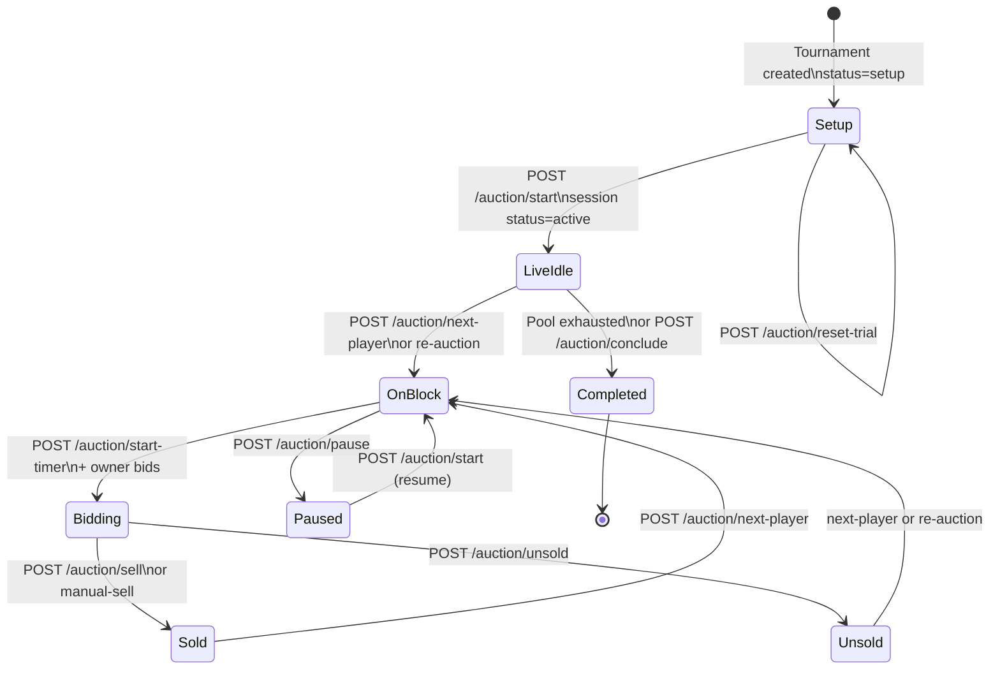
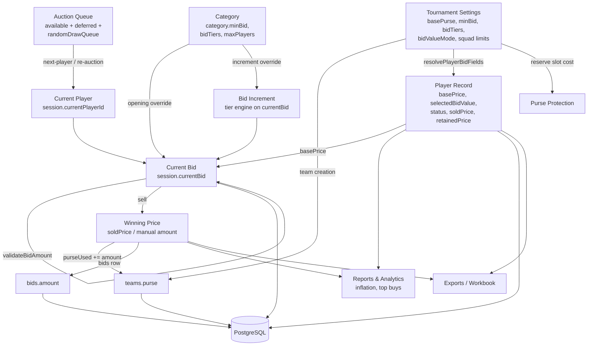
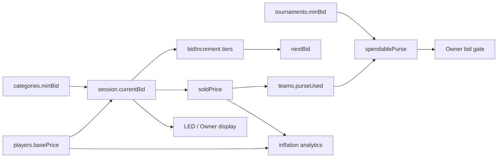
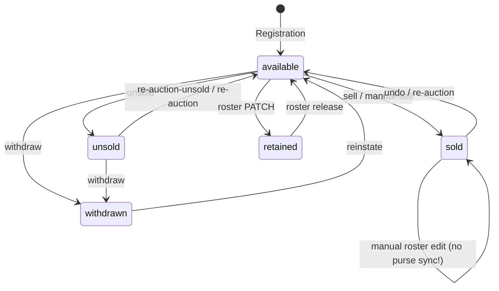
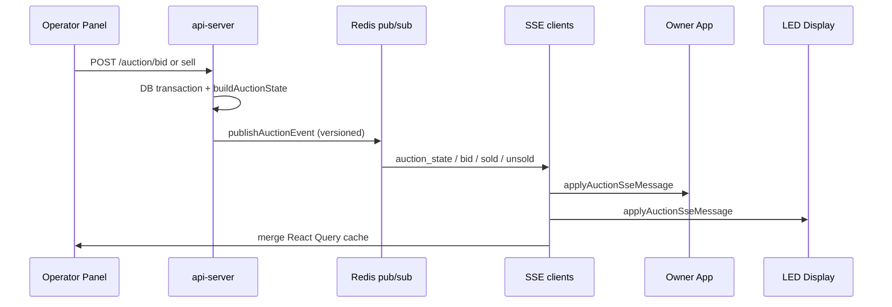
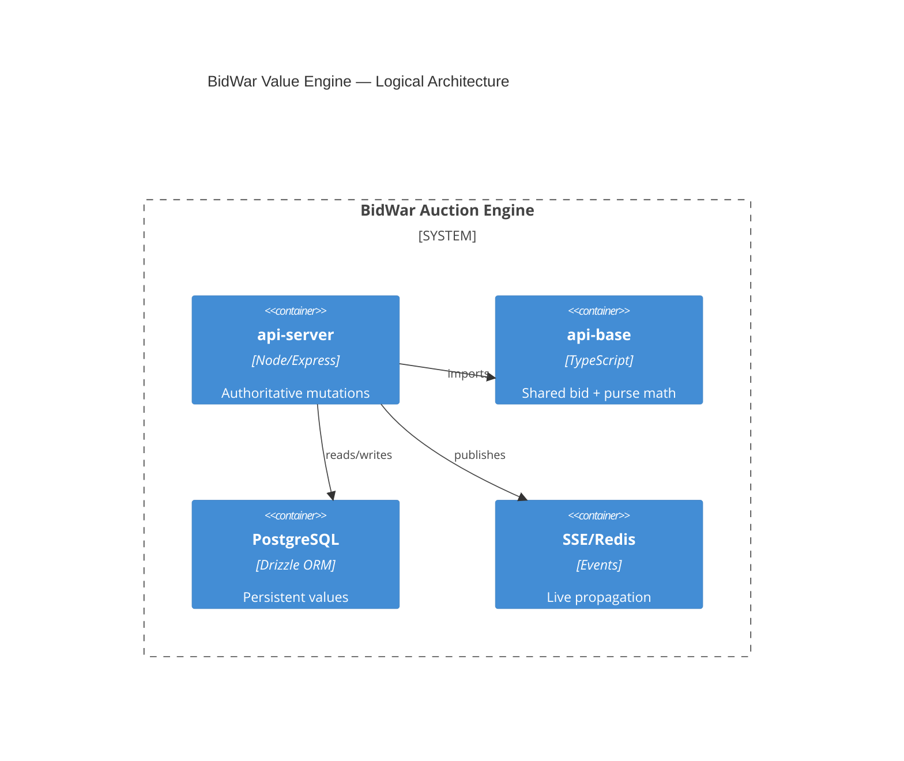

# BidWar Auction Mathematics and Value Engine Architecture

**Document type:** Official technical reference (architecture + mathematics audit)  
**Scope:** Cloud production stack (`artifacts/api-server`) with shared libraries (`lib/api-base`, `lib/db`) and local-mode parity notes (`artifacts/bidwar-local`)  
**Method:** Static analysis of existing code — no implementations, no UI, no feature proposals  
**Audience:** Senior engineers onboarding to BidWar’s auction value system without reading the full codebase  
**Last audited:** 2026-06-30  

---

## Table of Contents

1. [System Overview](#section-1-system-overview)
2. [Base Value Hierarchy](#section-2-base-value-hierarchy)
3. [Value Flow Map](#section-3-value-flow-map)
4. [Database Analysis](#section-4-database-analysis)
5. [Code Flow](#section-5-code-flow)
6. [Team Purse Mathematics](#section-6-team-purse-mathematics)
7. [Retained Players](#section-7-retained-players)
8. [Re-Auction](#section-8-re-auction)
9. [Current Bid](#section-9-current-bid)
10. [Category Rules](#section-10-category-rules)
11. [Player Value Mode](#section-11-player-value-mode)
12. [Edge Cases](#section-12-edge-cases)
13. [Mathematical Dependencies](#section-13-mathematical-dependencies)
14. [State Transitions](#section-14-state-transitions)
15. [Live Synchronization](#section-15-live-synchronization)
16. [Known Risks](#section-16-known-risks)
17. [Future Extensibility](#section-17-future-extensibility)
18. [Final Summary](#section-18-final-summary)

---

## Section 1 — System Overview

### 1.1 Purpose

BidWar’s auction value engine manages **four distinct monetary layers**:

| Layer | Primary storage | Meaning |
|-------|-----------------|---------|
| **Player base value** | `players.base_price` | Registered reserve / catalog price for a player |
| **Session current bid** | `auction_sessions.current_bid` | Live opening price or highest accepted bid on the block |
| **Final sold price** | `players.sold_price` + `bids.amount` | Price at which a player is assigned to a team |
| **Team purse ledger** | `teams.purse`, `teams.purse_used`, `purse_boosters` | Budget capacity and consumption |

These layers are **not always equal**. Opening bid may differ from stored `basePrice` when category rules apply. Final sold price may differ from `currentBid` only on manual sell. Purse math uses sold/retained prices, not base prices (except for reserve-slot calculations which use tournament `minBid`).

### 1.2 Lifecycle Phases



#### Phase A — Tournament setup (`tournaments.status = "setup"`)

1. Organizer configures **tournament defaults**: `basePurse`, `minBid`, bid tiers/increment, squad limits, `bidValueMode`.
2. **Categories** optionally define `minBid`, `bidIncrement`, `bidTiers`, `maxPlayers`.
3. **Teams** created with `purse = tournaments.basePurse`, `purseUsed = 0`.
4. **Players** registered with `basePrice` resolved via `resolvePlayerBidFields()` (`lib/api-base/src/bid-value.ts`).
5. **Retained players** may be pre-assigned with `status=retained`, `retainedPrice`, `teamId` → triggers `recalcTeamPurseUsed`.
6. Bid value fields (`basePrice`, `selectedBidValue`) are **editable only while `tournaments.status === "setup"`** (`canEditPlayerBidValue`).

#### Phase B — Auction session start

- `POST /tournaments/:id/auction/start` transitions `auction_sessions.status` from `idle` → `active` (or resumes from `paused`).
- Does **not** set `currentBid` or select a player.
- Readiness validation runs on first start (teams, players, categories, bid tiers).

#### Phase C — Player on block

- `POST /auction/next-player`, `POST /auction/defer-player` (auto-advance), or `POST /auction/re-auction` sets:
  - `auction_sessions.current_player_id`
  - `auction_sessions.current_bid` (opening amount)
  - `current_bid_team_id = null`
- Intelligence logs `logPlayerAuctionStart` with player snapshot and **`basePrice` from player row** (not category-adjusted opening bid).

#### Phase D — Live bidding

- Owner `POST /auction/bid` must match **exact** next amount (`validateBidAmount`).
- Session updates: `currentBid`, `currentBidTeamId`, timer, `revision++`.
- Intermediate bids are **not** persisted in `bids` table — only intelligence `auction_bid_events`.

#### Phase E — Resolution

- **Sell:** `soldPrice = session.currentBid`, `purseUsed += soldAmount`, insert `bids` row, clear session block fields.
- **Manual sell:** `soldPrice = request.amount` (may ignore live `currentBid`), same purse/bid logic if `amount > 0`.
- **Unsold:** `status=unsold`, clear session; **`soldPrice` unchanged (typically null)**.

#### Phase F — Post-auction / analytics

- `soldPrice`, `basePrice`, intelligence events feed reports, exports, inflation analytics.
- `POST /auction/conclude` marks session completed; player prices preserved.
- `POST /auction/reset-trial` wipes non-retained auction outcomes and intelligence tables.

### 1.3 Architectural Split

| Component | Role in value engine |
|-----------|---------------------|
| `lib/api-base` | Shared bid math, purse capacity, bid-value resolution, import validation |
| `artifacts/api-server/src/routes/auction.ts` | Authoritative live mutations (~3,000 LOC) |
| `artifacts/api-server/src/lib/purse-protection.ts` | Spendable purse / reserve math |
| `artifacts/api-server/src/lib/player-purse.ts` | Full purseUsed recalculation |
| `artifacts/api-server/src/lib/team-purse-snapshot.ts` | Live display purse rows |
| `artifacts/api-server/src/lib/auction-logger.ts` | Append-only intelligence (cloud only) |
| `artifacts/bidwar-local` | Offline parity — simplified purse protection, no intelligence/audit |

---

## Section 2 — Base Value Hierarchy

### 2.1 Terminology

| Term | Code field | Meaning |
|------|------------|---------|
| Tournament minimum bid | `tournaments.min_bid` | Global floor; used for purse reserve slots and import validation |
| Tournament default purse | `tournaments.base_purse` | Copied to `teams.purse` at team creation |
| Category minimum bid | `categories.min_bid` | Optional opening-bid override when player goes on block |
| Player base price | `players.base_price` | Persistent player reserve value (default ₹100,000) |
| Player selected bid value | `players.selected_bid_value` | Player-chosen value when `bidValueMode=player` |
| Bid value source | `players.bid_value_source` | `"system"` or `"player"` |
| Session current bid | `auction_sessions.current_bid` | Effective live opening or highest bid |
| Retained price | `players.retained_price` | Pre-auction retention cost |
| Sold price | `players.sold_price` | Final auction assignment price |

**Important:** There is no separate DB column for “effective base at auction time.” Effective opening bid is computed at runtime and stored transiently in `auction_sessions.current_bid`.

### 2.2 Player Base Price Resolution (Registration / Roster Edit)

**File:** `lib/api-base/src/bid-value.ts` — `resolvePlayerBidFields()`

#### System mode (`bidValueMode !== "player"`)

```
basePrice = input.basePrice ?? tournament.minBid ?? 100000
selectedBidValue = null
bidValueSource = "system"
```

Validation: `basePrice > 0` and finite.

#### Player mode (`bidValueMode === "player"` with configured options)

```
selected = input.selectedBidValue ?? input.basePrice
basePrice = selected   (must be in bidValueOptions array)
selectedBidValue = selected
bidValueSource = "player"
```

Player mode **replaces** the starting input only; category logic downstream is unchanged per code comment.

#### Edit lock

```
canEditPlayerBidValue(status) = (status === "setup")
```

Enforced in `artifacts/api-server/src/routes/players.ts` lines 1021–1027. After auction starts, PATCH with `basePrice` or `selectedBidValue` returns HTTP 409.

### 2.3 Effective Opening Bid (Player On Block)

Used when a player enters the live block via **next-player** or **defer auto-advance**:

```
IF player.categoryId IS NOT NULL:
  LOAD category.minBid
  IF category.minBid IS NOT NULL AND category.minBid > 0:
    openingBid = category.minBid
  ELSE:
    openingBid = player.basePrice
ELSE:
  openingBid = player.basePrice

session.currentBid = openingBid
session.currentBidTeamId = null
```

**Cloud:** `artifacts/api-server/src/routes/auction.ts` lines 1172–1191 (next-player), 2316–2325 (defer).  
**Local:** `resolvePlayerOpeningBid()` in `artifacts/bidwar-local/src/server/routes/auction.ts` lines 161–176.

**Precedence summary:**

| Priority | Source | Applies when |
|----------|--------|--------------|
| 1 (highest) | `categories.minBid` | Category assigned AND `minBid > 0` |
| 2 | `players.basePrice` | Default fallback |
| — | `tournaments.minBid` | **Not** used for opening bid directly; only if player base omitted at registration in system mode |

**Asymmetry:** Category `minBid` can exceed `player.basePrice` (category wins). Category `minBid` below player base is still used if `> 0` (category wins). If category `minBid` is null or 0, player base is used.

### 2.4 Re-Auction Starting Value

**File:** `artifacts/api-server/src/routes/auction.ts` lines 1869–1920

```
startingBid = startFromBase
  ? player.basePrice
  : (player.soldPrice ?? player.basePrice)

session.currentBid = startingBid
```

- **`startFromBase: true` (default):** Uses stored `basePrice` only — **category minBid is NOT applied**.
- **`startFromBase: false`:** Uses last `soldPrice` if sold; else `basePrice`.
- Operator UI currently always sends `startFromBase: true`.

### 2.5 Fallback Rules (Complete)

| Scenario | Fallback chain |
|----------|----------------|
| New player, system mode, no base provided | `tournament.minBid` → `100000` |
| New player, player mode, invalid selection | Rejected (must match options) |
| Opening bid, no category | `player.basePrice` |
| Opening bid, category with null/zero minBid | `player.basePrice` |
| Re-auction | `player.basePrice` or `soldPrice` (no category) |
| Purse reserve per slot | `tournament.minBid` (never player base) |
| Import base value below tournament min | Validation error (`import-export.ts`) |
| Tier increment, no JSON tiers | Legacy columns `bidTier1/2/3*` defaults |

### 2.6 Overrides (Explicit)

| Override type | Mechanism | Persists to `players.basePrice`? |
|---------------|-----------|-----------------------------------|
| Category minBid on block | Sets `session.currentBid` | No |
| Manual sell amount | Sets `soldPrice` directly | No (sold price only) |
| Excel/import `baseValue` | Updates `players.basePrice` | Yes (if allowed by tournament status) |
| Re-auction `startFromBase:false` | Sets `session.currentBid` from soldPrice | No |
| Purse booster | Increases effective capacity | No change to `teams.purse` column |

---

## Section 3 — Value Flow Map

### 3.1 End-to-End Flow



### 3.2 Transition Table

| From | Action | Value written | Value read |
|------|--------|---------------|------------|
| Tournament create | POST `/tournaments` | `basePurse`, `minBid`, tiers | — |
| Team create | POST `/teams` | `purse=basePurse`, `purseUsed=0` | `tournaments.basePurse` |
| Player create | POST `/players` | `basePrice`, optional `retainedPrice` | `resolvePlayerBidFields` |
| Next player | POST `/auction/next-player` | `currentBid=openingBid` | category.minBid, player.basePrice |
| Bid | POST `/auction/bid` | `currentBid=amount` | session, tiers, purse protection |
| Sell | POST `/auction/sell` | `soldPrice=currentBid`, `purseUsed+=`, `bids` insert | session.currentBid |
| Unsold | POST `/auction/unsold` | `status=unsold` | player.basePrice (intel log only) |
| Re-auction | POST `/auction/re-auction` | `currentBid`, clear soldPrice | basePrice or soldPrice |
| Undo | POST `/auction/undo` | clear soldPrice, `purseUsed-=`, delete bid | last `bids.amount` |
| Reset trial | POST `/auction/reset-trial` | clear sold prices, reset purses to retained | retainedPrice sum |
| Booster apply | POST purse-boosters | `purse_boosters` row | effective capacity |

### 3.3 What Never Flows Automatically

- **`basePrice` → `currentBid`** on sell (sell uses current bid, not re-read base).
- **`currentBid` → `soldPrice`** on unsold (unsold has no price).
- **Category minBid → re-auction opening** (re-auction skips category).
- **Intelligence `basePrice` → opening bid** (intel logs player row base, not session opening).
- **Intermediate bids → `bids` table** (only final sale recorded).

---

## Section 4 — Database Analysis

### 4.1 Core Tables

#### `tournaments`

| Field | Value role | Written | Read | Updated live? |
|-------|-----------|---------|------|---------------|
| `base_purse` | Default team budget | Create, settings | Team create | Blocked during live auction (direct team purse edit) |
| `min_bid` | Floor + purse reserve unit | Create, settings | Opening fallback (registration), purse protection, import | Yes (settings) — affects future reserve math |
| `bid_increment`, `bid_tier*` , `bid_tiers` | Increment tiers | Create, settings | Bid validation, display | Yes |
| `minimum_squad_size`, `maximum_squad_size` | Squad / reserve rules | Create, settings | Purse protection, bid gate | Yes |
| `bid_value_mode`, `bid_value_options` | Player self-selection | Create, settings | `resolvePlayerBidFields` | Locked in practice after registration phase |
| `status` | `setup` / `completed` / etc. | Auction lifecycle | Edit locks, readiness | Yes |

#### `categories`

| Field | Value role | Written | Read | Updated live? |
|-------|-----------|---------|------|---------------|
| `min_bid` | Opening bid override | CRUD | next-player, defer | Yes — affects **future** blocks only |
| `bid_increment`, `bid_tiers` | Category increment override | CRUD | `resolveActiveBidIncrement` | Yes |
| `max_players` | Per-team category cap | CRUD | Bid validation | Yes |

#### `players`

| Field | Value role | Written | Read | Never updated? |
|-------|-----------|---------|------|----------------|
| `base_price` | Catalog reserve | Create, import, PATCH (setup only) | Opening (fallback), display, reports, intel | **Not** updated by sell/unsold/re-auction |
| `selected_bid_value` | Player mode audit | Create, PATCH (setup) | Display, export | Same lock as basePrice |
| `bid_value_source` | system/player | Create, PATCH | Export labels | Same |
| `sold_price` | Final sale | sell, manual-sell | purse recalc, reports, undo clears | Cleared on undo/re-auction/reset |
| `retained_price` | Retention cost | Roster PATCH | purse recalc | Preserved on reset-trial |
| `status` | Pool membership | Auction + roster | Selection, counts | — |
| `team_id` | Assignment | sell, retained, undo | Purse, squads | — |
| `category_id` | Rules linkage | Roster | Opening, tiers, limits | — |
| `is_non_playing_member` | Excluded from slot counts | Roster | Purse protection, squad limits | — |

#### `teams`

| Field | Value role | Written | Read | Notes |
|-------|-----------|---------|------|-------|
| `purse` | Original budget | Team create, PATCH | Capacity math | Direct edit blocked during live session |
| `purse_used` | Consumption ledger | sell, undo, re-auction, recalc, reset | Protection, display | **Never** decremented except undo/re-auction/reset/recalc |
| `is_bidding_enabled` | Gate | PATCH | Bid route | — |

#### `auction_sessions` (one row per tournament)

| Field | Value role | Written | Read | Cleared when |
|-------|-----------|---------|------|--------------|
| `current_bid` | Live price on block | next-player, bid, re-auction | validateBidAmount, sell | sell, unsold, conclude, reset |
| `current_bid_team_id` | Leading team | bid | sell guard | same |
| `current_player_id` | On-block player | next-player, re-auction | All live ops | sell, unsold, conclude |
| `last_outcome` | JSON sold/unsold card | sell, unsold | LED, operator | next transition |
| `sold_players_count`, `unsold_players_count` | Counters | Derived in buildState | SSE, UI | reset |
| `revision` | Optimistic concurrency | bid, sell, next-player | bid conditional update | — |
| `deferred_player_ids`, `random_draw_queue` | Queue state | next-player, defer, undo | Selection | reset |

#### `bids`

| Field | Meaning |
|-------|---------|
| `amount` | **Final sold price** at time of sale (not intermediate bids) |
| `player_id`, `team_id`, `tournament_id` | Sale record |
| `timestamp` | Undo ordering (latest bid undone) |

**Never stores:** opening bid, intermediate raises, unsold outcomes.

#### `purse_boosters`

Append-only capacity adjustments. `teams.purse` unchanged; effective capacity = `purse + SUM(active boosters)`.

| Field | Role |
|-------|------|
| `amount` | Booster value |
| `status` | `active` / `cancelled` |
| `previous_capacity`, `new_capacity` | Audit trail |

### 4.2 Intelligence Tables (Cloud Only — Append-Only)

#### `auction_bid_events`

Every accepted live bid: `bid_amount`, `previous_bid_amount`, computed `bid_increment`, timing metadata.

#### `auction_player_events`

Lifecycle: `outcome` ∈ `{in_progress, sold, unsold, deferred}`; `base_price` from player row at start; `final_amount` on conclusion.

#### `auction_timer_events`

Timer interactions — no direct price math.

**Reset trial deletes all three tables** for the tournament.

### 4.3 Derived / Non-Persisted Values

| Value | Computed in | Formula |
|-------|-------------|---------|
| `bidIncrement` | `buildAuctionState` | `computeTieredIncrement(currentBid, activeTiers)` |
| `spendablePurse` | `computeTeamPurseProtection` | See Section 6 |
| `purseRemaining` | `computePurseRemaining` | `effectiveCapacity - purseUsed` |
| `inflation_pct` | Intelligence SQL | `(final_amount / base_price - 1) * 100` |
| `nextBid` | `computeNextBidAmount` | See Section 9 |

### 4.4 Reports & Export Surfaces

| Surface | Primary price fields |
|---------|---------------------|
| Admin reports API | `basePrice`, `soldPrice`, `retainedPrice`, `purse - purseUsed` |
| Team reports | `soldPrice`, `retainedPrice` |
| Analytics API | `soldPrice`, `basePrice`, aggregates |
| Field registry export (`baseValue`) | Maps to `players.basePrice` |
| `export-players-rows.ts` | Full registration + auction columns |
| Webhooks | `soldPrice` or `basePrice` in messages |

**Report inconsistency note:** Some report paths use `team.purse - purseUsed` without booster totals; live auction uses `effectiveCapacity` (`admin-reports.ts` vs `team-purse-snapshot.ts`).

---

## Section 5 — Code Flow

### 5.1 Shared Libraries

| File | Function | Purpose | Input | Output | Side effects |
|------|----------|---------|-------|--------|--------------|
| `lib/api-base/src/auction-bid.ts` | `computeNextBidAmount` | Next valid bid | `currentBid`, `bidIncrement`, `currentBidTeamId` | number | None |
| `lib/api-base/src/auction-bid.ts` | `validateBidAmount` | Strict equality check | amount + input | `{ok}` or error | None |
| `lib/api-base/src/bid-value.ts` | `resolvePlayerBidFields` | Registration base resolution | tournament config + input | `basePrice`, `selectedBidValue`, source | None |
| `lib/api-base/src/bid-value.ts` | `canEditPlayerBidValue` | Edit lock | tournament status | boolean | None |
| `lib/api-base/src/purse-capacity.ts` | `computeEffectiveCapacity` | Booster-adjusted cap | purse, boosterTotal | number | None |
| `lib/api-base/src/purse-capacity.ts` | `computePurseRemaining` | Remaining budget | capacity, used | number | None |

### 5.2 Increment Engine

| File | Function | Lines | Purpose |
|------|----------|-------|---------|
| `artifacts/api-server/src/routes/auction.ts` | `parseBidTiers` | 309–325 | Parse JSON or legacy columns |
| same | `computeTieredIncrement` | 327–332 | First tier where `currentBid < upTo` |
| same | `getCategoryTiers` | 334–348 | Category override |
| same | `resolveTournamentBidTiers` | 350–370 | Load tournament tiers |
| same | `resolveActiveBidIncrement` | 372–396 | Category-aware increment for current player |

**Tier selection algorithm:**

```
FOR each tier IN tiers (ordered):
  IF tier.upTo is undefined OR currentBid < tier.upTo:
    RETURN tier.increment
RETURN lastTier.increment ?? 50000
```

### 5.3 Purse Engine

| File | Function | Lines | Purpose |
|------|----------|-------|---------|
| `artifacts/api-server/src/lib/purse-protection.ts` | `computeTeamPurseProtection` | 33–168 | Reserve + spendable |
| same | `computeAllTeamPurseProtections` | 175–218 | Batch for all teams |
| `artifacts/api-server/src/lib/player-purse.ts` | `recalcTeamPurseUsed` | 9–26 | Full recompute from roster |
| `artifacts/api-server/src/lib/team-purse-snapshot.ts` | `buildTeamPurseSnapshot` | 34–117 | Live SSE purse rows |
| `artifacts/api-server/src/lib/purse-capacity.ts` | `getActiveBoosterTotal` | — | SUM active boosters |

### 5.4 Auction HTTP Mutations (Cloud)

| Endpoint | File lines | Value mutations |
|----------|------------|-----------------|
| `GET /auction` | 878+ | Reads `buildAuctionState` |
| `POST /auction/start` | 938–1044 | Session status only |
| `POST /auction/next-player` | 1079–1231 | `currentBid=openingBid`, intel start |
| `POST /auction/bid` | 1234–1449 | `currentBid=amount`, intel bid |
| `POST /auction/sell` | 1452–1641 | `soldPrice`, `purseUsed+=`, bid insert |
| `POST /auction/manual-sell` | 1642–1787 | `soldPrice=amount`, audit |
| `POST /auction/unsold` | 1790–1861 | status unsold, intel end |
| `POST /auction/re-auction` | 1864–1958 | `currentBid`, clear sold, purse reverse if sold |
| `POST /auction/re-auction-unsold` | 1961–2014 | unsold→available only |
| `POST /auction/reset-trial` | 2018–2187 | Full value wipe (retained preserved) |
| `POST /auction/defer-player` | 2190–2379 | Defer + optional next opening |
| `POST /auction/undo` | 2382–2499 | Reverse last sale |
| `POST /auction/conclude` | 2683–2744 | Session complete, prices kept |
| `POST /auction/start-timer` | 2653+ | Timer only — no price change |

### 5.5 Roster Mutations Affecting Values

| Endpoint | File | Effect |
|----------|------|--------|
| `POST /players` | `routes/players.ts` ~430–468 | Sets basePrice; recalc if retained |
| `PATCH /players/:id` | ~1021–1200 | basePrice lock; recalc on retained change |
| `PATCH /teams/:id` | `routes/teams.ts` ~348–399 | purse edit blocked live |
| `POST /purse-boosters` | `routes/purse-boosters.ts` | Capacity only |
| `POST /players/:id/withdraw` | `player-withdrawal.ts` | Clears prices if applicable; recalc |

### 5.6 State Builder

| File | Function | Lines | Output |
|------|----------|-------|--------|
| `artifacts/api-server/src/routes/auction.ts` | `buildAuctionState` | 419–716 | Full REST/SSE snapshot including `currentBid`, `bidIncrement`, `teamPurses`, serialized `currentPlayer.basePrice` |

---

## Section 6 — Team Purse Mathematics

### 6.1 Definitions

Let:

- `P` = `teams.purse` (original purse)
- `B` = Σ `purse_boosters.amount` where `status = 'active'`
- `U` = `teams.purse_used`
- `C` = effective capacity = `P + B`
- `R` = purse remaining = `C - U`

**Code:** `lib/api-base/src/purse-capacity.ts`

```
effectiveCapacity = computeEffectiveCapacity(P, B) = P + B
purseRemaining    = computePurseRemaining(C, U)   = C - U
```

### 6.2 Purse Used (`U`)

#### Canonical definition (`recalcTeamPurseUsed`)

```
U = Σ soldPrice   WHERE status = 'sold'   AND teamId = team
  + Σ retainedPrice WHERE status = 'retained' AND teamId = team
```

**File:** `artifacts/api-server/src/lib/player-purse.ts` lines 19–23

#### Incremental updates (auction hot path)

| Event | Update |
|-------|--------|
| Sell / manual sell (amount > 0) | `U = U + amount` (SQL atomic) |
| Undo | `U = GREATEST(0, U - bid.amount)` |
| Re-auction (was sold) | `U = GREATEST(0, U - player.soldPrice)` |
| Reset trial | `U = Σ retainedPrice` for team |

**Note:** Live sell path uses atomic SQL increment, not `recalcTeamPurseUsed`. Recalc is used on retained roster edits, delete, withdraw.

### 6.3 Purse Protection (Spendable Purse)

**File:** `artifacts/api-server/src/lib/purse-protection.ts`

Let:

- `minSquad` = `tournaments.minimumSquadSize`
- `tMin` = `tournaments.minBid` (tournament floor — **not** category min)
- `count` = players on team with `status ∈ {sold, retained}` excluding `isNonPlayingMember`

```
slotsRequired = max(0, minSquad - count)

IF minSquad = 0:
  reservePurse = 0
  spendablePurse = purseRemaining
ELSE IF slotsRequired = 0:
  reservePurse = 0
  spendablePurse = purseRemaining
ELSE:
  reservePurse = slotsRequired × tMin
  spendablePurse = max(0, purseRemaining - reservePurse)
```

**Bid gate:** `amount > spendablePurse` → HTTP 400.

**Manual sell gate:** Same check when `amount > 0`.

### 6.4 Initial Purse

On team creation (`routes/teams.ts` ~171):

```
teams.purse = tournaments.basePurse   (default ₹10,000,000)
teams.purseUsed = 0
```

### 6.5 Booster / Bonus Purse

On apply (`routes/purse-boosters.ts`):

```
previousCapacity = P + currentBoosterTotal
newCapacity      = previousCapacity + boosterAmount
```

Stored in `purse_boosters`; **`teams.purse` never mutated**.

Cancel validates `newCapacity >= purseUsed` via `assertCapacityNotBelowUsed`.

### 6.6 Manual Purse Adjustment

| Method | Allowed when | Effect |
|--------|--------------|--------|
| PATCH `teams.purse` | Session NOT in `{active, paused, idle}` | Changes `P` only |
| Purse booster | Live auction | Changes `B` |
| Local PATCH `purseUsed` | Local mode only | Direct ledger edit (no cloud equivalent) |
| Cloud sync from local | `/sync` | May set `purseUsed` from payload |

### 6.7 Winning Bid Deduction

On sell:

```
soldAmount = session.currentBid ?? 0
U_team += soldAmount
players.soldPrice = soldAmount
bids.amount = soldAmount
```

On manual sell:

```
soldAmount = request.amount   (independent of currentBid)
```

### 6.8 Undo Sale

```
Load latest bids row for tournament
player.status = available
player.soldPrice = null
player.teamId = null
U_team = GREATEST(0, U_team - bid.amount)
DELETE bids row
session: lastAction only — currentBid NOT restored
```

### 6.9 Re-Auction Purse Reversal

If prior status was `sold`:

```
U_team = GREATEST(0, U_team - player.soldPrice)
DELETE all bids for (playerId, tournamentId)
player.soldPrice = null
player.teamId = null
player.status = available
```

### 6.10 Reset Trial Rollback

For each non-retained player:

```
status = available, teamId = null, soldPrice = null
```

For each team:

```
U = Σ retainedPrice for retained players on that team
```

Also: delete all `bids`, all intelligence events, reset session counters, `tournaments.status = setup`.

### 6.11 Refund Semantics

BidWar does not implement partial refunds. **Undo** and **re-auction (sold)** are the reversal mechanisms. Both clamp at zero:

```
GREATEST(0, purse_used - amount)
```

### 6.12 Scout Max Bid Hint

**File:** `artifacts/api-server/src/routes/teams.ts` ~270

```
maxBidCapacity = slotsRequired > 0
  ? floor(spendablePurse / slotsRequired)
  : spendablePurse
```

Informational for scout UI — actual bid gate still uses total `spendablePurse` for a single bid.

### 6.13 Local Mode Purse Gap

Local bid route uses simplified check:

```
spendable ≈ effectiveCapacity - purseUsed
```

**Without** minimum-squad reserve protection (`bidwar-local` auction.ts ~635–637).

---

## Section 7 — Retained Players

### 7.1 Value Determination

- `retainedPrice` set via roster create/PATCH (`players.ts`).
- Required pairing: `status=retained` requires `teamId` (validation lines 1069–1074).
- No automatic derivation from `basePrice` — organizer must supply `retainedPrice`.

### 7.2 Purse Deduction

Retained players contribute to `purseUsed` immediately:

```
U += retainedPrice   (via recalcTeamPurseUsed on create/update)
```

Recalc triggers:

- Player create with `status=retained` (line 467–468)
- PATCH changing retained status, team, or `retainedPrice` (lines 1191–1199)
- Player delete / withdraw (if had team)

### 7.3 When Deduction Happens

| Timing | Mechanism |
|--------|-----------|
| Pre-auction roster edit | Synchronous `recalcTeamPurseUsed` |
| During live auction | Same — retained edits recalc immediately |
| On sell of another player | Incremental `+= soldAmount` (separate from recalc) |

**Important:** Setting a player to `sold` via roster PATCH does **not** call `recalcTeamPurseUsed`. Sold purse updates must go through auction sell endpoints.

### 7.4 Database Updates

| Field | Retained player |
|-------|-----------------|
| `status` | `retained` |
| `team_id` | Assigning team |
| `retained_price` | Cost |
| `sold_price` | Typically null |
| `base_price` | Independent catalog value |

### 7.5 Restore Logic

| Action | Retained behavior |
|--------|-------------------|
| Reset trial | **Preserved** — status, team, retainedPrice kept |
| Reset trial purse | `U = sum(retainedPrice)` only |
| Undo | N/A (undo only reverses last **bid/sale** record) |
| Re-auction | Applies to sold/unsold — retained excluded from pool |
| Withdraw | **Blocked** for retained status |

### 7.6 Auction Pool Exclusion

Players with `status=retained` are excluded from available pool selection (`auction.ts` pool filters).

### 7.7 Edge Cases

| Case | Behavior |
|------|----------|
| Retained player transferred to new team | Recalc both old and new team `purseUsed` |
| `retainedPrice = 0` | Valid — adds 0 to purseUsed |
| Retained + non-playing member | Counts toward purseUsed; NPM flag affects squad slot counts only |
| Re-auction retained | Not applicable — retained cannot be re-auctioned without status change |

---

## Section 8 — Re-Auction

### 8.1 Two Distinct Operations

| Operation | Endpoint | Scope |
|-----------|----------|-------|
| **Bring unsold players** | `POST /auction/re-auction-unsold` | All `unsold → available` |
| **Single re-auction** | `POST /auction/re-auction` | One player returned to block |

### 8.2 Bring Unsold Players

**Cloud:** `auction.ts` lines 1961–2014

```
FOR each player WHERE status = 'unsold':
  status = 'available'

session.randomDrawQueue = null
session.lastAction = "RE-AUCTION ROUND: N unsold..."
```

**Does NOT:**

- Set `currentPlayerId`
- Set `currentBid`
- Change `basePrice`
- Start bidding

Operator must call **next-player** afterward.

### 8.3 Single Re-Auction

**Request body:**

```typescript
{
  playerId: number,
  startFromBase?: boolean,  // default true
  reason?: string           // audit
}
```

**Preconditions:**

- Auction not paused
- Organizer auth

**If player was sold:**

```
purseUsed -= soldPrice (clamped)
DELETE bids for player
```

**Player reset:**

```
status = available
teamId = null
soldPrice = null
```

**Session set:**

```
status = active
currentPlayerId = playerId
currentBid = startFromBase ? basePrice : (soldPrice ?? basePrice)
currentBidTeamId = null
timer cleared
randomDrawQueue = null
lastOutcome = null
```

**Notifications:** WhatsApp re-auction notify (if configured).

**Audit:** `auction.reauction` with `priorSoldPrice`, `startFromBase` metadata.

**Intelligence:** No `logPlayerAuctionStart` on re-auction path.

### 8.4 Operator UI Behavior (Documented State)

- Instant re-auction buttons call API with `startFromBase: true` always.
- `startFromBase: false` exists in API but is **not exposed** in operator UI.
- Resume-bid dialog “Restart this player” also uses `startFromBase: true`.

### 8.5 Queue / Status Summary

| Prior status | After re-auction | On block? |
|--------------|------------------|-----------|
| sold | available | Yes — immediately |
| unsold | available | Yes — immediately |
| available | available | Yes — re-selected |

---

## Section 9 — Current Bid

### 9.1 Initialization Paths

| Path | Formula | `currentBidTeamId` |
|------|---------|-------------------|
| next-player | category.minBid (>0) else basePrice | null |
| defer (auto) | same as next-player | null |
| defer (manual mode) | null | null |
| re-auction | basePrice or soldPrice | null |
| bid (first) | unchanged until bid accepted | set on first bid |

### 9.2 Semantic Dual Role

From `lib/api-base/src/auction-bid.ts` header comment:

- **Before first bidder:** `currentBid` = opening/base/reserve price; first bid must **equal** it exactly.
- **After first bidder:** `currentBid` = high bid; next bid = `currentBid + bidIncrement`.

### 9.3 Where `currentBid` Changes

| Action | New value |
|--------|-----------|
| POST bid | `amount` (validated) |
| sell / unsold / conclude / reset | `null` |
| next-player / re-auction | opening formula |
| undo | **unchanged** (not restored) |
| withdraw on-block player | `null` (pool clear) |

### 9.4 Increment Calculation

Displayed increment (`buildAuctionState`):

```
bidIncrement = computeTieredIncrement(session.currentBid ?? 0, activeTiers)
```

Active tiers: category override if current player has category, else tournament tiers.

**Next bid amount:**

```
IF currentBidTeamId IS NULL:
  nextBid = currentBid ?? 0
ELSE:
  nextBid = currentBid + bidIncrement
```

### 9.5 Minimum Valid Bid

BidWar uses **strict equality**, not minimum-or-higher:

```
valid ⟺ amount === nextBid
```

Additional gates:

- `amount <= spendablePurse`
- Squad size < maximum
- Category count < maxPlayers
- Team not already leading
- Timer running, session active

### 9.6 Sold Price Relationship

| Path | soldPrice source |
|------|------------------|
| Normal sell | `session.currentBid` |
| Manual sell | Request `amount` |
| Unsold | unchanged (null) |

### 9.7 Rollback

| Mechanism | Restores currentBid? |
|-----------|---------------------|
| Undo | No |
| Re-auction | Sets new opening from base/sold |
| Pause/resume | Preserves currentBid |

---

## Section 10 — Category Rules

### 10.1 Category Minimum Bid

- Optional nullable integer on `categories.min_bid`.
- When player with category goes on block: if `minBid > 0`, it becomes `session.currentBid`.
- **Does not modify** `players.basePrice`.

### 10.2 Category Bid Increment

Priority in `getCategoryTiers`:

1. Parse `categories.bidTiers` JSON if valid array
2. Else if `categories.bidIncrement > 0` → flat single tier `[{ increment }]`
3. Else tournament tiers

Applies only during **live bid increment resolution** for player on block.

### 10.3 Category Restrictions

**maxPlayers:** Count of team's sold+retained players in same category (excluding NPM) must be `< maxPlayers` before bid accepted.

### 10.4 Inheritance

Categories do **not** inherit minBid from tournament. Unset category minBid → player base used for opening.

### 10.5 Category Filter (Session)

`auction_sessions.active_category_ids` JSON restricts which categories are eligible for random/sequential draw — affects **who** is selected, not how opening bid is calculated once selected.

---

## Section 11 — Player Value Mode

### 11.1 Modes

| Mode | DB flag | Behavior |
|------|---------|----------|
| System | `bid_value_mode = 'system'` (default) | Organizer/system sets `basePrice`; defaults to `tournament.minBid` |
| Player | `bid_value_mode = 'player'` | Registrant picks from `bid_value_options` JSON array |

### 11.2 Configuration

- `tournaments.bid_value_options`: JSON array of allowed integers.
- `shouldShowPlayerBidValueSelector`: true only when player mode AND options non-empty.

### 11.3 Interaction with Category

Player-selected `basePrice` is stored on player row. When going on block:

- If category `minBid > 0`, **category minBid overrides** for `session.currentBid` even in player mode.
- Player mode does not bypass category opening rules.

### 11.4 Interaction with Tournament minBid

- Registration: system mode uses `tournament.minBid` as default base.
- Import: `baseValue` must be `>= tournament.minBid`.
- Purse reserve: always uses `tournament.minBid` per slot.

### 11.5 Post-Registration Lock

After `tournaments.status !== 'setup'`, both `basePrice` and `selectedBidValue` are locked via API.

---

## Section 12 — Edge Cases

### 12.1 Value Hierarchy Edge Cases

| Case | Outcome |
|------|---------|
| Player base > category minBid | Opening = category minBid (lower) |
| Player base < category minBid | Opening = category minBid (higher) |
| Category minBid null or 0 | Opening = player base |
| Category removed from player mid-auction | Next selection uses player base only |
| Tournament minBid changed during live | Affects purse reserve for **future** bids; not retroactive on currentBid |
| Re-auction after unsold round | Opening = basePrice, **ignores** category minBid |

### 12.2 Auction Lifecycle Edge Cases

| Case | Outcome |
|------|---------|
| Auction restarted (reset trial) | Non-retained prices cleared; intel wiped; status→setup |
| Undo after sell | Sale reversed; player available; **not** put back on block |
| Unsold then batch re-auction | Status available; must next-player |
| Unsold then single re-auction | Immediately on block at basePrice |
| Sold then re-auction | Purse refunded; bids deleted |
| Retained then released | Requires roster PATCH; recalc purse |
| Retained then re-auction | Must change status first |
| Deleted player on block | Delete guard clears session block + recalc purse |
| Edited player during live | basePrice locked; other fields may update |
| Manual sell amount = 0 | Player marked sold, no purse change, no bid row |
| Manual sell with live currentBid ignored | soldPrice = manual amount |

### 12.3 Bidding Edge Cases

| Case | Outcome |
|------|---------|
| Duplicate bid same team | HTTP 409 — already leading |
| Concurrent bids | Optimistic `revision` on bid path; race possible (see risks) |
| Bid without timer | Rejected if timer not running |
| Bid exceeding spendable | HTTP 400 with reserve message |
| Opening bid at 0 | Possible if basePrice/manually set to 0 (registration rejects non-positive) |
| Trial mode | Only first 2 teams by ID may bid |

### 12.4 Data Integrity Edge Cases

| Case | Outcome |
|------|---------|
| PATCH player to sold via roster | Does not update purseUsed |
| Excel import soldPrice | Can set directly — bypasses auction |
| Cloud vs local report purse | Local may differ on reserve protection |
| Intelligence base vs opening | Intel logs player basePrice, not category-adjusted opening |
| Admin report purseRemaining | May omit boosters |

### 12.5 Multi-Operator Edge Cases

| Case | Outcome |
|------|---------|
| Two operators next-player | Optimistic revision — one wins |
| Sell with stale expected bid | HTTP 409 sell_race |
| Undo while player on block | Independent — undo doesn't affect block |

---

## Section 13 — Mathematical Dependencies

### 13.1 Dependency Graph



### 13.2 Change Impact Matrix

| If this changes | Affected values |
|-----------------|-----------------|
| `players.basePrice` | Future openings (next-player), display labels, reports, inflation denominator; **not** current session unless re-auction |
| `categories.minBid` | Future openings for categorized players |
| `session.currentBid` | Next bid validation, increment tier, LED, owner UI |
| `tournaments.minBid` | Registration defaults, import validation, purse reserve, **not** opening bid directly |
| `tournaments.bidTiers` | Increment ladder |
| `teams.purse` | effectiveCapacity |
| Booster amount | effectiveCapacity, spendablePurse |
| `soldPrice` / sell | purseUsed, bids, squad counts, reports |
| `retainedPrice` | purseUsed via recalc |
| Undo | purseUsed↓, soldPrice cleared |
| Category maxPlayers | Bid gate only |

---

## Section 14 — State Transitions

### 14.1 Player Status Enum

**Canonical:** `available | sold | unsold | retained | withdrawn`  
**File:** `artifacts/api-server/src/lib/player-status.ts`

### 14.2 Transition Diagram



### 14.3 Session Status

`auction_sessions.status`: `idle | active | paused | completed`

### 14.4 "Current" as Operational State

A player is **on block** when `session.currentPlayerId = player.id` regardless of DB status (still `available` until sold/unsold).

LED maps this to display status `live` via `currentPlayerId` match.

---

## Section 15 — Live Synchronization

### 15.1 Architecture



### 15.2 Event Types and Value Fields

| SSE type | Price fields propagated |
|----------|------------------------|
| `auction_state` | Full snapshot: `currentBid`, `currentPlayer.basePrice`, `bidIncrement`, `teamPurses`, `outcome.amount` |
| `bid` | Delta: `currentBid`, team info, `bidIncrement`, timer |
| `sold` | `amount`, `lastOutcome`, `teamPurses`, clears block |
| `unsold` | `lastOutcome`, counts — no amount |

**File:** `artifacts/api-server/src/lib/auction-broadcast.ts`

### 15.3 Invalidation Channels

Mutations may include `invalidate: ["players", "bids", "purses"]`. Clients refetch roster where `soldPrice` lives.

### 15.4 Versioning

- Monotonic `version` per tournament in Redis/SSE `id:` field.
- Client dedup in `sync-auction-sse.ts`.
- Gap triggers full snapshot fetch.

### 15.5 Consumer-Specific Reads

| Consumer | Primary value sources |
|----------|----------------------|
| Operator panel | `state.currentBid`, `currentPlayer.basePrice`, increment |
| Owner app (`LiveBid.tsx`) | `currentBid`, `currentPlayer.basePrice`, `spendablePurse`, `computeNextBidAmount` |
| LED (`use-led-view.ts`) | `currentBid`, `basePrice`, `soldPrice` (roster), `outcome.amount` |
| Admin | Player list + reports APIs |
| OBS overlay | Same auction state hook |

### 15.6 Owner vs Platform SSE Difference

Platform `sync-auction-sse.ts` appends to bid history cache on `bid` events; owner copy does not.

### 15.7 Polling Fallback

When SSE disconnected, clients poll `GET /auction` — same `buildAuctionState` math.

---

## Section 16 — Known Risks

### 16.1 Race Conditions

| Risk | Location | Impact |
|------|----------|--------|
| Concurrent bids without row lock | `POST /auction/bid` | Last write wins; earlier bid may be lost in session while logged in intel |
| Pause + in-flight bid | pause vs bid | Bid may land with timer cleared |
| next-player concurrent calls | revision guard | Mitigated — loser gets current state |
| Sell race | expectedBidTeamId guard | Mitigated with 409 |

### 16.2 Calculation Mismatches

| Mismatch | Description |
|----------|-------------|
| Opening vs intel base | Intel logs `player.basePrice`; session may use category minBid |
| Re-auction vs next-player | Re-auction skips category minBid |
| Report purse vs live purse | Reports may omit boosters |
| LED base label vs currentBid | Shows both — diverge when category overrides |
| Local vs cloud reserve | Local bids skip full purse protection |

### 16.3 Double Purse Deduction

| Scenario | Risk level |
|----------|------------|
| Normal sell + recalc | Low — sell uses atomic increment, recalc not called |
| Roster PATCH to sold + auction sell | **High** — PATCH sold doesn't update purse; manual duplicate possible |
| Undo + re-sell same player | Low — undo clears sold state first |

### 16.4 Incorrect Restoration

| Scenario | Issue |
|----------|-------|
| Undo | Does not restore `currentPlayerId` / `currentBid` |
| Re-auction unsold batch | Does not auto-select player |
| Reset trial | Intelligence deleted — irreversible analytics loss |

### 16.5 Invalid Overrides

| Scenario | Issue |
|----------|-------|
| Manual sell below current bid | Allowed — soldPrice = manual amount |
| Import soldPrice during live | Possible via bulk import paths |
| Excel base below minBid | Blocked at validation |

### 16.6 Dead / Underused API Surface

| Item | Status |
|------|--------|
| `startFromBase: false` in re-auction API | Implemented, UI never sends false |
| `teams.purseUsed` PATCH | Local only |
| Legacy `bid_increment` column | Fallback when no JSON tiers |

### 16.7 Conflicting Calculations

| Area | Conflict |
|------|----------|
| purseUsed | Incremental on sell vs full recalc on retained — both valid but different code paths |
| maxBidCapacity scout hint | Uses floor division — not same as single bid limit |
| Intelligence bid_increment on first bid | Computed as full bidAmount when previous null |

---

## Section 17 — Future Extensibility

Extension points identified in existing architecture (no design implied):

| Extension point | Natural hook location |
|-----------------|----------------------|
| Temporary starting bid override | `POST /auction/re-auction` body schema; `POST /auction/next-player` pre-set hook; new session field |
| Per-round base price rules | Between `resolvePlayerOpeningBid` and session update |
| Operator correction audit trail | Existing `auditLog` + `parseAuditReason` patterns on manual-sell / undo |
| Bulk re-auction with parameters | Extend `re-auction-unsold` beyond status flip |
| Multiple purse pools | New table analogous to `purse_boosters`; `computeEffectiveCapacity` generalization |
| Category-specific purse pools | Extension of `computeTeamPurseProtection` inputs |
| Women/men split purses | Team-level or tournament-level partition keys in purse snapshot builder |
| Session-only opening price | `auction_sessions` column without mutating `players.basePrice` |
| Enhanced intel fidelity | `logPlayerAuctionStart` payload — record effective opening separately |
| Bid history persistence | Currently only in `auction_bid_events` — could link to `bids` schema |

---

## Section 18 — Final Summary

### 18.1 Architecture Diagram



### 18.2 Data Flow Diagram

```
Registration ──► players.base_price ──► next-player ──► auction_sessions.current_bid
                                              │
categories.min_bid ───────────────────────────┘
                                              │
                         bid ◄── validateBidAmount ◄── tier increment
                          │
                         sell ──► players.sold_price ──► teams.purse_used
                          │              │
                          └──────────────┴──► bids.amount ──► reports / intel
```

### 18.3 Calculation Flow Diagram

```
                    ┌─────────────────────┐
                    │ resolvePlayerBidFields │
                    └──────────┬──────────┘
                               ▼
                    ┌─────────────────────┐
         ┌─────────│   players.basePrice   │─────────┐
         │         └─────────────────────┘         │
         ▼                                           ▼
┌─────────────────┐                      ┌──────────────────┐
│ category.minBid │──► openingBid ──────►│ session.currentBid│
└─────────────────┘                      └────────┬─────────┘
                                                │
                    ┌───────────────────────────┼───────────────────────────┐
                    ▼                           ▼                           ▼
         computeTieredIncrement        validateBidAmount              computeTeamPurseProtection
                    │                           │                           │
                    ▼                           ▼                           ▼
              bidIncrement                  nextBid                   spendablePurse
```

### 18.4 Dependency Graph (Condensed)

```
tournaments.minBid ─────► purse reserve ─────► bid affordability
players.basePrice ────────► opening (fallback) ──► currentBid ──► soldPrice
categories.minBid ──────► opening (override) ────► currentBid
soldPrice / retainedPrice ► purseUsed ───────────► spendablePurse
boosters ───────────────► effectiveCapacity ─────► purseRemaining
basePrice + soldPrice ──► inflation analytics (intel / reports)
```

### 18.5 Risk Matrix

| Risk | Likelihood | Severity | Mitigation present |
|------|------------|----------|-------------------|
| Concurrent bid overwrite | Medium | Critical | Partial — revision on bid, no FOR UPDATE |
| Opening/intel base mismatch | High | Low | None — documented asymmetry |
| Re-auction category skip | High | Medium | None — by implementation |
| Roster sold without purse | Low | High | No guard on PATCH sold |
| Report purse without boosters | Medium | Low | Partial |
| Undo incomplete restore | Medium | Low | By design |
| Local reserve gap | Medium | Medium | None in local mode |

### 18.6 Complexity Analysis

| Area | Cyclomatic / conceptual complexity | Notes |
|------|-----------------------------------|-------|
| Opening bid resolution | Medium | Two paths (next-player vs re-auction) differ |
| Tier increment | Medium | JSON + legacy columns + category override |
| Purse protection | Medium-High | Boosters + reserve + squad + category limits |
| Live sync | Medium | Versioned SSE + partial deltas + invalidations |
| Intelligence | Low coupling | Fire-and-forget — never blocks auction |
| Local parity | High drift risk | Subset of cloud rules |

**Primary maintenance hotspot:** `artifacts/api-server/src/routes/auction.ts` (~3,000 LOC) — all critical value mutations.

### 18.7 Missing Documentation (Prior to This Document)

- No single spec for opening bid vs stored basePrice divergence.
- Re-auction category exclusion undocumented in product docs.
- Intelligence `basePrice` ≠ effective opening bid undocumented.
- Local mode purse protection differences undocumented.
- `startFromBase: false` API parameter undocumented in operator materials.

### 18.8 Unknown Behaviors

| Behavior | Notes |
|----------|-------|
| Exact behavior if `category.minBid` set mid-live for on-block player | No re-read until next selection |
| Excel import updating sold during active auction | Depends on import route guards — not uniformly blocked |
| Multiple undo in sequence | Each reverses latest `bids` row only |
| soldPrice persistence when status manually set unsold via import | Possible inconsistent states |

### 18.9 Code Smells (Value Engine)

| Smell | Location |
|-------|----------|
| Duplicated opening bid logic | next-player inline vs local `resolvePlayerOpeningBid` |
| Dual purseUsed update strategies | Atomic increment vs `recalcTeamPurseUsed` |
| `currentBid` dual semantics | Opening vs high bid in one field |
| Intelligence logs wrong opening base | `logPlayerAuctionStart` uses player.basePrice |
| Unused API parameter | `startFromBase: false` |
| Report purse formula inconsistency | admin-reports vs team-purse-snapshot |

### 18.10 Technical Debt

| Item | Impact |
|------|--------|
| No session field for effective opening price | Forces inference from currentBid |
| `bids` table stores only sales | No authoritative intermediate bid DB |
| basePrice locked after setup | No first-class live correction path |
| Cloud/local behavioral drift | Offline auctions may diverge on affordability |
| Inflation tied to registration base | Re-auction rounds still use original base in intel |

---

## Appendix A — Formula Quick Reference

```
# Registration (system mode)
basePrice = input.basePrice ?? tournament.minBid ?? 100000

# Opening bid (next-player / defer auto)
openingBid = (category.minBid > 0) ? category.minBid : player.basePrice

# Opening bid (re-auction)
startingBid = startFromBase ? player.basePrice : (player.soldPrice ?? player.basePrice)

# Next valid bid
nextBid = (currentBidTeamId == null) ? currentBid : currentBid + bidIncrement

# Tier increment
increment = first tier where currentBid < upTo (or last tier)

# Purse capacity
effectiveCapacity = teams.purse + SUM(active boosters)
purseRemaining = effectiveCapacity - purseUsed

# Purse protection
slotsRequired = max(0, minimumSquadSize - squadCount)
reservePurse = slotsRequired × tournament.minBid
spendablePurse = max(0, purseRemaining - reservePurse)

# Purse used (canonical)
purseUsed = Σ soldPrice (sold) + Σ retainedPrice (retained)

# Inflation (analytics)
inflation_pct = round((final_amount / base_price - 1) × 100)
```

---

## Appendix B — Key File Index

| Path | Role |
|------|------|
| `lib/api-base/src/auction-bid.ts` | Bid validation math |
| `lib/api-base/src/bid-value.ts` | Base price resolution + edit lock |
| `lib/api-base/src/purse-capacity.ts` | Capacity formulas |
| `lib/api-base/src/auction-data/field-registry.ts` | Export/import field map |
| `lib/api-base/src/auction-data/import-export.ts` | Excel validation |
| `lib/db/src/schema/players.ts` | Player value columns |
| `lib/db/src/schema/teams.ts` | Purse columns |
| `lib/db/src/schema/tournaments.ts` | Tournament defaults |
| `lib/db/src/schema/categories.ts` | Category rules |
| `lib/db/src/schema/auction_sessions.ts` | Live session values |
| `lib/db/src/schema/bids.ts` | Sale records |
| `lib/db/src/schema/purse_boosters.ts` | Booster ledger |
| `lib/db/src/schema/auction_events.ts` | Intelligence tables |
| `artifacts/api-server/src/routes/auction.ts` | Live auction engine |
| `artifacts/api-server/src/routes/players.ts` | Roster value CRUD |
| `artifacts/api-server/src/routes/teams.ts` | Team purse CRUD |
| `artifacts/api-server/src/routes/purse-boosters.ts` | Booster apply/cancel |
| `artifacts/api-server/src/routes/intelligence.ts` | Inflation analytics SQL |
| `artifacts/api-server/src/lib/purse-protection.ts` | Spendable purse |
| `artifacts/api-server/src/lib/player-purse.ts` | PurseUsed recalc |
| `artifacts/api-server/src/lib/team-purse-snapshot.ts` | Live purse display |
| `artifacts/api-server/src/lib/auction-logger.ts` | Intelligence writer |
| `artifacts/api-server/src/lib/auction-broadcast.ts` | SSE payload types |
| `artifacts/bidwar-local/src/server/routes/auction.ts` | Local parity |
| `artifacts/auction-platform/src/lib/sync-auction-sse.ts` | Client merge |
| `artifacts/owner-app/src/screens/LiveBid.tsx` | Owner value display |

---

*End of document.*
