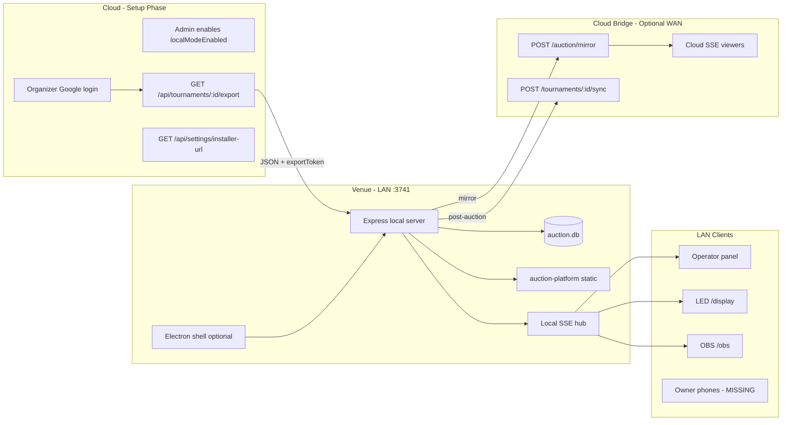

# BidWar Local Auction Architecture Audit & Migration Feasibility Report

**Audit date:** June 11, 2026  
**Scope:** Auction systems only. Cricket/badminton/match scoring explicitly out of scope.  
**Method:** Read-only inspection of production codebase (`artifacts/`, `lib/`, `docs/`, CI, threat model). No assumptions from legacy Electron design without code evidence.

---

## Table of contents

1. [Executive Summary](#1-executive-summary)
2. [Current Architecture Analysis](#2-current-architecture-analysis)
3. [Electron Audit](#3-electron-audit)
4. [Auction Flow Audit](#4-auction-flow-audit)
5. [Security Audit](#5-security-audit)
6. [Authentication Audit](#6-authentication-audit)
7. [OBS & Viewer Audit](#7-obs--viewer-audit)
8. [Network Architecture Audit](#8-network-architecture-audit)
9. [Reuse Analysis](#9-reuse-analysis)
10. [Migration Complexity Analysis](#10-migration-complexity-analysis)
11. [Risk Analysis](#11-risk-analysis)
12. [Recommended Architecture](#12-recommended-architecture)
13. [Migration Roadmap](#13-migration-roadmap)
14. [Final Verdict](#14-final-verdict)

---

## 1. Executive Summary

BidWar's "Local Auction Mode" is **not an Electron-first architecture**. The real offline engine is already a **Node.js Express server + SQLite (libSQL) + LAN SSE**, bound to `0.0.0.0:3741`. Electron (`artifacts/bidwar-local/electron/main.ts`, ~80 lines) only forks that server, shows a control-panel window, and packages the Windows installer.

| Finding | Evidence |
|---------|----------|
| **Implemented delivery path** | Only `artifacts/bidwar-local` (Electron + embedded Node server) |
| **Production readiness** | ~55–60% (`docs/LOCAL_MODE_AUDIT.md`) |
| **Core auction engine** | Local `auction.ts` = 947 lines vs cloud = 2,631 lines (~36% by size) |
| **Hand-written local codebase** | ~2,553 lines across `src/`, `electron/`, `scripts/`, `renderer/` |
| **Realtime transport** | SSE everywhere; no WebSocket auction stack |
| **Scoring in local mode** | Zero references in `bidwar-local` (correctly out of scope) |
| **P0 blockers** | No local auth, owner-app not bundled, nav disabled, offline media broken |

**Primary conclusion:** Migration is not "Electron vs Node" — it is **"complete the existing Node local runtime"** and decide how to **package** it for non-technical organizers (Electron, Node SEA/pkg, Tauri, or Windows Service + browser).

**Recommended architecture:** **Hybrid — Node Local Runtime as the product, Electron (or equivalent) as a thin launcher/installer only.** Do not rewrite the auction stack in Electron or in a browser PWA. Invest in server parity, local auth, owner-app bundling, and offline media.

**Feasibility of target flow** (Login → License → Export → Local Session → Auction → Cloud Sync → OBS/Viewers): **Technically feasible with current architecture**, but **not achievable for non-technical users today** due to auth, owner-app, media, and UX gaps.

---

## 2. Current Architecture Analysis

### 2.1 Monorepo topology

```
pnpm workspace
├── artifacts/
│   ├── api-server/          # Cloud Express API (PostgreSQL)
│   ├── auction-platform/    # Organizer + LED + OBS + live viewer SPA
│   ├── owner-app/           # Team owner bidding PWA (NOT bundled locally)
│   └── bidwar-local/        # Electron shell + local Express + SQLite
├── lib/
│   ├── db/                  # PostgreSQL Drizzle schema
│   ├── db-local/            # SQLite Drizzle schema (auction subset)
│   ├── api-base/            # Shared auction math, fetch helpers
│   ├── api-client-react/    # Generated React Query hooks
│   └── api-spec/            # OpenAPI contract
```

### 2.2 Cloud auction stack

| Layer | Technology | Key files |
|-------|------------|-----------|
| API | Express 5 | `artifacts/api-server/src/routes/auction.ts` (2,631 lines) |
| DB | PostgreSQL + Drizzle | `lib/db/` |
| Realtime | In-process SSE hub | `artifacts/api-server/src/lib/broadcast.ts` |
| Auth | JWT cookies (`bidwar_auth`), custom Google OAuth | `artifacts/api-server/src/routes/auth.ts`, `lib/jwt.ts` |
| Frontend | Vite React SPA | `artifacts/auction-platform/` |
| Deploy | Render (Linux) | `RENDER_ENV_VARS.md`, `DEPLOY.md` |

### 2.3 Local auction stack (as implemented)

| Layer | Technology | Key files |
|-------|------------|-----------|
| Shell | Electron 36 | `artifacts/bidwar-local/electron/main.ts` |
| API | Express 5 (forked child) | `artifacts/bidwar-local/src/server/index.ts` |
| DB | SQLite via `@libsql/client` | `lib/db-local/`, `{userData}/bidwar-data/auction.db` |
| Realtime | In-process SSE (duplicate of cloud pattern) | `bidwar-local/src/server/routes/auction.ts` |
| Static UI | Bundled `auction-platform` only | `scripts/copy-frontend.mjs` |
| Cloud bridge | Mirror + sync queue | `mirror.ts`, `sync-worker.ts`, `routes/local.ts` |

### 2.4 Local source size (hand-written code)

| File | Lines |
|------|------:|
| `src/server/routes/auction.ts` | 947 |
| `renderer/index.html` | 403 |
| `src/server/routes/local.ts` | 253 |
| Other routes + mirror/sync + Electron shell | ~950 |
| **Total** | **~2,553** |

### 2.5 SaaS model (auction-relevant)

BidWar is **tournament-scoped multi-tenancy**, not workspace SaaS:

- **Organizer accounts** (`organizers` table): `maxTournaments`, account `licenseStatus` (active/suspended)
- **Tournament licenses** (`tournaments.licenseStatus`): `trial` → `active` → `completed`
- **Local mode flag** (`tournaments.localModeEnabled`): admin-gated per tournament
- **No Stripe/subscription automation** in codebase — licensing is admin-driven

This supports SaaS growth: each org exports only their tournament; export tokens are per-tournament secrets.

### 2.6 Scoring systems (out of scope — identified only)

Present in cloud only; **absent from `bidwar-local`**:

| Module | Cloud location |
|--------|----------------|
| Cricket scoring | `artifacts/api-server/src/routes/scoring.ts`, `lib/scoring-*` |
| Badminton | `artifacts/api-server/src/routes/badminton.ts`, `lib/badminton-*` |
| Scoring foundation | `artifacts/api-server/src/routes/scoring-foundation.ts` |

These do not affect local auction migration recommendations.

### 2.7 Dependency map (auction-critical)



---

## 3. Electron Audit

### 3.1 What Electron actually does

`artifacts/bidwar-local/electron/main.ts`:

- Forks `dist-server/index.js` on port **3741**
- Sets `DB_PATH` under `app.getPath("userData")`
- Creates 900×640 control panel (`renderer/index.html`)
- IPC: `get-local-ip`, `get-server-port`, `get-db-path`, `open-browser`, `open-external`

Electron does **not** implement auction logic, auth, or database access in the main process.

### 3.2 IPC surface (complete)

| Channel | Purpose |
|---------|---------|
| `get-local-ip` | First non-internal IPv4 |
| `get-server-port` | Always `3741` |
| `get-db-path` | SQLite path |
| `open-browser` | Opens LAN URL in system browser |
| `open-external` | `shell.openExternal` |

No auction, auth, or sync IPC — all business logic is in the forked Node server.

### 3.3 Build & deployment

| Item | Status |
|------|--------|
| Package | `@workspace/bidwar-local` v1.0.0 |
| CI | `.github/workflows/build-electron.yml` — Windows NSIS only |
| Signing | Unsigned (`CSC_IDENTITY_AUTO_DISCOVERY=false`) |
| Admin trigger | Cloud admin UI → GitHub Actions via `GITHUB_PAT` |
| Install size | ~150MB+ (Chromium bundled) |

**CI footgun:** Workflow may run `pnpm --filter @workspace/db-local run build` but `lib/db-local/package.json` has no `build` script.

### 3.4 Is Electron still functional?

| Component | Functional? | Notes |
|-----------|-------------|-------|
| Server fork | Yes | `startServer()` forks `dist-server/index.js` |
| LAN binding | Yes | `0.0.0.0:3741` |
| Import UI | Yes | Renderer file picker → `POST /local/import` |
| QR code | Yes | `GET /local/qr.png` (base URL only) |
| Full venue auction | **No** | Operator auth blocked; owner-app missing |
| Parity with cloud | **Partial** | Missing routes, media, auth |

### 3.5 Compatibility with current production code

**Still aligned:**

- Cloud export/sync/mirror APIs with tests (`sync.test.ts`, `mirror.test.ts`)
- Purse boosters in local auction routes
- Operator PIN middleware (optional `X-Operator-Pin`)
- OpenAPI types for `localModeEnabled`, export tokens
- Local-mode setup wizard at `/tournament/:id/local-mode`

**Outdated / broken assumptions:**

- Bundled SPA still uses `OrganizerGuard` → cloud `/api/auth/organizer/*` (local server has no auth routes)
- `copy-frontend.mjs` bundles only `auction-platform`, not `owner-app`
- Sidebar shows "Local Mode — coming soon" while route exists (`layout.tsx` ~line 297)
- Media URLs remain Cloudinary — broken without WAN (`docs/FULL_FIDELITY_LOCAL_MODE_GAP_ANALYSIS.md`)
- Local import Zod schema strips many tournament fields (banner, audio, cheer, sponsors partial)
- `verify:local` script tests cloud dev stack, not BidWar Local

### 3.6 Dangerous to reuse without change

| Item | Risk |
|------|------|
| `fork(..., { env: { ...process.env } })` | Child inherits parent env; could leak cloud secrets on dev machines |
| Open CORS on local server | `app.use(cors())` — any LAN origin |
| Unauthenticated `POST /local/import` | Anyone on LAN with JSON file can import |
| Export token as bearer | Mirror/sync without user identity |
| Reusing cloud `OrganizerGuard` offline | Hard blocker for operator panel |

### 3.7 Maintenance verdict

**Partially maintained, not production-ready.** Electron shell is stable but tiny; active work is in `bidwar-local/src/server/` and cloud export/sync. Documented June 2026 audits confirm ongoing architectural attention, but P0 gaps remain unfixed.

---

## 4. Auction Flow Audit

### 4.1 Cloud auction flow (reference)

1. Organizer authenticates (Google OAuth or tournament password)
2. License checked (`trial` limits bidding to 2 teams; `active` unlocks full auction)
3. Operator opens `/tournament/:id/auction`
4. Mutations via REST → PostgreSQL → `buildAuctionState()` → SSE broadcast
5. LED (`/display`), OBS (`/obs`), viewers (`/live/:id`), owners (`/owner-app`) subscribe to same SSE snapshot

### 4.2 Intended local auction flow

| Step | Cloud | Local today | Gap |
|------|-------|-------------|-----|
| Google login | Required for export wizard | N/A at venue | Login must happen **before** export (online) |
| License validation | Server-side in `auction.ts` | **Not enforced locally** | Trial limits, SMS, WhatsApp gates missing |
| Tournament download | `GET /export` (48h token) | `POST /local/import` | Works if online first |
| Session creation | `auction_sessions` row | Same in SQLite | Works |
| Live auction | REST + SSE | REST + SSE on LAN | Core bid/sell/undo works |
| Cloud sync | N/A | Mirror (live) + sync (final) | Mirror best-effort; queue drains every 30s |
| OBS updates | SSE from cloud or mirrored state | LAN SSE works; cloud OBS needs mirror | Mirror missing display overlay fields |
| Viewer updates | Cloud SSE | Needs mirror when using cloud URLs | Offline LAN viewers OK; remote viewers need WAN |

### 4.3 API route parity (evidence)

**Cloud auction routes (27):** includes `defer-player`, `display-overlay`, `display-player-filter`, `stop-timer`, `conclude`, `cheer`, `mirror` (receiver).

**Local auction routes (24):** includes purse-boosters, `team-purse-view`, `queue`. **Missing entirely:**

- `POST .../defer-player`
- `POST .../display-overlay`
- `POST .../display-player-filter`
- `POST .../stop-timer`
- `POST .../conclude`
- `POST .../cheer`

Grep confirms **zero matches** for these strings in `artifacts/bidwar-local/`.

**Impact:** Operator panel buttons for defer, LED overlay modes, stop-timer, conclude, and live viewer cheers will **404 or fail** against local server.

### 4.4 Local auction flow feasibility

```text
Google Login (online)
  → License Validation (cloud, at export time)
  → Tournament Download (export JSON + token)
  → Install BidWar Local / start Node runtime
  → Import JSON
  → Local Auction Session (SQLite)
  → LAN SSE → Operator / LED / OBS
  → Optional mirror → Cloud SSE → Remote viewers
  → Post-auction sync → Cloud PostgreSQL
```

**Feasible:** Steps 3–6 core mechanics exist.  
**Not feasible for non-technical users today:** Steps 4–5 blocked by auth and owner-app.  
**Degraded offline:** Media, branding, audio, some LED overlays.

---

## 5. Security Audit

### 5.1 What each runtime exposes

| Asset | Cloud Node | Electron shell | Local Node runtime |
|-------|------------|----------------|-------------------|
| Server source | Not shipped | Not in app bundle (esbuild bundle) | `dist-server/index.js` bundled — harder to read but not encrypted |
| React SPA | Public static assets | Same — **fully readable** | Same — **fully readable** |
| `SESSION_SECRET`, DB URLs | Server env only | Inherited via `process.env` fork risk | Not needed locally |
| `GOOGLE_CLIENT_SECRET` | Server only | Not required locally | Not required locally |
| `exportToken` | DB + export JSON | Stored in SQLite after import | Stored in SQLite |
| Team `accessCode` | DB + export JSON | In SQLite after import | In SQLite |
| Auction business logic | Server-side | In `dist-server` bundle | In `dist-server` bundle |

### 5.2 Reverse engineering risk

| Runtime | Risk level | Reasoning |
|---------|------------|-----------|
| Electron | **Medium** | Chromium + readable frontend; server logic in esbuild bundle (not obfuscated) |
| Pure Node runtime | **Medium** (same) | Identical server bundle; no Chromium but same JS bundle |
| Cloud API | **Low** (for logic) | Logic never shipped to clients |

**Neither Electron nor Node runtime protects business logic** from a determined reverse engineer. Protection comes from **server-side enforcement on cloud**, not local packaging choice.

### 5.3 Secret leakage comparison

| Scenario | Electron | Node runtime |
|----------|----------|--------------|
| LAN attacker mutates auction | High (open CORS, optional PIN) | Same |
| Stolen export JSON | High (token + access codes) | Same |
| Stolen installer | Low (no cloud secrets by default) | Lower (smaller artifact) |
| Dev machine env inheritance | Medium (`fork` spreads `process.env`) | Medium if same pattern used |

### 5.4 Security comparison summary

**Packaging choice (Electron vs Node) does not materially change security posture.** Both ship the same Express bundle and the same readable React assets. Security improvements needed regardless:

1. Mandatory operator PIN at import
2. Authenticated import (or signed export packages)
3. Local organizer session (not cloud cookie dependency)
4. Restrict CORS to LAN origins
5. Do not fork with full `process.env`
6. Treat export JSON as confidential capability token

---

## 6. Authentication Audit

### 6.1 Cloud auth (reference)

- **Not Better Auth** — custom JWT in `bidwar_auth` cookie (7-day TTL)
- **Google OAuth** manual implementation in `auth.ts` (Passport packages unused)
- **Organizer per tournament:** `OrganizerGuard` → `checkOrganizerAuth(tournamentId)` → `/api/auth/organizer/:id/me`
- **Organizer account:** Google + email/mobile + scrypt password

### 6.2 Local auth (today)

- **No `/api/auth/*` routes** on local server (`index.ts` mounts only tournaments, teams, players, categories, auction, local)
- Optional `X-Operator-Pin` on mutating auction routes
- Bundled operator UI still wrapped in `OrganizerGuard` — redirects to `/organizer?next=...` when cloud auth fails

### 6.3 Google login in local mode

| Question | Answer |
|----------|--------|
| When does Google login happen? | **Before venue** — on cloud web app for export wizard |
| Can auction run without Google at venue? | **Yes** — if import already done; no Google needed on LAN |
| Does internet loss affect local auction? | **No** for LAN operations; mirror/sync pause |
| Does internet loss affect operator panel today? | **Yes indirectly** — panel requires cloud auth check |

### 6.4 Recommended auth model (feasibility)

Embed in export package:

- Tournament organizer password hash or one-time local session token
- Operator PIN
- Optional "local mode" flag for `OrganizerGuard` bypass on `:3741` origin

Documented as P0 in `FULL_FIDELITY_LOCAL_MODE_GAP_ANALYSIS.md` §3.3 and is **feasible without Google at venue**.

---

## 7. OBS & Viewer Audit

### 7.1 OBS overlay

| Item | Cloud | Local LAN | Remote via mirror |
|------|-------|-----------|-------------------|
| Route | `/tournament/:id/obs` | Same path on `:3741` | Cloud URL if mirror active |
| Data source | SSE + React Query | Local SSE | Cloud SSE after mirror |
| Gate | None | None | N/A |
| Offline | Needs API | **Works on LAN** | Needs WAN |

OBS uses same hooks as LED (`useAuctionSocket`, `useGetAuctionState`). **Works locally** if opened as `http://<LAN-IP>:3741/tournament/:id/obs`.

### 7.2 Public live viewers

| Surface | Route | Local LAN | Cloud + mirror |
|---------|-------|-----------|----------------|
| Live viewer | `/live/:id` | Works on LAN | Remote viewers need cloud |
| LED display | `/tournament/:id/display` | Works on LAN | Mirror pushes state to cloud |
| Cloud-only viewers | `bidwar.in/live/:id` | Need mirror + WAN | Yes |

### 7.3 Update flow during internet interruption

```text
[Local mutation]
  → SQLite write
  → Local SSE broadcast (immediate, all LAN clients)
  → mirrorStateToCloud() fire-and-forget
      → Success: cloud SSE → remote viewers/OBS on cloud URL
      → Failure: sync_queue entry → retry every 30s when Google 204 probe succeeds
```

**LAN OBS/LED/operator:** Unaffected by WAN loss.  
**Remote viewers on cloud URL:** Freeze until mirror resumes.  
**Cheer messages:** Not implemented locally — remote fan features absent.

### 7.4 Cloud synchronization requirement

| Feature | Requires cloud? |
|---------|-----------------|
| Venue auction | **No** (after import) |
| Remote online audience | **Yes** (mirror) |
| Post-auction official results | **Yes** (sync) |
| Initial setup/export | **Yes** |
| Google login / license grant | **Yes** |

---

## 8. Network Architecture Audit

### 8.1 Options evaluated

| Option | In repo? | Venue UX | Verdict |
|--------|----------|----------|---------|
| **Electron + local web server** | Yes | Installer + control panel | Viable launcher |
| **Pure Node local runtime** | Partial (`dist-server` runnable standalone) | Needs installer/service | **Recommended engine** |
| **Local web server only** | Same as above | Browser for all UIs | Simplest architecture |
| **PWA offline** | No | No multi-device LAN server | **Not suitable** |
| **Custom router firmware** | No | N/A | **Avoid** |
| **Full cloud stack local** | Dev only | Postgres + heavy | **Avoid** |

### 8.2 Device access model (current)

| Device | Access pattern | Works today? |
|--------|----------------|--------------|
| Auction PC | Electron or `http://localhost:3741` | Yes |
| Operator tablet | `http://<LAN-IP>:3741` | **Blocked by auth** |
| LED screen | `http://<LAN-IP>:3741/tournament/:id/display` | Yes (no auth gate) |
| OBS | Browser source to local OBS URL | Yes on LAN |
| Owner phones | `/owner-app/join?...` | **404 — not bundled** |
| Mobile discovery | QR encodes base URL only | Partial — no per-team links |

### 8.3 Simplest non-technical UX (target)

```text
1. Download installer (one double-click)
2. App opens → "Import tournament file" (or auto-import from cloud link)
3. Screen shows: "Connect phones to this Wi‑Fi" + QR codes for Display / Owners
4. Click "Start Auction" → browser opens operator panel (already authenticated locally)
```

**Achievable** after P0 fixes. **Not achievable** with current codebase without workarounds.

### 8.4 Performance: Electron vs Node runtime

| Dimension | Electron | Node runtime | Winner |
|-----------|----------|--------------|--------|
| Auction mutation latency | Same (forked Node handles API) | Same | **Tie** |
| SSE delivery | In-process | In-process | **Tie** |
| LED render performance | System browser / Chromium | System browser | **Tie** (browser choice matters more) |
| Memory on auction PC | +Chromium (~150MB+) | Lower | **Node** |
| Cold start | Electron + 1s delay before window | Faster | **Node** |
| Install size | ~150MB+ | ~30–50MB (estimated) | **Node** |

**Lag is determined by the Express server and LAN Wi‑Fi, not Electron vs Node.** Electron adds overhead but not auction-path latency.

---

## 9. Reuse Analysis

### 9.1 Reusable without changes

| Module | Path | Role |
|--------|------|------|
| Local DB schema | `lib/db-local/` | SQLite tables, sync_queue |
| Auction math | `lib/api-base/src/auction-bid.ts` | Shared bid validation |
| Auction readiness | `lib/api-base/src/auction-readiness.ts` | Pre-auction checks |
| Client SSE hook | `artifacts/auction-platform/src/hooks/use-auction-socket.ts` | Works against local `/api` |
| LED view model | `artifacts/auction-platform/src/lib/led-view/` | Display derivation |
| OBS page | `artifacts/auction-platform/src/pages/obs-overlay.tsx` | Same data hooks |
| Live viewer | `artifacts/auction-platform/src/pages/liveviewer.tsx` | LAN-capable |
| Cloud export API | `artifacts/api-server/src/routes/tournaments.ts` | Export + sync |
| Cloud mirror receiver | `artifacts/api-server/src/routes/auction.ts` | `POST .../mirror` |
| Export token validation | `artifacts/api-server/src/lib/export-token.ts` | Timing-safe |
| Mirror client | `artifacts/bidwar-local/src/server/mirror.ts` | Best-effort push |
| Sync worker | `artifacts/bidwar-local/src/server/sync-worker.ts` | Queue drain |
| Local import/sync routes | `artifacts/bidwar-local/src/server/routes/local.ts` | Import, sync-to-cloud, QR |
| CRUD routers | `bidwar-local/src/server/routes/{tournaments,teams,players,categories}.ts` | SQLite CRUD |
| Purse capacity | `bidwar-local/src/server/lib/purse-capacity.ts` | Booster logic |
| Electron shell | `artifacts/bidwar-local/electron/{main,preload}.ts` | Launcher (if kept) |
| Build pipeline | `build-server.mjs`, `build-electron.yml` | Packaging |
| Setup wizard | `artifacts/auction-platform/src/pages/local-mode.tsx` | Cloud-side UX |
| OpenAPI client | `lib/api-client-react/` | Operator mutations |
| Threat model | `threat_model.md` | LAN boundary documented |

### 9.2 Reusable with minor changes

| Module | Change needed |
|--------|---------------|
| `scripts/copy-frontend.mjs` | Add `owner-app` build + copy |
| `src/server/index.ts` | Mount `/owner-app` static, `/api/branding`, `/media` |
| `components/layout.tsx` | Enable Local Mode nav link |
| `components/organizer-guard.tsx` | Bypass when local origin / embedded local session |
| `lib/db-local/src/setup.ts` | Add missing tournament columns (banner, audio, cheer) |
| `routes/local.ts` import Zod | Accept full tournament fields from export |
| `renderer/index.html` | Per-team QR deep links |
| `artifacts/auction-platform/src/lib/cloudinary.ts` | Local `/media/` URL rewrite |
| `lib/db-local/package.json` | Add `build` script for CI |

### 9.3 Requires refactoring

| Module | Work |
|--------|------|
| `bidwar-local/src/server/routes/auction.ts` | Add 6+ missing routes; license checks; align `buildAuctionState` with cloud (~1,600 line gap) |
| Local auth subsystem | New `/api/auth/local/*` or signed session from export |
| Cloud export (`tournaments.ts`) | Offline Media Bundle (OMB), branding embed, operator PIN |
| `electron/main.ts` | Stop inheriting full `process.env` |
| Local CORS/security | Restrict origins, require PIN |
| Operator PIN flow | Export → import → enforce on all mutations |
| `use-branding.ts` | Local branding route |

### 9.4 Requires complete replacement

| Module | Reason |
|--------|--------|
| **None of the core architecture** | Stack is sound; gaps are completion, not wrong foundation |
| Offline Media Bundle (OMB) | **New subsystem** — not a replacement of existing code, but greenfield within export pipeline |
| Optional: Electron → Node SEA/pkg | Replacement of **packaging only**, not auction engine |

---

## 10. Migration Complexity Analysis

### 10.1 Evidence-based metrics

| Metric | Value | Source |
|--------|-------|--------|
| Cloud `auction.ts` lines | 2,631 | File count |
| Local `auction.ts` lines | 947 | File count |
| Hand-written local codebase | ~2,553 | Source tree count (excl. node_modules) |
| Line parity | ~36% | Ratio |
| Auction route coverage | 24/27 named routes; 6 critical missing | Route grep |
| `bidwar-local` source files | 19 | Glob |
| `db-local` files | 13 | Glob |
| Documented completion | 55–60% | `LOCAL_MODE_AUDIT.md` |
| Integration tests for local | 0 | No `__tests__` in bidwar-local |
| Scoring in local | 0% | Grep |

### 10.2 Effort split (evidence-based)

| Category | % of local-mode work | Evidence |
|----------|---------------------|----------|
| **Reusable as-is** | **~45%** | Working server fork, SQLite, SSE, core auction mutations, mirror/sync, cloud export APIs, React display stack |
| **Refactor / extend** | **~40%** | Auction route parity, local auth, owner-app bundling, schema/import parity, OrganizerGuard, security hardening |
| **Rewrite / new** | **~15%** | Offline Media Bundle, signed export packages, optional packaging change (Electron → Node SEA) |

### 10.3 Electron → Node migration specifically

If "migration" means **drop Electron**:

| Reused | ~95% of auction code |
| Lost | Control panel UI (`renderer/index.html`), IPC helpers, NSIS pipeline config |
| Effort to replace launcher | Small (1–2 weeks) — tray app or Windows Service + browser |

**The auction engine does not need migration — it is already Node.**

### 10.4 Architecture comparison matrix

| Dimension | Option A: Electron (current) | Option B: Pure Node runtime |
|-----------|---------------------------|----------------------------|
| Development effort | Lower (exists) | Slightly lower long-term (no Chromium) |
| Security | Medium (same server bundle) | Medium (same) |
| Reliability | Good LAN engine; shell overhead | Same engine, less RAM |
| Maintainability | Two layers (shell + server) | One server + optional thin launcher |
| User experience | Installer + control panel | Needs equivalent launcher UX |
| Scalability (SaaS) | Per-tournament export model | Same |
| Offline support | Partial (~55–60%) | Same (engine identical) |
| Live viewer support | Mirror to cloud | Same |
| OBS support | LAN works today | Same |
| Future growth | Demote Electron over time | Preferred long-term packaging |

---

## 11. Risk Analysis

| Risk | Severity | Category | Evidence |
|------|----------|----------|----------|
| Operator panel unusable offline | **High** | Auth | `OrganizerGuard` + no local auth |
| Owner bidding broken | **High** | Product | `owner-app` not in `copy-frontend.mjs` |
| Broken images/audio offline | **High** | Media | Cloudinary URLs in export |
| LAN tampering (no PIN) | **High** | Security | Open CORS, optional PIN |
| Export token theft | **High** | Security | Bearer mirror/sync; JSON contains token + access codes |
| Auction route 404s | **High** | Compatibility | Missing defer, overlay, conclude, cheer |
| Dual-master (cloud + local auction) | **Medium** | Sync | No concurrent auction guard |
| Mirror ≠ results sync confusion | **Medium** | Data | Documented gap |
| Failed sync_queue no retry | **Medium** | Sync | `failed: true` not retried |
| Unsigned Windows installer | **Medium** | Deploy | SmartScreen warnings |
| SSE single-process (no Redis) | **Low** (local) | Scale | Acceptable on one venue PC |
| Electron env inheritance | **Medium** | Security | `main.ts` fork env |
| Remote viewers freeze on WAN loss | **Medium** | Viewer | Mirror pauses; expected |
| CI `db-local build` missing | **Low** | Deploy | Workflow footgun |
| Plaintext tournament passwords (cloud) | **Medium** | Security | Pre-existing cloud issue |

---

## 12. Recommended Architecture

### Choice: **Hybrid — Node Local Runtime (primary) + thin desktop launcher (secondary)**

This is not "continue Electron as-is." It is:

1. **Treat `artifacts/bidwar-local/src/server/` + `lib/db-local/` as the product** (already true in code).
2. **Complete server parity, auth, owner-app, and offline media** on that Node runtime.
3. **Keep Electron temporarily** as the non-technical installer shell, **or** replace with Node SEA / Windows Service once P0 UX exists in a browser-based launcher page served by the same Express app.

### Why not the other options?

| Option | Verdict |
|--------|---------|
| Continue Electron (unchanged) | **Reject** — P0 blockers remain; Electron doesn't fix them |
| Pure Node (no launcher) | **Insufficient alone** — non-technical users need double-click install |
| Pure Electron (move logic into main process) | **Reject** — wrong direction; logic already correctly in Node child |
| PWA | **Reject** — cannot host LAN server for phones |
| Rewrite in new stack | **Reject** — ~45% already reusable; rewrite cost unjustified |

### Why hybrid wins

- **Same latency** as pure Node (Electron already forks Node)
- **Better venue reliability** than cloud-only (SQLite on LAN authoritative)
- **SaaS compatible** — per-tournament export tokens, multi-org
- **OBS/viewers** — LAN immediate; cloud via mirror
- **Smallest migration** — complete existing code, don't replace runtime paradigm
- **Scoring stays out** — `bidwar-local` has zero scoring code today

---

## 13. Migration Roadmap

### Phase 1 — Unblock venue auction (P0) — 3–5 weeks expected

1. Local organizer auth (export-embedded session or local `/api/auth` stub)
2. `OrganizerGuard` local-origin bypass
3. Bundle `owner-app` in build + serve at `/owner-app/*`
4. `POST .../verify-access` on local server
5. Enable sidebar link to local-mode wizard
6. QR codes → display URL + per-team owner join URLs
7. E2E test: export → import → bid → sell → sync

### Phase 2 — Parity & reliability (P1) — 4–6 weeks

1. Port missing auction routes (defer, display-overlay, display-player-filter, stop-timer, conclude)
2. Local license/trial enforcement
3. Offline Media Bundle in export + `/media` static route
4. Branding embed + local `/api/branding`
5. Mandatory operator PIN in export/import flow
6. Security: restrict CORS, sanitize fork env
7. Concurrent cloud/local auction guard
8. Sync queue retry with backoff

### Phase 3 — Packaging & UX (P2) — 2–4 weeks

1. Evaluate Electron vs Node SEA vs Tauri for install size
2. Code-signed Windows installer
3. Auto cloud URL on sync (from import metadata)
4. macOS/Linux smoke tests
5. Integration test suite for `bidwar-local`

### Phase 4 — Production hardening — 2–3 weeks

1. Operator playbook documentation (in-product)
2. Monitoring/health for local server
3. Optional multi-operator coordination
4. Admin telemetry for local sync failures

### Estimated effort

| Scenario | Duration | Scope |
|----------|----------|-------|
| **Best case** | 6–8 weeks | P0 only; Electron kept; accept some offline degradation (media cache later) |
| **Expected** | 12–16 weeks | P0 + P1; full venue reliability; OBS/viewers via mirror |
| **Worst case** | 20–28 weeks | Full fidelity per `FULL_FIDELITY_LOCAL_MODE_GAP_ANALYSIS.md` + new packaging + signed installers + full test matrix |

---

## 14. Final Verdict

### Architecture decision

**Do not choose between Electron and Node — the codebase already chose Node for auction execution.** The decision is only **how to package and authenticate** the existing `Express + SQLite + SSE` local server.

**Recommended path:** Complete the **Node Local Runtime**, retain a **thin Electron (or equivalent) launcher** for non-technical installers until a lighter Node-native installer proves equivalent UX.

### Internet failure matrix

| Case | Auction (LAN) | Data integrity | Sync | Recovery |
|------|---------------|----------------|------|----------|
| **1. Internet available** | Full speed on LAN; mirror feeds cloud viewers | Strong | Mirror live + sync at end | Normal |
| **2. Slow internet** | LAN unaffected; mirror may lag | Local authoritative | Queue builds | Sync worker drains when probe succeeds |
| **3. Internet lost mid-auction** | **Continues on LAN** | SQLite consistent | Mirror/sync pause | Resume mirror on reconnect; manual sync-to-cloud at end |
| **4. Internet restored later** | No interruption on LAN | Local DB intact | Worker drains queue (30s interval) | Operator triggers sync-to-cloud; verify cloud state |

### Concern resolution summary

| Concern | Resolution |
|---------|------------|
| SaaS architecture | Supported via per-tournament export tokens and `localModeEnabled` gating |
| Non-technical users | Achievable after P0; **not today** |
| Source code security | Packaging choice irrelevant; focus on local auth + token handling |
| Google login | Online before export; not required at venue |
| OBS & viewers | LAN works now; remote needs mirror |
| Lag & performance | Node runtime is the performance path; Electron is overhead only |

### Bottom line

BidWar should **not migrate away from its existing Node local server** — it should **finish it**. Electron should be **demoted to an optional shell**, not the architectural center. The old Electron implementation is **directionally correct but materially incomplete and incompatible** with current cloud features (auth, owner-app, display routes, media). Reuse the server and SQLite layer; replace assumptions, not the runtime.

---

## Related documents

| Document | Path |
|----------|------|
| Prior local mode audit | `docs/LOCAL_MODE_AUDIT.md` |
| Full fidelity gap analysis | `docs/FULL_FIDELITY_LOCAL_MODE_GAP_ANALYSIS.md` |
| Roster architecture | `docs/LOCAL_MODE_ROSTER_ARCHITECTURE.md` |
| Broadcast overlay setup | `docs/BROADCAST_OVERLAY.md` |
| Threat model | `threat_model.md` |
| Windows build CI | `.github/workflows/build-electron.yml` |

---

*Report generated from codebase inspection, June 2026. Re-verify before release planning.*
