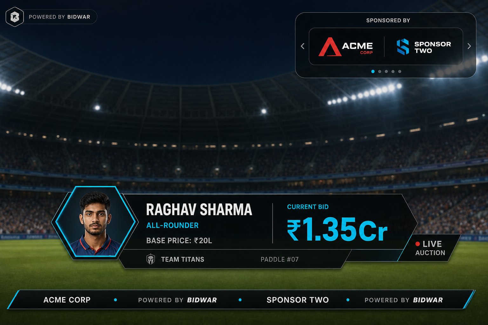

# Broadcast Overlay

BidWar’s **Broadcast Overlay** is a transparent, real-time browser overlay for live streaming franchise auctions. It is optimized for **landscape 16:9** at **1920×1080** and works with any broadcast software that supports a **Browser Source** (OBS, vMix, Wirecast, XSplit, StreamYard, etc.).

The internal URL path remains `/tournament/:id/obs` for backward compatibility. User-facing copy uses **Broadcast Overlay** terminology.

## Broadcast Info

| Field | Value |
|-------|--------|
| **Recommended Resolution** | 1920 × 1080 |
| **Aspect Ratio** | 16:9 |
| **Update Method** | Real-time automatic updates |
| **Usage** | Browser Source compatible |

Portrait / mobile overlay layouts are **Phase 2**. The overlay may remain visible on mobile browsers, but the primary design target is landscape broadcast output.

## Quick Setup

1. **Copy Broadcast Overlay URL** — from the tournament Links page.
2. **Open OBS, vMix, Wirecast** (or your preferred broadcast app).
3. **Add Browser Source** — paste the overlay URL.
4. **Set Width = 1920**
5. **Set Height = 1080**
6. **Done** — overlay syncs with the live auction automatically.

Enable a transparent background in your broadcast software if the source supports it.

## Safe area (1920×1080)

The overlay canvas is fixed at 1920×1080 with `overflow: hidden`. Critical elements are positioned inside an action-safe region (~5% inset):

- **Sponsor carousel** — top-right, inside horizontal safe margin
- **Player card & bid panel** — lower-third, full width with horizontal padding
- **Team purse ticker** — above sponsor ribbon when teams are loaded
- **Sponsor ribbon** — bottom edge with safe inset padding

Constants live in `artifacts/auction-platform/src/lib/broadcast-overlay.ts`.

## BidWar branding

Subtle, permanent branding (FanCode / CricHeroes style) — always visible on stream:

| Element | Placement | Size |
|---------|-----------|------|
| **Brand mark** | Top-left, inside safe inset (`40px` left, `32px` top) | Logo `22px` tall + “Powered by BidWar” caption |
| **Tournament logo** | Stacked below brand mark (when configured) | Unchanged |
| **Ticker credit** | Bottom ribbon, between sponsor names | Same ribbon typography as sponsors |

- Sponsor carousel (top-right) remains larger and primary.
- Brand mark `z-index: 35` — visible during auction, pause/break, player transitions, and outcome banners.
- Bottom ticker always shows at least “Powered by BidWar”; with sponsors, credit is interleaved after each sponsor name.

## Related surfaces

| Surface | Purpose |
|---------|---------|
| LED Big Screen (`/display`) | Venue projector / TV |
| Broadcast Overlay (`/obs`) | Streaming browser source |
| Live Auction Viewer (`/liveviewer`) | Spectator watch page |
