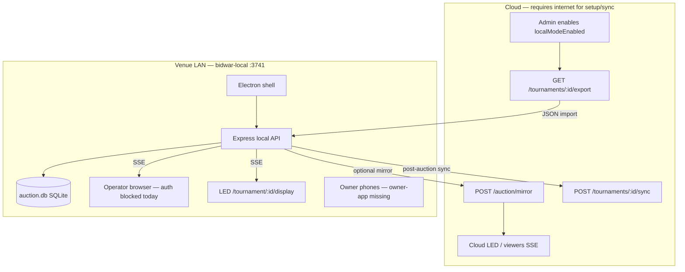

# BidWar Local Mode — Complete Audit & Architecture Guide

**Last updated:** June 2026  
**Scope:** Evidence from codebase only (`artifacts/bidwar-local`, `lib/db-local`, cloud export/sync/mirror, `auction-platform` setup UI).  
**Audience:** Engineering, product, and venue operations.

---

## Table of contents

1. [Executive summary](#executive-summary)
2. [What Local Mode is (as implemented)](#what-local-mode-is-as-implemented)
3. [Audit answers (12 questions)](#audit-answers-12-questions)
4. [File-by-file evidence map](#file-by-file-evidence-map)
5. [Architecture diagram](#architecture-diagram)
6. [Electron vs other approaches](#electron-vs-other-approaches)
7. [Production gaps & roadmap](#production-gaps--roadmap)
8. [Recommendations](#recommendations)

---

## Executive summary

BidWar Local Mode is a **partially implemented** offline/LAN auction system. The core idea is sound:

```text
One venue computer runs a local API + SQLite database.
Operator, team owners, and LED display connect over the same Wi‑Fi (LAN).
Internet is only required for setup (export) and optional sync — not during the live auction.
```

| Question | Answer |
|----------|--------|
| Run auction with zero internet? | **Yes, only via BidWar Local after import** — not via cloud-only |
| Local storage? | **SQLite (`auction.db`) on the auction PC** |
| Still needs cloud? | **Setup, optional live mirror, final sync, admin enablement, installer** |
| Internet drops mid-auction (cloud)? | **SSE reconnects; UI goes stale; mutations fail** |
| Internet drops mid-auction (local)? | **LAN auction continues; cloud mirror/sync pauses** |
| Offline database? | **Yes — `lib/db-local` + libSQL/SQLite** |
| Sync back to cloud? | **Mirror (live) + sync queue worker + manual `/sync-to-cloud`** |
| Conflicts? | **One-time export token, no merge, no dual-master guard** |
| Multiple operator screens on LAN? | **Yes (shared SSE), no leader lock** |
| LED screen on LAN without internet? | **Yes — `/tournament/:id/display` on local server** |
| Non-technical install? | **Partial — wizard exists, but nav disabled, manual sync URL, blockers** |
| % implemented | **~55–60% production-ready** |

**Important:** Electron is the **only implemented delivery path** in this repo, but it is **not the only viable architecture**. The real offline engine is the **Express local server + SQLite** (`artifacts/bidwar-local/src/server/` + `lib/db-local`). Electron mainly packages and starts that server.

---

## What Local Mode is (as implemented)

Local Mode has **two layers**:

### Layer 1 — Cloud (setup & sync)

- Admin enables `localModeEnabled` on a tournament.
- Organizer downloads a tournament export JSON (48-hour export token).
- Optional: live **mirror** of auction display state to cloud during venue auction.
- Post-auction: **sync** final results (players, purses, bids) back to cloud.

### Layer 2 — Venue (BidWar Local)

- **Electron app** (`artifacts/bidwar-local`) forks a **Node Express server** on port **3741**, bound to `0.0.0.0`.
- **SQLite database** at `{userData}/bidwar-data/auction.db` (Windows: `%APPDATA%/…`).
- Serves bundled **auction-platform** static build + local API routes.
- LAN devices (phones, LED, extra operator screens) connect to `http://<local-ip>:3741`.

There is **no** separate “local router firmware,” **no** PWA offline auction engine, and **no** service-worker fallback in the cloud app.

---

## Audit answers (12 questions)

### 1. Can an organiser run an auction if internet is completely disconnected?

#### Cloud-only: **No**

The live auction UI calls `/api/...` on the hosted API. There is no offline cache, service worker, or local fallback in `auction-platform`.

#### BidWar Local (after import): **Partially yes**

The local server starts without cloud connectivity and binds to all interfaces:

```43:45:artifacts/bidwar-local/src/server/index.ts
  app.listen(PORT, "0.0.0.0", () => {
    console.log(`BidWar Local server running on port ${PORT}`);
  });
```

Electron forks the server with a file DB path — no cloud env required:

```27:38:artifacts/bidwar-local/electron/main.ts
function startServer() {
  if (!fs.existsSync(DATA_DIR)) fs.mkdirSync(DATA_DIR, { recursive: true });

  const serverScript = path.join(__dirname, "../dist-server/index.js");
  serverProcess = fork(serverScript, [], {
    env: {
      ...process.env,
      PORT: String(SERVER_PORT),
      DB_PATH,
      NODE_ENV: "production",
    },
```

Local auction mutations write to SQLite and broadcast over in-process SSE:

```180:184:artifacts/bidwar-local/src/server/routes/auction.ts
  async function broadcastState(tournamentId: number, invalidate: string[] = []) {
    const state = await buildAuctionState(tournamentId);
    broadcastToTournament(tournamentId, { type: "auction_state", state, invalidate });
    mirrorStateToCloud(db, tournamentId);
    return state;
  }
```

**Prerequisite:** Tournament data must already be imported via `POST /local/import` (requires prior cloud export while online).

**Blocker today:** Operator panel is behind cloud auth (`OrganizerGuard`) and local server has no `/api/auth/*` routes — see [Question 10](#10-can-organisers-install-and-start-local-mode-without-technical-knowledge).

---

### 2. Which data is stored locally?

#### Database file

| Item | Location |
|------|----------|
| Path (Electron) | `{userData}/bidwar-data/auction.db` |
| Engine | libSQL/SQLite via Drizzle (`lib/db-local`) |

```10:12:artifacts/bidwar-local/electron/main.ts
const DATA_DIR = path.join(app.getPath("userData"), "bidwar-data");
const DB_PATH = path.join(DATA_DIR, "auction.db");
```

#### SQLite tables (`lib/db-local/src/setup.ts`)

| Table | Contents |
|-------|----------|
| `tournaments` | Name, purse rules, timers, `cloudId`, `cloudBaseUrl`, `exportToken`, `operatorPin` |
| `teams` | Names, colors, purse, `accessCode`, `cloudId` |
| `players` | Roster, status, prices, photo **URLs**, `cloudId` |
| `categories` | Category rules, `cloudId` |
| `bids` | Bid history during local auction |
| `auction_sessions` | Live state (current player, bid, timer, wheel, break, etc.) |
| `sync_queue` | Pending/failed cloud mirror payloads |

#### Browser storage (Electron renderer)

- `localStorage.activeTournamentId`
- `localStorage.cloudBaseUrl`
- Organizer setup checklist keys: `local_mode_{tournamentId}_step_{n}` (cloud web app only)

#### Not stored locally

- Player/team **image binaries** (only remote `photoUrl` / `logoUrl` strings)
- Owner-app bundle
- Cloud branding (falls back to defaults)
- Audit logs, SMS/WhatsApp, cheer messages

---

### 3. Which data still requires cloud APIs?

| Phase | Cloud endpoint / feature | Evidence |
|-------|--------------------------|----------|
| Admin enables feature | `localModeEnabled` on tournament | `lib/db/src/schema/tournaments.ts` |
| Export snapshot | `GET /api/tournaments/:id/export` | `artifacts/api-server/src/routes/tournaments.ts` |
| Download installer URL | `GET /api/settings/installer-url` | `artifacts/api-server/src/routes/settings.ts` |
| Organizer setup page | `useGetTournament`, export fetch | `artifacts/auction-platform/src/pages/local-mode.tsx` |
| Live mirror (optional) | `POST /api/tournaments/:id/auction/mirror` | `artifacts/bidwar-local/src/server/mirror.ts` |
| Final results sync | `POST /api/tournaments/:id/sync` | `artifacts/bidwar-local/src/server/routes/local.ts` |
| Cloud sync status panel | Polls cloud auction state every 10s | `local-mode.tsx` → `CloudSyncStatus` |
| Organizer auth (operator panel) | `/api/auth/organizer/:id/*` — **not on local server** | `artifacts/auction-platform/src/lib/auth.ts` |
| Owner bidding app | `/owner-app/*` — **not bundled in Electron** | `artifacts/bidwar-local/scripts/copy-frontend.mjs` |
| Branding | `/api/branding` (defaults on failure) | `artifacts/auction-platform/src/hooks/use-branding.ts` |
| Remote media | HTTP fetch of exported URLs | Export payload in `tournaments.ts` |

Export is gated and mints a 48-hour token:

```411:419:artifacts/api-server/src/routes/tournaments.ts
  if (!tournament.localModeEnabled) {
    res.status(403).json({ error: "Local mode is not enabled for this tournament" });
    return;
  }

  const exportToken = randomBytes(32).toString("hex");
  const exportTokenExpiresAt = new Date(Date.now() + 48 * 60 * 60 * 1000);
  await db.update(tournamentsTable).set({ exportToken, exportTokenExpiresAt }).where(eq(tournamentsTable.id, id));
```

---

### 4. If internet disconnects during a live auction, what exactly happens?

#### A) Cloud-hosted auction (normal mode)

1. **SSE stream** (`useAuctionSocket`) errors → reconnect every 3s → after 5s status becomes `"disconnected"`.
2. **Display/viewer** shows `DisplayConnectionBanner`: *"Showing last known auction state until the feed recovers."*
3. **Operator mutations** (bid, sell, next player) **fail** — no local queue.
4. **No offline persistence** of in-flight auction state on the client.

```118:125:artifacts/auction-platform/src/hooks/use-auction-socket.ts
      es.onerror = () => {
        if (es !== current) return;
        es.close();
        markReconnecting();
        if (!destroyed) {
          retryTimer = setTimeout(connect, 3000);
        }
      };
```

#### B) BidWar Local auction (LAN mode)

1. **Local auction continues** — SQLite reads/writes; LAN SSE clients keep updating.
2. **`mirrorStateToCloud`** fails silently → entry queued in `sync_queue`.
3. **Sync worker** skips when offline (Google 204 connectivity probe fails).
4. **Cloud display/viewers** on the public URL **freeze** at last successful mirror.
5. **LAN LED display** at `http://<local-ip>:3741/tournament/:id/display` **keeps working** (public route, local SSE).
6. Electron renderer shows **"Offline"** for internet; local server is unaffected.

---

### 5. Is there offline database support? If yes, where?

**Yes.**

| Layer | Path |
|-------|------|
| Schema + migrations | `lib/db-local/src/setup.ts` |
| Drizzle schemas | `lib/db-local/src/schema/*.ts` |
| Factory | `lib/db-local/src/index.ts` |
| Runtime DB (Electron) | `{userData}/bidwar-data/auction.db` |
| Server default (non-Electron) | `process.cwd()/auction.db` — `artifacts/bidwar-local/src/server/index.ts` |

```10:14:lib/db-local/src/index.ts
export async function createLocalDb(filePath: string) {
  const client = createClient({ url: `file:${filePath}` });
  await setupTables(client);
  return drizzle(client, { schema });
}
```

---

### 6. How is data synchronized back to cloud?

Three mechanisms:

#### (1) Live mirror (best-effort, during auction)

`mirrorStateToCloud` → `POST {cloudBaseUrl}/api/tournaments/{cloudId}/auction/mirror` with `X-Export-Token`.

Cloud applies session state and rebroadcasts SSE to cloud displays:

```2309:2334:artifacts/api-server/src/routes/auction.ts
  await db.update(auctionSessionsTable).set({
    status: d.status,
    currentPlayerId: d.currentPlayerCloudId ?? null,
    currentBidTeamId: d.currentBidTeamCloudId ?? null,
    ...
  }).where(eq(auctionSessionsTable.id, session.id));

  const fullState = await buildAuctionState(tid);
  broadcastToTournament(tid, { type: "auction_state", state: fullState });
```

**Mirror does not sync** sold players, bids table, or purse totals — only session/display state.

#### (2) Background sync worker (queued mirrors)

Drains `sync_queue` every 30s when online — `artifacts/bidwar-local/src/server/sync-worker.ts`.

#### (3) Manual final sync (post-auction)

Electron UI → `POST /local/sync-to-cloud` → cloud `POST /api/tournaments/:cloudId/sync` with player results, purses, bids.

Cloud marks tournament `completed` and stamps token as used (replay prevention).

---

### 7. What conflicts can occur?

| Conflict | Behavior | Evidence |
|----------|----------|----------|
| One-time sync token | Second sync with same token → HTTP 409 | `tournaments.ts` sync handler |
| Re-import wipes local state | Deletes teams/players/bids/sessions before re-insert | `local.ts` import handler |
| No merge / no conflict resolution | Sync overwrites cloud by `cloudId`; no version vectors | `tournaments.ts` sync loop |
| Dual operation (cloud + local) | No lock preventing both | Not implemented |
| Failed queue entries | HTTP error sets `failed: true` permanently — no retry | `sync-worker.ts` |
| Multiple local operators | No leader election; concurrent POSTs can race | Shared SSE map only |
| Local vs cloud ID on mirror | Maps local → cloud IDs; wrong mapping corrupts cloud session | `mirror.ts` |
| Manual sync marks all queue synced | Even if only full sync ran | `local.ts` post-sync update |

Tests cover **cloud-side token security only**: `artifacts/api-server/src/__tests__/sync.test.ts`, `mirror.test.ts`. **No integration tests for `bidwar-local`.**

---

### 8. Can multiple operator screens connect on the same local network?

**Yes, technically** — multiple browsers hit `http://<local-ip>:3741` and subscribe to the same SSE hub:

```15:33:artifacts/bidwar-local/src/server/routes/auction.ts
const sseClients = new Map<number, Set<Response>>();
...
function broadcastToTournament(tid: number, payload: unknown) {
  sseClients.get(tid)?.forEach(res => {
    try { res.write(`data: ${json}\n\n`); } catch { /* client disconnected */ }
  });
}
```

**Caveats:**

- Optional `X-Operator-Pin` on mutating routes; if unset → **open LAN access** (`auction.ts` middleware).
- No session locking — two operators can both click "Sell" or "Next player."
- Operator routes sit behind **`OrganizerGuard`** in bundled SPA (cloud auth) — see Q10.

---

### 9. Can LED screen connect locally without internet?

**Yes.**

- Display route is **public** (no `OrganizerGuard`): `artifacts/auction-platform/src/App.tsx`
- Local server serves bundled SPA + local API on `0.0.0.0:3741`
- Electron quick access opens `/tournament/:id/display`

**Caveats:**

- Logos/player photos need cached or reachable URLs (often cloud CDN).
- `/api/branding` missing locally → defaults used.
- Cheer messages, some overlays may hit cloud-only endpoints.

---

### 10. Can organisers install and start Local Mode without technical knowledge?

**Not fully — significant UX gaps.**

**What exists:**

- 6-step wizard at `/tournament/:id/local-mode` (`local-mode.tsx`)
- Electron installer pipeline (GitHub Actions + admin installer URL)
- In-app import + QR + sync UI (`renderer/index.html`)

**Blockers:**

1. **Sidebar nav disabled** — "Local Mode — coming soon", not clickable (`layout.tsx`).
2. **Admin must enable** `localModeEnabled` and set installer URL.
3. **Manual cloud URL prompt** for sync (`renderer/index.html`).
4. **Windows SmartScreen** warnings documented in wizard.
5. **Operator panel requires cloud auth** — no local `/api/auth/*`; `OrganizerGuard` redirects when not logged in.
6. **QR code is base URL only** — not owner join or display deep links (`local.ts` `/local/qr.png`).
7. **Owner phones** expect `/owner-app/join?...` — owner-app **not bundled** (`copy-frontend.mjs` copies auction-platform only).
8. **Misleading copy** — setup page implies cloud gets every bid in real time; only true when mirror succeeds over internet.

---

### 11. What percentage of Local Mode is actually implemented?

Component-level estimate (code present vs production-usable):

| Component | Est. complete | Notes |
|-----------|---------------|-------|
| Cloud flag + export/sync/mirror API | ~90% | Token security tested |
| SQLite schema + import | ~85% | Re-import is destructive |
| Local auction engine (core paths) | ~75% | Missing defer, overlay, stop-timer, cheer |
| Electron shell + LAN server | ~80% | Builds in CI |
| LAN display (LED) | ~80% | Media/branding gaps |
| Owner-app on LAN | ~0% | Not shipped in bundle |
| Local organizer auth | ~0% | Blocks operator panel |
| Sync reliability | ~60% | No retry on failed queue |
| Organizer UX / discovery | ~40% | Nav disabled, manual steps |
| End-to-end tests | ~10% | Cloud unit tests only |

**Overall: ~55–60%** of a production Local Mode story.

#### Cloud vs local auction route parity

**In cloud, not in local** (`api-server/src/routes/auction.ts` vs `bidwar-local/.../auction.ts`):

- `defer-player`
- `display-overlay`, `display-player-filter`
- `stop-timer`
- `cheer`
- Audit logging, WhatsApp notifications, license checks

---

### 12. What is missing before production release?

#### P0 — Blockers

1. Local auth or bypass for operator routes when served from `bidwar-local`.
2. Bundle or proxy **owner-app** for team-owner bidding on LAN.
3. Enable Local Mode in sidebar — remove "Coming Soon".
4. QR / deep links → display URL and per-team owner join URLs.
5. End-to-end offline test (import → run auction → sync).

#### P1 — Important

6. Automatic cloud URL on sync (stored at import; remove manual prompt).
7. Sync queue retry for `failed: true` entries.
8. Prevent concurrent cloud + local auction on same tournament.
9. Document that mirror ≠ results sync.
10. Local `/api/branding` stub or embed branding in export.
11. Cache/media strategy for offline photos/logos.
12. Operator PIN export/setup flow (schema exists; not in export payload).

#### P2 — Polish

13. Fix misleading Cloud Sync Status copy on setup page.
14. macOS/Linux installer validation (CI has targets; workflow is Windows-only).
15. Code-signed Windows installer (`CSC_IDENTITY_AUTO_DISCOVERY=false` today).
16. Multi-operator coordination (optional leader lock).
17. Integration tests for `bidwar-local` server.

---

## File-by-file evidence map

### Cloud platform (feature flag, export, sync, mirror)

| File | Role |
|------|------|
| `lib/db/src/schema/tournaments.ts` | `localModeEnabled`, `exportToken*`, mirror/sync timestamps |
| `artifacts/api-server/src/routes/tournaments.ts` | Export snapshot, sync results, gating |
| `artifacts/api-server/src/routes/auction.ts` | Cloud SSE + mirror receiver |
| `artifacts/api-server/src/routes/settings.ts` | Public installer URL |
| `artifacts/api-server/src/__tests__/sync.test.ts` | Sync token security tests |
| `artifacts/api-server/src/__tests__/mirror.test.ts` | Mirror token security tests |
| `artifacts/auction-platform/src/pages/local-mode.tsx` | Organizer 6-step setup wizard |
| `artifacts/auction-platform/src/pages/admin.tsx` | Admin toggle + installer + build pipeline UI |
| `artifacts/auction-platform/src/components/layout.tsx` | **Disabled** Local Mode nav |
| `artifacts/auction-platform/src/hooks/use-auction-socket.ts` | Cloud SSE + reconnect behavior |
| `artifacts/auction-platform/src/components/display/display-connection-banner.tsx` | Offline display UX |
| `artifacts/auction-platform/src/components/organizer-guard.tsx` | Blocks operator UI without cloud auth |
| `artifacts/auction-platform/src/lib/auth.ts` | Organizer login → `/api/auth/organizer/*` |

### BidWar Local (Electron + server)

| File | Role |
|------|------|
| `artifacts/bidwar-local/electron/main.ts` | Fork server, LAN IP, DB path |
| `artifacts/bidwar-local/electron/preload.ts` | IPC bridge |
| `artifacts/bidwar-local/renderer/index.html` | Import, QR, sync UI |
| `artifacts/bidwar-local/src/server/index.ts` | Express app, static SPA, sync worker |
| `artifacts/bidwar-local/src/server/routes/auction.ts` | Local auction + SSE |
| `artifacts/bidwar-local/src/server/routes/local.ts` | Import, sync-to-cloud, QR |
| `artifacts/bidwar-local/src/server/mirror.ts` | Live cloud mirror |
| `artifacts/bidwar-local/src/server/sync-worker.ts` | Queue drain |
| `artifacts/bidwar-local/src/server/routes/{tournaments,teams,players,categories}.ts` | CRUD on SQLite |
| `artifacts/bidwar-local/scripts/copy-frontend.mjs` | Bundle auction-platform only (not owner-app) |
| `artifacts/bidwar-local/package.json` | Electron build/package scripts |
| `.github/workflows/build-electron.yml` | Windows CI release |

### Local database

| File | Role |
|------|------|
| `lib/db-local/src/index.ts` | SQLite client factory |
| `lib/db-local/src/setup.ts` | DDL + migrations |
| `lib/db-local/src/schema/*.ts` | Table definitions incl. `sync_queue` |

### Not Local Mode (do not confuse)

| File | Role |
|------|------|
| `scripts/src/verify-local.ts` | Dev stack smoke test (Vite + API), **not** BidWar Local Electron |

---

## Architecture diagram

### As implemented today



### Intended venue network (from setup wizard)

```text
                    ┌─────────────────────┐
                    │   Auction Computer   │
                    │  BidWar Local :3741  │
                    └──────────┬──────────┘
                               │ Wi‑Fi
                    ┌──────────▼──────────┐
                    │    Venue Router      │
                    └──────────┬──────────┘
              ┌────────────────┼────────────────┐
              │                │                │
     ┌────────▼────────┐ ┌─────▼─────┐ ┌───────▼────────┐
     │  Operator panel  │ │ Owner     │ │ LED display    │
     │  (browser)       │ │ phones    │ │ (browser)      │
     └──────────────────┘ └───────────┘ └────────────────┘
```

**Note:** There is no custom router software — any standard Wi‑Fi router works. The auction computer **is** the LAN server.

---

## Electron vs other approaches

### Is Electron the only way?

**In this repo: yes — it is the only implemented offline/LAN path.**

**In general: no.** Electron is a **packaging choice**. The offline engine is:

```text
Express local API  +  SQLite  +  LAN SSE  +  static SPA
```

That stack can run **without** Electron.

### What exists in this codebase

| Approach | In repo? | Notes |
|----------|----------|-------|
| Electron + local Express + SQLite | **Yes** | `artifacts/bidwar-local/` |
| “Local router” as separate hardware/firmware | **No** | Wi‑Fi diagram + `0.0.0.0:3741` bind only |
| PWA / service worker offline auction | **No** | No offline bid engine in browser |
| Cloud app working fully without internet | **No** | Needs live API + SSE |
| Standalone local server without Electron | **Partially** | `dist-server/index.js`; Electron only forks it |

### Alternative approaches (not implemented)

#### 1. Standalone local server (recommended simplification)

**Same backend, no Electron.**

- Run `node dist-server/index.js` or a single packaged `.exe` (pkg / Node SEA).
- Windows Service or desktop shortcut → browser opens `http://<lan-ip>:3741`.

| Pros | Cons |
|------|------|
| Smaller than Electron (~150MB+) | Less hand-holding for non-technical users |
| Simpler updates/debugging | Still need installer + auto-start |
| Reuses existing SQLite + SSE | |

**Best for:** Fastest path to production with least new code.

#### 2. Tauri or lightweight desktop wrapper

Same model as Electron; uses system WebView instead of bundled Chromium.

| Pros | Cons |
|------|------|
| Smaller install, lower RAM | Still a desktop app; WebView quirks |

**Best for:** Desktop launcher if Electron feels too heavy.

#### 3. Dedicated mini PC / laptop as auction server

Auction laptop runs local server; venue uses a normal Wi‑Fi router.

| Pros | Cons |
|------|------|
| Simple, reliable | Laptop must stay on and on Wi‑Fi |
| No router firmware | |

**Best for:** Real venues — matches current Local Mode docs.

#### 4. Offline-capable PWA (browser only)

**Not a good fit for BidWar as-is.**

Browsers cannot host the auction **server** for other phones on the LAN. Would require major rewrite (IndexedDB, sync, conflict handling).

**Best for:** Read-only caching — not multi-device live auction.

#### 5. “Cache cloud on LAN” / local reverse proxy

Helps **slow** internet, not **zero** internet — mutations still need cloud.

#### 6. Full cloud stack locally (Postgres + api-server)

Possible for dev (`pnpm dev`) — **not suitable for venues** (heavy, needs Postgres).

### Practical ranking for BidWar

1. **Standalone local server + simple Windows installer** — easiest production path  
2. **Keep Electron** — if built-in import/QR/sync UI matters for non-technical users  
3. **Tauri wrapper** — if install size matters  
4. **PWA-only** — avoid  
5. **Custom local router firmware** — avoid  

### Electron does not fix current gaps

Even with Electron, these block a smooth offline venue run:

- Operator panel needs cloud auth — local server has no `/api/auth/*`
- Owner bidding needs `/owner-app` — not bundled
- Sidebar still says "Local Mode — coming soon"

---

## Production gaps & roadmap

### Suggested phases

#### Phase 1 — Make local server usable (P0)

- [ ] Local auth stub or `OrganizerGuard` bypass when `mode: local` / same origin on `:3741`
- [ ] Bundle owner-app into local static serve (or proxy)
- [ ] Enable sidebar link to `/tournament/:id/local-mode`
- [ ] QR codes → display URL + per-team owner join URLs
- [ ] E2E test script: export → import → bid → sell → sync

#### Phase 2 — Reliability (P1)

- [ ] Auto cloud URL on sync (from import metadata)
- [ ] Retry failed `sync_queue` entries with backoff
- [ ] Guard against simultaneous cloud + local auction
- [ ] Export branding + operator PIN in snapshot
- [ ] Offline media cache or embed critical logos in export

#### Phase 3 — Product polish (P2)

- [ ] Evaluate Electron vs standalone installer vs Tauri
- [ ] Code-signed Windows installer
- [ ] macOS/Linux smoke tests
- [ ] Optional multi-operator leader lock
- [ ] Fix misleading sync status copy on setup page

---

## Recommendations

### Short term

1. **Treat `bidwar-local` Express server as the product** — not Electron specifically.
2. **Fix P0 blockers** (local auth, owner-app, nav, deep links) before shipping installers to organisers.
3. **Do not invest in PWA-only offline** — wrong architecture for multi-device LAN auction.

### Medium term

4. **Consider dropping full Electron** for a lighter **“BidWar Local Service”**:
   - Node binary or small NSIS installer
   - Optional thin launcher for import/QR/sync only
   - Browser for operator + display + owner UI

5. **Keep cloud mirror optional** — venue LAN is authoritative during auction; sync is post-event or when online.

### Long term

6. **Document operator playbook:** export window (48h), same Wi‑Fi, LED URL, owner links, sync once at end.
7. **Add integration tests** under `artifacts/bidwar-local/` mirroring cloud auction tests.

---

## Related files & workflows

| Resource | Path |
|----------|------|
| Windows build CI | `.github/workflows/build-electron.yml` |
| Admin installer settings | `artifacts/auction-platform/src/pages/admin.tsx` (Local App Installer / Windows Build Pipeline) |
| Prior audit notes (attached) | `attached_assets/Pasted-IMPORTANT-SYSTEM-AUDIT-TASK-...txt` |
| Dev smoke test (not Local Mode) | `scripts/src/verify-local.ts` |

---

## Glossary

| Term | Meaning |
|------|---------|
| **Local Mode** | Cloud feature flag + venue offline stack |
| **BidWar Local** | Electron app + embedded Express + SQLite |
| **Mirror** | Live push of display/session state to cloud (not full results) |
| **Sync** | One-time push of final player/purse/bid results to cloud |
| **Export token** | 48-hour secret for mirror + sync authentication |
| **LAN** | Local Wi‑Fi; devices use auction PC IP (e.g. `192.168.1.5:3741`) |

---

*This document reflects codebase state as of the audit date. Re-verify before release planning.*
