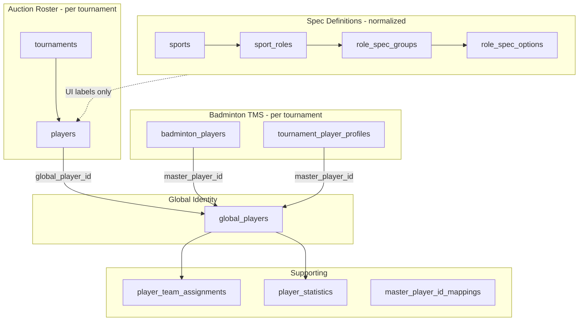
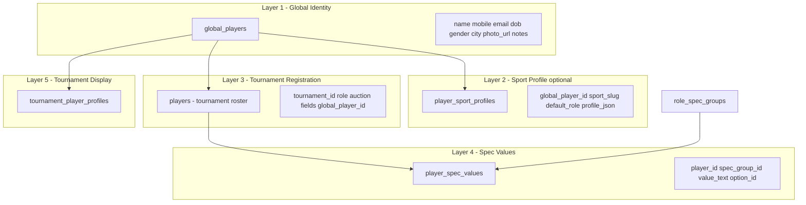

# Multi-Sport Player Architecture Report

**Project:** BidWar  
**Date:** 24 June 2026  
**Status:** Audit only — no implementation  
**Scope:** Player identity, sport specifications, persistence, sync, and presentation across auction, badminton, and future sports.

---

## Executive Summary

BidWar has a **split-brain player model**:

| Layer | Multi-sport ready? | Notes |
|-------|-------------------|-------|
| Spec definitions (`sports`, `sport_roles`, `role_spec_groups`, `role_spec_options`) | **Yes** | Admin-configurable per sport/role |
| Registration UI | **Partially** | Sport-aware labels; cricket column mapping underneath |
| Persistence (`players` table) | **No** | Three cricket-named columns for all sports |
| Global identity (`global_players`) | **Partially** | One row per person, but sport fields overwrite on sync |
| Badminton scoring (`badminton_players`) | **Separate** | Not auto-linked to auction badminton specs |
| Presentation (LED, exports, search) | **No** | Cricket terminology and role codes hardcoded |

**Recommended direction:** Introduce normalized **tournament player spec values** keyed to `role_spec_groups`, slim `global_players` to identity-only, add optional **sport profiles** for cross-tournament sport context, and refactor presentation to consume spec metadata — not cricket column names.

---

## 1. Current Architecture

### 1.1 Conceptual model (as implemented today)



### 1.2 Tables that exist vs. tables that do not

| Table | Exists | Role |
|-------|--------|------|
| `global_players` | Yes | Cross-tournament person identity (`gp_*`) |
| `players` | Yes | Auction tournament roster (acts as `tournament_players`) |
| `tournament_player_profiles` | Yes | Tournament display identity (initials, photo override) |
| `badminton_players` | Yes | Badminton TMS/scoring player records |
| `sport_roles` / `role_spec_groups` / `role_spec_options` | Yes | Spec **definitions** only |
| `player_team_assignments` | Yes | Franchise roster (auction sale → team) |
| `player_statistics` | Yes | Aggregates keyed by `(player_id, sport, tournament_id)` |
| `master_player_id_mappings` | Yes | Legacy module ID → master player |
| `player_profiles` | **No** | — |
| `player_specifications` | **No** | — |
| `player_attribute_values` | **No** | — |
| `tournament_players` | **No** | `players` table serves this role |

### 1.3 Spec value persistence (the core gap)

Registration maps dynamic spec groups to **three fixed slots**:

```typescript
// artifacts/auction-platform/src/pages/players.tsx
const SPEC_KEYS = ["battingStyle", "bowlingStyle", "specialization"] as const;
```

| Spec slot | DB column | Badminton example | Cricket example |
|-----------|-----------|-------------------|-----------------|
| 0 | `players.batting_style` | Playing Hand → `"Right Hand"` | Batting Hand → `"Right-hand"` |
| 1 | `players.bowling_style` | Playing Style → `"Attacking"` | Bowling Style → `"Fast/Pace"` |
| 2 | `players.specialization` | Experience → `"Intermediate"` | (optional spec) |
| 3+ | **Not persisted** | Court Preference → **lost** | Bowling Arm → **lost** |

Groups beyond index 2 are held in React state (`extraSpecSelections`) but **never sent to the API** on save.

### 1.4 Global player sync behavior

`syncAuctionPlayerToMaster` (`artifacts/api-server/src/lib/master-sports/sync.ts`):

- Triggers on player create/update/register/import.
- Matches by `globalPlayerId`, `auctionPlayerId`, mobile, email, or name.
- **Updates existing `global_players` row** with latest auction player fields.
- Hardcodes `sport: "cricket"` in `buildMasterPlayerFields()` regardless of tournament sport.
- Overwrites `defaultRole`, `auctionPlayerId`, `photoUrl`, contact fields on each sync.
- Does **not** sync `battingStyle` / `bowlingStyle` / `specialization`.

**Live example — Animesh Thakur (badminton only):**

| Record | Key fields |
|--------|------------|
| `players#116` | sport tournament = badminton; `batting_style="Right Hand"`, `bowling_style="Attacking"`, `specialization="Intermediate"` |
| `global_players#gp_mqsbrdy1qy2r3` | `sport="cricket"` (wrong); `default_role="Doubles Player"`; `handedness=null`; `auction_player_id=116` |
| `badminton_players` | **No row** |
| `tournament_player_profiles` | **No row** |

**Live example — Tushar Saraswat (cricket + badminton):**

| `players` row | Tournament sport | Spec columns |
|---------------|------------------|--------------|
| #1 | cricket | all null |
| #6, #114 | badminton | all null |

Per-tournament rows are isolated, but `global_players` has a single row with `sport="cricket"`, `default_role="Singles Player"`, `auction_player_id=6` (badminton row).

### 1.5 Badminton auction vs. badminton scoring disconnect

| Path | Table | Handedness / specs |
|------|-------|-------------------|
| Badminton **auction** registration | `players` | Via `batting_style` slot (cricket column name) |
| Badminton **TMS** walk-in | `badminton_players` | `handedness` column (`R` / `L`) |
| Master sync (badminton module) | `global_players.handedness` | Populated from `badminton_players`, not from auction `players` |

A player can exist in auction badminton with specs in legacy columns and have **no** `badminton_players` row (Animesh) or a row with `handedness=null` (Tushar).

---

## 2. Dependency Map — Every Touchpoint

### 2.1 Database & schema

| File | Reads | Writes | Classification |
|------|-------|--------|----------------|
| `lib/db/src/schema/players.ts` | — | `batting_style`, `bowling_style`, `specialization`, `global_player_id` | Data model |
| `lib/db/src/schema/global_players.ts` | — | identity + `sport`, `default_role`, `handedness`, `auction_player_id` | Data model |
| `lib/db/src/schema/sports.ts` | spec definitions | admin CRUD | Definition layer |
| `lib/db/src/schema/badminton.ts` | — | `badminton_players.handedness`, `master_player_id` | Parallel data model |
| `lib/db/src/schema/tournament-player-profiles.ts` | display overrides | initials, photo | Tournament identity |
| `lib/db/src/schema/master-sports.ts` | assignments, stats | `player_team_assignments`, `player_statistics` | Cross-sport meta |
| `lib/db-local/src/schema/players.ts` | local mirror | same 3 legacy columns | Offline parity |

### 2.2 API routes

| Route / file | Operations |
|--------------|------------|
| `artifacts/api-server/src/routes/players.ts` | CRUD, bulk CSV, public register, import-from-tournament — all read/write legacy spec columns; calls `syncAuctionPlayerToMasterAsync` |
| `artifacts/api-server/src/routes/global-players.ts` | Search autocomplete reads latest `players` row styles + `global_player_id` |
| `artifacts/api-server/src/routes/sports.ts` | Spec group/option CRUD (definitions only) |
| `artifacts/api-server/src/routes/auction.ts` | SSE/state serializes player with legacy fields |
| `artifacts/api-server/src/routes/tournaments.ts` | Local export snapshot includes legacy fields |
| `artifacts/api-server/src/routes/badminton.ts` | Separate CRUD for `badminton_players.handedness` |
| `artifacts/bidwar-local/src/server/routes/players.ts` | Local mode parity |

### 2.3 Services & sync

| Service | Behavior |
|---------|----------|
| `lib/master-sports/sync.ts` | Auction → global identity; sport hardcoded; overwrites on match |
| `lib/master-sports/badminton.ts` | Badminton TMS ↔ global; optional auction link |
| `lib/master-sports/migrate-badminton.ts` | One-time badminton → master migration |
| `lib/master-sports/cricket-roster.ts` | Roster sync uses global player ID |
| `lib/serializers/player.ts` | All serializers expose `battingStyle`, `bowlingStyle`, `specialization` |
| `lib/serializers/global-player.ts` | Search DTO includes legacy spec fields from `players` |

### 2.4 Registration flows

| UI | File | Spec handling |
|----|------|---------------|
| Organizer add/edit | `pages/players.tsx` | Dynamic groups → `SPEC_KEYS` mapping; extra groups UI-only |
| Public register | `pages/player-register.tsx` | Same slot mapping |
| Badminton TMS | `pages/badminton/players.tsx` | Separate form; `handedness` on `badminton_players` |
| Admin spec config | `components/admin/sports-panel.tsx` | Manages definitions only |

### 2.5 Display & consumption

| Surface | File | Cricket coupling |
|---------|------|------------------|
| LED portrait | `components/display/v1/PlayerPortrait.tsx` | Label `"Bat"`, value `battingHand` |
| LED side panel | `components/display/side/SidePlayerProfilePanel.tsx` | `"Batting"`, `"Bowling"` labels |
| LED view hook | `lib/led-view/use-led-view.ts` | `mapRole` → BAT/BOWL/AR/WK; `mapHand(battingStyle)` |
| LED types | `lib/led-view/types.ts` | `LedRoleCode`, `battingHand` |
| Live viewer | `pages/liveviewer.tsx` | Reads legacy API fields |
| Auction operator | `pages/auction-operator.tsx` | Dynamic labels via `useRoleSpecGroups`; values from legacy fields |
| Owner app | `owner-app/src/screens/LiveBid.tsx` | Types include `battingStyle` / `bowlingStyle` |
| Player overlay | `components/display/player-overlay.tsx` | Generic `role` string only |
| Demo / lovable | `lovableupdates/src/lib/*` | Full cricket LED pipeline duplicate |

### 2.6 Reports & exports

| File | Legacy columns exported |
|------|-------------------------|
| `lib/export-players-excel.ts` | Batting Style, Bowling Style, Specialization, CricHero URL |
| `pages/players.tsx` | CSV template + parse aliases |
| `routes/players.ts` | Import-candidates copies all legacy fields |

### 2.7 Search & autocomplete

| Endpoint | Behavior |
|----------|----------|
| `GET /global-players/search` | Dedupes by mobile; returns **most recent** `players` row including legacy specs — can bleed sport A specs into sport B registration prefill |

### 2.8 Tests & seeds

| File | Notes |
|------|-------|
| `scripts/src/seed-sports.ts` | Cricket spec definitions; badminton roles without seed specs |
| `__tests__/security-hardening.test.ts` | Mock players with null specs |
| `__tests__/badminton-auction-franchise.test.ts` | `globalPlayerId` franchise lookup |

### 2.9 Dependency flow (read path for LED)

```
players.batting_style
  → API Player.battingStyle
  → use-led-view mapHand()
  → LedPlayer.battingHand
  → PlayerPortrait Stat label="Bat" → screen "BAT"
```

Role path:

```
players.role (free text, e.g. "Doubles Player")
  → mapRole() heuristic
  → LedRoleCode "AR" (default) or "BAT" if string contains "bat"
  → ROLE_LABEL → "All-Rounder" / "Batter"
```

---

## 3. Problems (Consolidated)

| # | Problem | Evidence |
|---|---------|----------|
| P1 | Spec definitions normalized; values denormalized into cricket columns | `SPEC_KEYS` → `players.batting_style` etc. |
| P2 | Only 3 spec groups persist; 4+ silently dropped | `extraSpecSelections` not in save payload |
| P3 | No `player_specifications` / attribute value table | DB audit: tables do not exist |
| P4 | `global_players.sport` hardcoded to `"cricket"` on sync | `sync.ts` `buildMasterPlayerFields` |
| P5 | Global row overwritten on each sync (`default_role`, `auction_player_id`) | `syncAuctionPlayerToMaster` update path |
| P6 | Auction badminton and `badminton_players` disconnected | Animesh: auction row only; no TMS row |
| P7 | LED/display uses cricket labels and role codes for all sports | `PlayerPortrait`, `mapRole`, `LedRoleCode` |
| P8 | Global search prefills wrong sport specs | Autocomplete from latest `players` row |
| P9 | `player_statistics.sport` can be `"cricket"` for badminton tournaments | Tushar stats rows |
| P10 | OpenAPI / generated client locked to cricket field names | `openapi.yaml`, `api.schemas.ts` |
| P11 | Local mode and cloud must stay in sync | `lib/db-local`, `bidwar-local` routes |
| P12 | `cricheroUrl` cricket-only field on universal player model | schema + register UI |

---

## 4. Recommended Target Architecture

### 4.1 Design principles

1. **Global identity is sport-neutral** — one person, one row, no sport-specific attributes.
2. **Sport profiles are optional and additive** — a person can have cricket + badminton + tennis profiles simultaneously.
3. **Tournament registration stores spec values in normalized rows** — unlimited groups per role.
4. **Presentation reads spec metadata** — labels from `role_spec_groups.group_name`, values from normalized storage.
5. **Backward compatible reads during migration** — dual-read legacy columns until cutover.

### 4.2 Layer model



### 4.3 Proposed tables

#### `global_players` (slimmed — migration alters existing)

**Keep:** `id`, `canonical_name`, `first_name`, `last_name`, `display_name`, `mobile_number`, `email`, `dob`, `gender`, `city`, `photo_url`, `notes`, timestamps.

**Remove or deprecate:** `sport`, `default_role`, `handedness`, `auction_player_id` (move to sport profiles or tournament links).

**Rationale:** Identity only. No "last sync wins" sport fields.

#### `player_sport_profiles` (new)

One row per `(global_player_id, sport_slug)`.

| Column | Type | Notes |
|--------|------|-------|
| `id` | serial PK | |
| `global_player_id` | text FK → `global_players.id` | |
| `sport_slug` | text FK → `sports.slug` | cricket, badminton, tennis, … |
| `default_role` | text nullable | Sport-level preferred role |
| `profile_json` | jsonb nullable | Sport-specific extras (BWF code, rankings) |
| `created_at` / `updated_at` | timestamptz | |

**Unique:** `(global_player_id, sport_slug)`

**Examples:**

| Person | cricket profile | badminton profile |
|--------|-----------------|-------------------|
| Tushar | `default_role: "All-Rounder"` | `default_role: "Singles Player"` |
| Animesh | (none) | `default_role: "Doubles Player"`, `profile_json: { handedness: "R" }` |

#### `player_spec_values` (new)

Normalized tournament-player spec storage.

| Column | Type | Notes |
|--------|------|-------|
| `id` | serial PK | |
| `player_id` | int FK → `players.id` ON DELETE CASCADE | Tournament roster row |
| `spec_group_id` | int FK → `role_spec_groups.id` | Links to definition + label |
| `value_text` | text NOT NULL | Selected option name or free text |
| `created_at` / `updated_at` | timestamptz | |

**Unique:** `(player_id, spec_group_id)`

**Examples — Animesh, badminton Doubles Player, tournament 5:**

| spec_group_id | group_name (from definition) | value_text |
|---------------|------------------------------|------------|
| 42 | Playing Hand | Right Hand |
| 43 | Playing Style | Attacking |
| 44 | Experience | Intermediate |
| 45 | Court Preference | Back Court Specialist |

#### `players` (existing — reduced responsibility)

Keep auction/tournament fields: `tournament_id`, `serial_no`, `name`, `role`, `base_price`, auction status, team, category, contact, photo, `global_player_id`.

**Deprecate after migration:** `batting_style`, `bowling_style`, `specialization` (retain nullable during transition).

#### `tournament_player_profiles` (existing — unchanged role)

Tournament-scoped display identity for scoring/broadcast (initials, photo override). Already correct separation per `docs/master-sports-architecture.md`.

#### `badminton_players` (existing — bridge then consolidate)

**Short term:** Sync `handedness` from `player_spec_values` where group = "Playing Hand".  
**Long term:** Optionally fold into `player_sport_profiles.profile_json` + tournament registration; keep TMS row for draw/fixture foreign keys until scoring schema unifies.

### 4.4 Alternative naming (if preferred)

| This report | Equivalent |
|-------------|------------|
| `player_sport_profiles` | `player_profiles` scoped by sport |
| `player_spec_values` | `player_attribute_values` keyed to `role_spec_groups` |

Single naming convention should be chosen before implementation; semantics above are the source of truth.

### 4.5 API shape (target)

```typescript
// Tournament player response (additive)
type Player = {
  id: number;
  tournamentId: number;
  name: string;
  role: string | null;
  globalPlayerId: string | null;
  // New
  specifications: Array<{
    specGroupId: number;
    groupName: string;
    displayOrder: number;
    value: string;
  }>;
  // Deprecated (dual-read period)
  battingStyle?: string | null;
  bowlingStyle?: string | null;
  specialization?: string | null;
};

// Global player — identity only
type GlobalPlayer = {
  id: string;
  canonicalName: string;
  mobileNumber: string | null;
  // ...
  sportProfiles: Array<{
    sportSlug: string;
    defaultRole: string | null;
    profileJson: Record<string, unknown> | null;
  }>;
};
```

### 4.6 Sync redesign

| Current | Target |
|---------|--------|
| `buildMasterPlayerFields` sets `sport: "cricket"` | Sync identity fields only |
| Overwrites `default_role` on global row | Upsert `player_sport_profiles` for tournament's sport |
| Single `auction_player_id` on global | Track per-tournament link on `players.global_player_id` only |
| No spec sync | Optionally upsert sport profile `profile_json` from spec values (not global row) |

### 4.7 Multi-sport isolation (target behavior)

**Same player — Cricket + Badminton:**

```
global_players (gp_x)
├── player_sport_profiles (gp_x, cricket)   → default_role: Batsman
├── player_sport_profiles (gp_x, badminton) → default_role: Doubles Player
├── players#10 (tournament 4, cricket)    → player_spec_values: Batting Hand=Right-hand
└── players#116 (tournament 5, badminton) → player_spec_values: Playing Hand=Right Hand, Court Preference=...
```

No overwrite between sports. Global row unchanged except identity fields.

**Same player — Badminton + Tennis (future):**

```
global_players (gp_x)
├── player_sport_profiles (gp_x, badminton)
├── player_sport_profiles (gp_x, tennis)   → default_role: Singles; profile_json: { backhand: "Two-handed" }
└── separate players rows per tournament with normalized spec values
```

Tennis requires adding `sports` seed row + roles/spec groups only — no new persistence pattern.

---

## 5. Database Design (DDL Sketch)

```sql
-- Sport-level profile (new)
CREATE TABLE player_sport_profiles (
  id SERIAL PRIMARY KEY,
  global_player_id TEXT NOT NULL REFERENCES global_players(id) ON DELETE CASCADE,
  sport_slug TEXT NOT NULL REFERENCES sports(slug),
  default_role TEXT,
  profile_json JSONB,
  created_at TIMESTAMPTZ NOT NULL DEFAULT NOW(),
  updated_at TIMESTAMPTZ NOT NULL DEFAULT NOW(),
  UNIQUE (global_player_id, sport_slug)
);

-- Normalized spec values (new)
CREATE TABLE player_spec_values (
  id SERIAL PRIMARY KEY,
  player_id INTEGER NOT NULL REFERENCES players(id) ON DELETE CASCADE,
  spec_group_id INTEGER NOT NULL REFERENCES role_spec_groups(id),
  value_text TEXT NOT NULL,
  created_at TIMESTAMPTZ NOT NULL DEFAULT NOW(),
  updated_at TIMESTAMPTZ NOT NULL DEFAULT NOW(),
  UNIQUE (player_id, spec_group_id)
);

CREATE INDEX ix_psv_player_id ON player_spec_values (player_id);
CREATE INDEX ix_psv_spec_group_id ON player_spec_values (spec_group_id);
CREATE INDEX ix_psp_global_player_id ON player_sport_profiles (global_player_id);
```

**Optional view for backward compatibility:**

```sql
CREATE VIEW player_legacy_specs AS
SELECT
  psv.player_id,
  MAX(CASE WHEN rsg.display_order = 0 THEN psv.value_text END) AS batting_style,
  MAX(CASE WHEN rsg.display_order = 1 THEN psv.value_text END) AS bowling_style,
  MAX(CASE WHEN rsg.display_order = 2 THEN psv.value_text END) AS specialization
FROM player_spec_values psv
JOIN role_spec_groups rsg ON rsg.id = psv.spec_group_id
GROUP BY psv.player_id;
```

---

## 6. Migration Plan

### 6.1 Phases

| Phase | Action |
|-------|--------|
| M0 | Add new tables; no behavior change |
| M1 | Backfill `player_spec_values` from legacy columns |
| M2 | Dual-write on create/update (legacy + normalized) |
| M3 | Dual-read (prefer normalized; fallback legacy) |
| M4 | Fix global sync + sport profiles backfill |
| M5 | UI/API switch to `specifications[]` |
| M6 | Deprecate legacy columns (nullable, stop writing) |
| M7 | Drop legacy columns (major version) |

### 6.2 Backfill algorithm

For each `players` row with non-null spec columns:

1. Resolve `tournament.sport` → `sport_roles` → player's `role`.
2. Load `role_spec_groups` ordered by `display_order`.
3. Map:
   - `batting_style` → spec group at `display_order = 0`
   - `bowling_style` → spec group at `display_order = 1`
   - `specialization` → spec group at `display_order = 2`
4. Insert `player_spec_values` rows where value non-empty.
5. Log rows where legacy value exists but no matching spec group (manual review queue).

**Known data loss:** Values for spec groups at index 3+ were never stored — cannot backfill Court Preference for historical players unless re-entered.

### 6.3 Global players migration

1. For each `global_players` row, insert `player_sport_profiles` from linked `players` rows grouped by tournament sport.
2. Clear `global_players.sport`, `default_role`, `handedness`, `auction_player_id` after backfill (or leave deprecated nullable).
3. Fix `sync.ts` to upsert sport profile instead of overwriting global sport fields.

### 6.4 Badminton bridge

1. For `badminton_players` with `master_player_id`, sync `handedness` into `player_sport_profiles.profile_json` for badminton.
2. When auction badminton player linked, copy Playing Hand spec → `badminton_players.handedness` (R/L mapping) on TMS sync job.

### 6.5 Rollback strategy

| Phase | Rollback |
|-------|----------|
| M0–M1 | Drop new tables; no app change |
| M2 | Stop dual-write; legacy columns still authoritative |
| M3 | Read legacy only via feature flag `PLAYER_SPECS_SOURCE=legacy` |
| M5+ | Keep legacy columns populated until M7; re-enable dual-write |

**Feature flag:** `PLAYER_SPECS_V2_ENABLED` controls read/write path.

### 6.6 Backward compatibility

| Consumer | Compatibility approach |
|----------|------------------------|
| OpenAPI clients | Keep deprecated fields populated from normalized data during M2–M6 |
| CSV import/export | Accept old headers; map columns to spec groups by sport+role |
| Local mode | Mirror `player_spec_values` in SQLite or serialize in sync payload |
| LED (until UI phase) | Adapter maps first 3 spec values → `battingHand` for zero UI change in M3 |

---

## 7. UI Refactor Plan

### 7.1 Classification of cricket terminology

| Item | Class | Fix |
|------|-------|-----|
| `players.batting_style` column | **Data model** | Deprecate; use `player_spec_values` |
| `SPEC_KEYS` slot mapping | **Functional** | Save all groups to `player_spec_values` |
| `mapRole` → BAT/BOWL/AR/WK | **Functional** | Use `roleRaw` / sport role string on LED; drop cricket codes |
| `LedRoleCode` type | **Data model** | Replace with `string` or `{ code, label }` |
| `mapHand(battingStyle)` | **Functional** | Resolve "hand" spec by group name per sport |
| `PlayerPortrait` label `"Bat"` | **Cosmetic** | Dynamic label from spec group (e.g. "Hand") |
| `SidePlayerProfilePanel` "Batting"/"Bowling" | **Cosmetic** | Render from `specifications[]` |
| Fallback roles Batsman/Bowler/… | **Functional** | Load from `sport_roles` API only |
| `cricheroUrl` | **Data model** | Move to `player_sport_profiles.profile_json.cricket` or sport extension table |
| Excel "Batting Style" headers | **Cosmetic** | Dynamic columns from spec groups per sport |
| `live-scoring-pad` BAT/BOWL team codes | **Cosmetic** | Scoring domain; out of player refactor scope |
| Demo/mockup IPL data | **Cosmetic** | Update when demo refreshed |

### 7.2 Refactor sequence

1. **API:** Add `specifications[]` to player serializers (read normalized + legacy fallback).
2. **Registration:** Replace `SPEC_KEYS` save with bulk upsert to `player_spec_values`.
3. **Hooks:** Extend `useRoleSpecGroups` to return full group IDs for save/load.
4. **LED:** New `usePlayerSpecs(view)` derives display stats from specifications + sport.
5. **Global search:** Return specs scoped by sport or omit specs from autocomplete (identity only).
6. **Owner app:** Consume `specifications[]` or generic key-value list.
7. **Export:** Generate columns dynamically from tournament sport roles.

### 7.3 LED target rendering

Instead of fixed Age / Bat / Base grid:

```
Age          | Playing Hand  | Base
48           | Right Hand    | ₹10,000
```

Labels from `role_spec_groups.group_name`; pick top N specs by `display_order` (configurable, default 3).

---

## 8. Risk Analysis

| ID | Issue | Severity | Impact | Migration complexity | Effort |
|----|-------|----------|--------|-------------------|--------|
| R1 | Legacy column mapping loses spec 4+ | **High** | Data never saved (Court Preference) | Medium — new table + UI save fix | **S** (1 week) |
| R2 | No normalized spec storage | **Critical** | Blocks true multi-sport | High — schema + full stack | **L** (3–4 weeks) |
| R3 | Global sync overwrites sport context | **High** | Wrong global sport/role; broken multi-sport identity | Medium — sync rewrite + backfill | **M** (1–2 weeks) |
| R4 | LED cricket labels on badminton | **Medium** | User confusion, unprofessional display | Low — presentation only | **S** (3–5 days) |
| R5 | `mapRole` corrupts non-cricket roles | **Medium** | Wrong role badge (e.g. Doubles → AR) | Low — use raw role | **S** (2–3 days) |
| R6 | Autocomplete spec bleed across sports | **Medium** | Wrong prefill on registration | Medium — scope search by sport | **S** (3 days) |
| R7 | Auction vs badminton TMS disconnect | **High** | Scoring missing handedness; duplicate entry | Medium — sync bridge job | **M** (1–2 weeks) |
| R8 | OpenAPI / generated client breaking change | **High** | All API consumers | High — additive fields first | **M** (included in R2) |
| R9 | Local mode drift | **Medium** | Offline tournaments break | Medium — mirror schema | **M** (1 week) |
| R10 | CSV import/export regression | **Medium** | Organizer workflows | Medium — dynamic mapping | **M** (1 week) |
| R11 | Historical data — lost 4th spec | **Low** | No recovery without re-entry | Low — document only | **XS** |
| R12 | `player_statistics.sport` mis-tagged | **Low** | Wrong analytics buckets | Low — backfill script | **XS** (1 day) |

**Effort key:** XS = 1–2 days, S = 3–5 days, M = 1–2 weeks, L = 3–4 weeks (one engineer, includes tests).

---

## 9. Phased Implementation Roadmap

### Phase 0 — Audit & flags (complete)

- [x] Document current architecture (this report)
- [ ] Add feature flags: `PLAYER_SPECS_V2_ENABLED`, `PLAYER_SPECS_SOURCE`

### Phase 1 — Schema foundation (week 1)

- Create `player_spec_values`, `player_sport_profiles`
- Drizzle schemas + indexes
- Backfill script from legacy columns
- Unit tests for backfill mapping

**Exit criteria:** 100% of non-null legacy spec values represented in normalized rows for active tournaments.

### Phase 2 — API dual-write / dual-read (weeks 2–3)

- Player create/update/register/import writes both paths
- Serializers return `specifications[]` + legacy fields (legacy populated from normalized)
- Global player search: identity-only or sport-filtered specs
- OpenAPI additive update + regenerate client

**Exit criteria:** New badminton player with 4 spec groups persists all 4; API returns all 4.

### Phase 3 — Global sync fix (week 3–4)

- Remove `sport: "cricket"` hardcode
- Upsert `player_sport_profiles` per tournament sport
- Stop overwriting global identity fields from unrelated tournaments
- Backfill sport profiles for existing global players

**Exit criteria:** Tushar-type multi-sport player has two sport profile rows; global row sport-neutral.

### Phase 4 — Registration UI (week 4)

- Remove `SPEC_KEYS` limit
- Load/save all spec groups via `player_spec_values`
- Public register parity

**Exit criteria:** Court Preference persists and reloads on edit.

### Phase 5 — Presentation layer (weeks 5–6)

- LED: dynamic spec labels; drop `LedRoleCode` / `mapRole` for display
- Operator, liveviewer, side panel, owner app
- Export/import dynamic columns

**Exit criteria:** Badminton LED shows "Playing Hand" not "BAT"; role shows "Doubles Player".

### Phase 6 — Badminton bridge (week 6–7)

- Auction → `badminton_players` handedness sync
- TMS create links to auction player when same mobile
- Optional: populate `tournament_player_profiles` from auction registration

**Exit criteria:** Animesh-type player appears in badminton TMS with correct handedness without re-entry.

### Phase 7 — Legacy deprecation (week 8+)

- Stop writing `batting_style`, `bowling_style`, `specialization`
- Local mode migrated
- Monitor; then drop columns in major release

**Exit criteria:** No code references legacy columns; migration complete.

---

## 10. Files Requiring Change (Implementation Checklist)

### Database

- `lib/db/src/schema/players.ts` — deprecate spec columns
- `lib/db/src/schema/global_players.ts` — slim identity
- **New:** `lib/db/src/schema/player-spec-values.ts`
- **New:** `lib/db/src/schema/player-sport-profiles.ts`
- `lib/db/src/index.ts` — DDL ensures
- `lib/db-local/*` — parity

### API

- `artifacts/api-server/src/routes/players.ts`
- `artifacts/api-server/src/routes/global-players.ts`
- `artifacts/api-server/src/lib/serializers/player.ts`
- `artifacts/api-server/src/lib/serializers/global-player.ts`
- `artifacts/api-server/src/lib/master-sports/sync.ts`
- `artifacts/api-server/src/lib/master-sports/badminton.ts`
- `lib/api-spec/openapi.yaml`

### Frontend

- `artifacts/auction-platform/src/pages/players.tsx`
- `artifacts/auction-platform/src/pages/player-register.tsx`
- `artifacts/auction-platform/src/hooks/use-role-spec-groups.ts`
- `artifacts/auction-platform/src/lib/led-view/use-led-view.ts`
- `artifacts/auction-platform/src/lib/led-view/types.ts`
- `artifacts/auction-platform/src/components/display/v1/PlayerPortrait.tsx`
- `artifacts/auction-platform/src/components/display/side/SidePlayerProfilePanel.tsx`
- `artifacts/auction-platform/src/pages/auction-operator.tsx`
- `artifacts/auction-platform/src/pages/liveviewer.tsx`
- `artifacts/auction-platform/src/lib/export-players-excel.ts`
- `artifacts/owner-app/src/screens/LiveBid.tsx`

### Scripts

- **New:** `scripts/migrate-player-spec-values.ts`
- **New:** `scripts/backfill-player-sport-profiles.ts`
- `scripts/src/seed-sports.ts` — complete badminton/tennis spec seeds

---

## 11. Open Decisions (Require Product Sign-off)

1. **Rename `players` → `tournament_players`?** Cosmetic clarity vs. migration cost. Recommendation: keep `players` name; document alias.
2. **Fold `badminton_players` into unified model?** Long-term yes; short-term bridge only.
3. **Sport profile required on first registration?** Recommendation: auto-create on first tournament entry per sport.
4. **CricHero URL:** cricket-only extension vs. generic `external_profile_url` per sport.
5. **LED spec count on portrait:** Fixed 3 vs. configurable per tournament.

---

## 12. Appendix — Live Data Snapshots (24 Jun 2026)

### Animesh Thakur

| Store | Data |
|-------|------|
| `players#116` | badminton tournament; specs in legacy columns |
| `global_players#gp_mqsbrdy1qy2r3` | `sport=cricket` (incorrect); specs not on global row |
| `badminton_players` | absent |
| Normalized specs | **Would be 3 rows** (Hand, Style, Experience); Court Preference **unrecoverable** |

### Tushar Saraswat (multi-tournament)

| Store | Data |
|-------|------|
| `players#1,#6,#114` | cricket + badminton rows; specs null on all |
| `global_players#gp_mq6b2droprkj6` | single row; points to badminton auction id |
| `badminton_players#13` | `handedness=null` |
| `tournament_player_profiles#2` | badminton tournament initials |

---

*End of report. Implementation must not begin until Phase 0 flags and Phase 1 schema are approved.*
