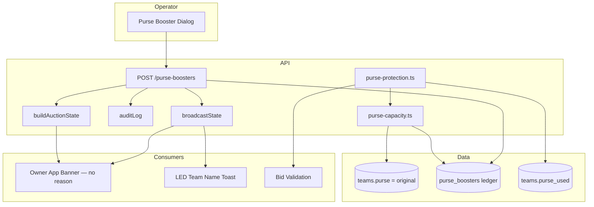

# Purse Booster — Implementation Plan

**Status:** Implemented (2026-06-08)  
**Last updated:** 2026-06-08  
**Scope:** Production-grade financial transaction system for BidWar purse capacity adjustments

---

## Approved Product Decisions (Final)

| Decision | Resolution |
|----------|------------|
| Targets | **Single team** and **All teams** only |
| Editing | **Not supported** — create and cancel only |
| Reason visibility | **Internal only** — audit log and organizer API/UI; never owner app, LED, live viewer, public screens, or push |
| Owner notification | Real-time banner: "💰 Purse Updated" + amount + previous/new capacity (no reason); history shows amount/date only |
| LED | `"[Team Name] Purse Updated"` only — no amount, reason, or capacity breakdown |
| Original purse | Never modified — stored in `teams.purse`; boosters live in `purse_boosters` |
| Live auction | Direct `PATCH teams.purse` blocked when session is idle/active/paused |
| Push notifications | **Out of scope** — owners are notified via auction state / SSE only |

---

## Table of Contents

1. [Executive Summary](#1-executive-summary)
2. [Business Rules](#2-business-rules)
3. [Database Schema](#3-database-schema)
4. [Purse Calculation Model](#4-purse-calculation-model)
5. [API Endpoints](#5-api-endpoints)
6. [Audit Model](#6-audit-model)
7. [UI Requirements](#7-ui-requirements)
8. [Owner Notifications](#8-owner-notifications)
9. [LED Display](#9-led-display)
10. [Local Mode & Sync](#10-local-mode--sync)
11. [Files Modified](#11-files-modified)
12. [Implementation Phases](#12-implementation-phases)
13. [Architecture Diagram](#13-architecture-diagram)
14. [Related Docs](#14-related-docs)

---

## 1. Executive Summary

Purse Booster is a **financial ledger feature**, not a direct edit of `teams.purse`.

| Principle | Decision |
|-----------|----------|
| Original purse | `teams.purse` is **never** changed by boosters |
| Booster storage | Append-only `purse_boosters` table |
| Effective capacity | `originalPurse + SUM(active boosters)` |
| Available purse | `effectiveCapacity - purseUsed` |
| Spendable purse | `max(0, purseRemaining - reservePurse)` (reserve logic unchanged) |
| Deletion | Never hard-delete — use `status = cancelled` + audit trail |
| Apply targets | **Single team** or **All teams** only |

### Baseline (Before Feature)

- `teams.purse` — original budget (editable via Teams page PATCH in setup only)
- `teams.purse_used` — denormalized sum of sold/retained player prices
- Spendable balance computed in `artifacts/api-server/src/lib/purse-protection.ts`

There was **no** Purse Booster feature. The player tag `booster` is cosmetic only.

---

## 2. Business Rules

1. **Apply targets:** single team or all teams in a tournament.
2. **Original purse immutability:** boosters must not modify `teams.purse`.
3. **Available purse formula:**

   ```
   Effective Capacity = Original Purse + Total Active Purse Boosters
   Purse Remaining    = Effective Capacity - Purse Used
   Spendable Purse    = max(0, Purse Remaining - Reserve Purse)
   ```

4. **Every booster record requires:** `amount`, `reason` (mandatory, internal), `createdBy`, `createdAt`, `status` (`active` | `cancelled`).
5. **Never hard-delete:** cancellation only, with full audit trail.
6. **No editing:** amount or reason changes require cancel + re-apply (two audit events).
7. **Validation:**
   - Reject negative or zero amounts
   - On cancel: effective capacity after removal must remain `>= purseUsed`
8. **Operator panel only** for creation — team pages are read-only for boosters.
9. **Reason is never exposed** to owners, LED, live viewer, public screens, or push.

---

## 3. Database Schema

### 3.1 Table: `purse_boosters`

**Cloud:** `lib/db/src/schema/purse_boosters.ts`  
**Local:** `lib/db-local/src/schema/purse_boosters.ts`  
**Migration:** `scripts/src/migrate.ts`

```sql
CREATE TABLE purse_boosters (
  id                SERIAL PRIMARY KEY,
  local_uuid        TEXT NOT NULL UNIQUE,
  tournament_id     INTEGER NOT NULL,
  team_id           INTEGER NOT NULL,
  amount            INTEGER NOT NULL CHECK (amount > 0),
  reason            TEXT NOT NULL,
  status            TEXT NOT NULL DEFAULT 'active',
  created_by_type   TEXT NOT NULL,
  created_by_id     TEXT,
  created_by_label  TEXT,
  created_at        TIMESTAMPTZ NOT NULL DEFAULT now(),
  cancelled_by_type TEXT,
  cancelled_by_id   TEXT,
  cancelled_by_label TEXT,
  cancelled_at      TIMESTAMPTZ,
  cancel_reason     TEXT,
  previous_capacity INTEGER NOT NULL,
  new_capacity      INTEGER NOT NULL,
  origin            TEXT NOT NULL DEFAULT 'cloud',
  sync_state        TEXT NOT NULL DEFAULT 'synced'
);
```

No edit columns — create and cancel only.

### 3.2 Auction Session — Real-Time Fields

Add to `auction_sessions` (cloud + local):

| Column | Type | Purpose |
|--------|------|---------|
| `last_purse_booster_json` | text | Owner banner payload (no reason) |
| `last_led_toast_json` | text | LED toast `{ teamName }` |

### 3.3 Auction State — Owner Banner Payload

`buildAuctionState()` exposes `lastPurseBooster` (no reason):

```typescript
lastPurseBooster: {
  id: number;
  teamId: number;
  teamName: string;
  amount: number;
  previousCapacity: number;
  newCapacity: number;
  appliedAt: string;
} | null
```

`ledPurseToast: { teamName: string } | null` for LED display.

### 3.4 `teams.purse` Semantics

| Field | Meaning |
|-------|---------|
| `teams.purse` | **Original purse** |
| `teams.purse_used` | Unchanged |
| `boosterTotal` | Computed: sum of active boosters |
| `effectiveCapacity` | `teams.purse + boosterTotal` |

Pre-auction manual purse edits via Teams page PATCH remain a separate, audited path (`team.purse_updated`). During live auction, direct purse PATCH is blocked in favor of Purse Booster.

---

## 4. Purse Calculation Model

### 4.1 Core Change

**Before:**

```typescript
const purseRemaining = teamRow.purse - teamRow.purseUsed;
```

**After:**

```typescript
const boosterTotal = await sumActiveBoosters(tournamentId, teamId);
const effectiveCapacity = teamRow.purse + boosterTotal;
const purseRemaining = effectiveCapacity - teamRow.purseUsed;
```

### 4.2 Shared Helpers

- `lib/api-base/src/purse-capacity.ts` — pure math
- `artifacts/api-server/src/lib/purse-capacity.ts` — DB lookups
- `artifacts/bidwar-local/src/server/lib/purse-capacity.ts` — local mirror

### 4.3 Calculation Touchpoints (Implemented)

| Location | Status |
|----------|--------|
| `artifacts/api-server/src/lib/purse-protection.ts` | Updated |
| `artifacts/api-server/src/routes/analytics.ts` | Extended `TeamPurse` |
| `artifacts/api-server/src/routes/teams.ts` | Scout + live PATCH guard |
| `artifacts/api-server/src/routes/auction.ts` | Bid validation, `buildAuctionState` |
| `artifacts/bidwar-local/src/server/routes/auction.ts` | Bid check + local booster routes |
| `artifacts/bidwar-local/src/server/routes/tournaments.ts` | `GET .../team-purses` |
| Operator / owner / team / LED UI | Effective capacity display |

---

## 5. API Endpoints

### 5.1 Routes

| Method | Path | Auth | Purpose |
|--------|------|------|---------|
| `POST` | `/tournaments/:tid/purse-boosters` | Organizer/admin | Apply booster(s) |
| `GET` | `/tournaments/:tid/purse-boosters` | Organizer/admin | List (includes reason) |
| `GET` | `/tournaments/:tid/teams/:teamId/purse-boosters` | Public/owner (no reason) or organizer (with reason) | Team history |
| `POST` | `/tournaments/:tid/purse-boosters/:id/cancel` | Organizer/admin | Cancel with `cancelReason` |

No `PATCH` edit endpoint.

### 5.2 Apply Request

```typescript
{
  target: "single" | "all";
  teamId?: number;              // required when target = "single"
  amount: number;               // positive integer
  reason: string;               // mandatory, min 10 chars, internal only
  showOnLed?: boolean;          // default true
}
```

### 5.3 Apply Response

```typescript
{
  applied: Array<{
    boosterId: number;
    teamId: number;
    teamName: string;
    amount: number;
    previousCapacity: number;
    newCapacity: number;
  }>;
  totalTeamsAffected: number;
}
```

### 5.4 Apply Server Flow

1. Validate auth (`isOrganizerOrAdmin`)
2. Validate `amount > 0`, `reason` via `parseAuditReason`
3. Resolve target teams (single or all)
4. Insert `purse_boosters` row per team with capacity snapshots
5. `auditLog` → `finance.purse_booster_added`
6. Set `lastPurseBoosterJson` + optional `lastLedToastJson`
7. `broadcastState(tid, ["purses", "auction_state"])`

### 5.5 Cancel Flow

1. Validate booster is `active`
2. Reject if effective capacity after removal `< purseUsed`
3. Update `status → cancelled` + cancel audit fields
4. `auditLog` → `finance.purse_booster_cancelled`
5. `broadcastState(tid, ["purses"])`

### 5.6 Guard: Block Direct Purse PATCH During Live Auction

In `PATCH /tournaments/:tid/teams/:teamId`:

```typescript
if (d.purse !== undefined && auctionSession.status !== "setup") {
  return res.status(403).json({
    error: "Use Purse Booster during live auction. Direct purse edits are setup-only.",
  });
}
```

---

## 6. Audit Model

### 6.1 Event Actions

| Action | Category | Severity | Trigger |
|--------|----------|----------|---------|
| `finance.purse_booster_added` | `finance` | `critical` | Apply |
| `finance.purse_booster_cancelled` | `finance` | `critical` | Cancel |

Reason appears in audit events and organizer list endpoints only.

### 6.2 Immutability Rules

| Operation | Allowed |
|-----------|---------|
| Hard delete | Never |
| Edit amount or reason | Cancel + re-apply only |
| Cancel | Soft cancel with `cancelReason` |

---

## 7. UI Requirements

### 7.1 Operator Panel

**Files:** `auction-operator.tsx`, `purse-booster-dialog.tsx`

- Toolbar: **💰 Purse Booster**
- Target: single team or all teams
- Amount + mandatory reason (organizer-only)
- `showOnLed` defaults true
- Purse cards show Original / Boosters / Capacity / Used / Spendable

### 7.2 Team Pages — Read Only

**File:** `teams.tsx`

Display Original Purse, Booster Total, Current Capacity. No creation controls.

### 7.3 LED / Display

**Files:** `purse-updated-toast.tsx`, `display-shell.tsx`, `team-overlay.tsx`

- Toast: `"[Team Name] Purse Updated"`
- Overlay purse row uses effective capacity

---

## 8. Owner Notifications

### 8.1 Real-Time Banner (Live Auction)

**File:** `artifacts/owner-app/src/screens/LiveBid.tsx`

Watch `state.lastPurseBooster?.teamId === teamId`:

```
💰 Purse Updated
+₹5,00,000
Previous Capacity: ₹10,00,000
New Capacity: ₹15,00,000
```

No reason. Auto-dismiss after ~5 seconds.

### 8.2 Squad History

**File:** `artifacts/owner-app/src/screens/Squad.tsx`

`GET .../teams/:teamId/purse-boosters` returns public JSON (amount, date, capacity snapshots — **no reason**).

### 8.3 Push Notifications

**Out of scope.** No push integration for purse boosters in v1.

---

## 9. LED Display

- Toast text: **`[Team Name] Purse Updated`** (or `"All Teams Purse Updated"` for bulk apply)
- **Do not show** amount, reason, or capacity on the toast
- Team overlay updates via `broadcastState(["purses"])` using effective capacity

---

## 10. Local Mode & Sync

### 10.1 Principles

| Principle | Implementation |
|-----------|----------------|
| Local authority during event | Boosters written to SQLite immediately |
| Stable identity | `local_uuid` on every row |
| Idempotent replay | Cloud upserts by `local_uuid` |
| No purse mutation | Cloud never touches `teams.purse` for boosters |

### 10.2 Local Routes

Implemented inside `artifacts/bidwar-local/src/server/routes/auction.ts` (mirrors cloud apply/cancel/list).

### 10.3 Final Sync Payload

Extended `POST /local/sync-to-cloud` and cloud `POST .../sync`:

```typescript
purseBoosters: [{
  localUuid, teamCloudId, amount, reason, status,
  createdAt, createdByLabel, cancelledAt?, cancelReason?,
  previousCapacity, newCapacity
}]
```

Reason syncs to cloud for audit only — not exposed to owner-facing APIs.

---

## 11. Files Modified

### Schema & Migrations

- `lib/db/src/schema/purse_boosters.ts`
- `lib/db-local/src/schema/purse_boosters.ts`
- `lib/db/src/schema/auction_sessions.ts` (+ local mirror)
- `scripts/src/migrate.ts`, `lib/db/src/index.ts` bootstrap

### API Server (Cloud)

- `artifacts/api-server/src/lib/purse-capacity.ts`
- `artifacts/api-server/src/lib/purse-protection.ts`
- `artifacts/api-server/src/lib/audit-critical-tags.ts`
- `artifacts/api-server/src/routes/purse-boosters.ts`
- `artifacts/api-server/src/routes/analytics.ts`, `teams.ts`, `auction.ts`, `tournaments.ts`
- `artifacts/api-server/src/routes/index.ts`

### Local Server

- `artifacts/bidwar-local/src/server/routes/auction.ts`
- `artifacts/bidwar-local/src/server/routes/local.ts`, `tournaments.ts`
- `lib/db-local/src/setup.ts`

### API Spec & Client

- `lib/api-spec/openapi.yaml` (+ codegen)

### Frontend

- `artifacts/auction-platform/src/components/purse-booster-dialog.tsx`
- `artifacts/auction-platform/src/pages/auction-operator.tsx`, `teams.tsx`
- `artifacts/auction-platform/src/components/display/purse-updated-toast.tsx`, `display-shell.tsx`
- `artifacts/owner-app/src/screens/LiveBid.tsx`, `Squad.tsx`

### Tests

- `lib/api-base/src/__tests__/purse-capacity.test.ts`

---

## 12. Implementation Phases

All phases complete:

- [x] Phase 1 — Schema + purse-capacity + purse-protection
- [x] Phase 2 — Cloud API routes, audit, auction state, guards
- [x] Phase 3 — OpenAPI + codegen
- [x] Phase 4 — Operator UI (Purse Booster dialog)
- [x] Phase 5 — Owner banner + history (no reason)
- [x] Phase 6 — LED toast + team pages read-only display
- [x] Phase 7 — Local mode routes + sync payload

---

## 13. Architecture Diagram



---

## 14. Related Docs

| Document | Relevance |
|----------|-----------|
| [AUDIT_LOGGING_HANDOFF.md](./AUDIT_LOGGING_HANDOFF.md) | Audit patterns, reason fields |
| [LOCAL_MODE_AUDIT.md](./LOCAL_MODE_AUDIT.md) | Local sync architecture |
| [LOCAL_MODE_ROSTER_ARCHITECTURE.md](./LOCAL_MODE_ROSTER_ARCHITECTURE.md) | localUuid sync pattern |

---

*End of document. Implementation matches approved product decisions above.*
