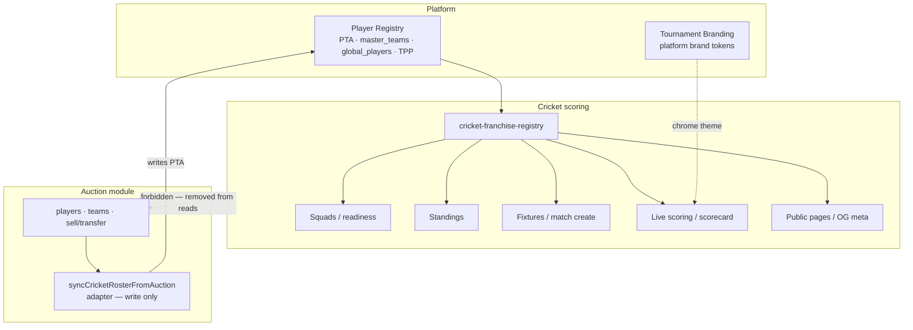

# Cricket → Auction Dependency Audit

**Date:** 2026-07-23  
**Parity with:** Badminton auction decoupling (Player Registry + Tournament Branding only)  
**Scope:** Runtime architecture coupling only — scoring business rules unchanged

---

## 1. Target dependency rule

```
Platform (Player Registry, Tournament Branding, Auth, Media, …)
    ↓
Cricket (squads · fixtures · standings · scoring · stats)
    ↓
Auction (optional write-side sync into Registry — never Cricket → Auction reads)
```

**Forbidden:** Cricket scoring read paths → auction `players` / `teams` tables or auction list APIs.  
**Allowed:** Auction sell/transfer hooks → `onAuctionPlayerRosterChanged` (Auction → Platform).

---

## 2. Dependency graph (after this change)



---

## 3. Audit checklist

| Check | Before | After |
|-------|--------|-------|
| Squads / readiness from PTA | ❌ auction `players`/`teams` | ✅ |
| Standings team seed + names | ❌ `teamsTable` | ✅ PTA + `master_teams` |
| Match create / draw team validation | ❌ `teamsTable` | ✅ PTA opaque team id |
| Public schedule / team / player | ❌ auction tables | ✅ Registry |
| Scorecard / leaderboard name maps | ❌ auction tables | ✅ Registry |
| Global career id map | ❌ `players.globalPlayerId` | ✅ PTA `auctionPlayerId` → `playerId` |
| Scorer UI `useListTeams` / `useListPlayers` | ❌ | ✅ `/scoring/master-teams` + `/roster` |
| Sync roster required for scoring | ❌ Sync button + auction read | ✅ 410 on cricket route; Auction owns sync |
| Branding copy / chrome | Auction-themed comments | Platform Tournament Branding tokens |
| Works if Auction module disabled | ❌ | ✅ if PTA populated |

---

## 4. Identity contract (unchanged business meaning)

| Scoring column | Opaque integer source | Display |
|----------------|----------------------|---------|
| `homeTeamId` / `awayTeamId` / standings `teamId` | PTA `auctionTeamId` | `master_teams` |
| Playing XI / events / stats `playerId` | PTA `auctionPlayerId` | `global_players` + TPP |

Column names remain legacy; values are tournament-scoped franchise integers, not master UUIDs (no schema migration).

---

## 5. Files changed (architectural)

| Area | Files |
|------|--------|
| Registry hub | `api-server/.../cricket-franchise-registry.ts` (new) |
| Roster reads | `cricket-roster.ts` list* → Registry; sync adapters kept for Auction→Platform |
| Standings / readiness | `scoring-standings.ts` |
| Match / fixtures | `scoring-service.ts`, `scoring-foundation-service.ts` |
| Public / stats / meta | `scoring-public-service.ts`, `scoring-stats-service.ts`, `scoring-global-stats-service.ts`, `cricket-page-meta.ts` |
| Routes | `cricket-master-sports.ts` — `POST /sync-roster` → **410** `AUCTION_SYNC_REMOVED` |
| UI | `scoring-match*.tsx`, `scoring-schedule.tsx`, `score-display-shell.tsx`, `pre-match-setup.tsx`, `scoring-squad.ts`, `cricket-branding.tsx` |

---

## 6. Remaining debt (not in this change)

| Severity | Item |
|----------|------|
| High | Packaging: cricket UI still under `auction-platform`; `scoring-app` `@` alias |
| Medium | Opaque IDs still named `auctionTeamId` / `auctionPlayerId` on PTA |
| Medium | Public squad `soldPrice` always `null` when Auction off (shape preserved) |
| Low | Optional Auction→Registry sync route should live under `/api/auction/*` |
| Low | Compile-time eslint Sport ↛ Auction boundaries |

---

## 7. Score

| Dimension | Score | Notes |
|-----------|-------|-------|
| Cricket independence (runtime) | **9/10** | Reads Platform only |
| Auction-off readiness | **9/10** | Requires PTA rows with opaque ids |
| Packaging purity | **4/10** | Shared with Badminton packaging debt |
| Overall cricket architecture | **8/10** | Matches Badminton data boundary |
