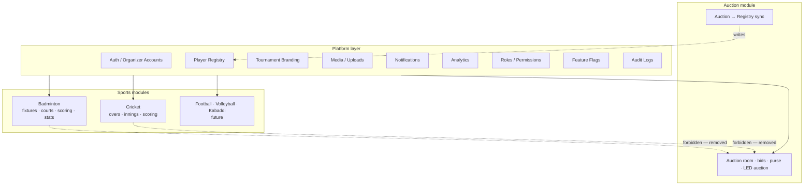

# BidWar Platform Architecture — Final Audit

**Date:** 2026-07-23  
**Role:** Lead Software Architect  
**Status:** Domain packages scaffolded (platform extraction Phase A–B); packaging + API shape remain debt

---

## 1. Target dependency rule

```
Platform
    ↓
Sports Modules (Badminton, Cricket, Football, …)
    ↓
Auction (independent feature module)
```

**Forbidden:** `Sport → Auction`, `Sport → Sport`, `Auction → Sport`.

**Allowed:** Auction → Platform (e.g. sync roster into Player Registry). Sports → Platform only.

---

## 2. Updated dependency graph



**Runtime today (Badminton + Cricket):** Solid Platform → Sport only (Auction may write Registry).  
**Compile/packaging today:** `scoring-app` still aliases `@` → `auction-platform/src` (Critical packaging debt).

---

## 3. Audit checklist (current status)

| Check | Badminton | Cricket | Notes |
|-------|-----------|---------|-------|
| No Auction UI imports | ✅ | ✅ | Cricket scorer uses Registry roster APIs |
| No Auction layouts/providers | ✅ | ✅ | SportsShell vs AppLayout |
| No Auction stores/hooks | ✅ | ✅ | |
| No Auction APIs except Registry/Branding | ✅ | ✅ | `/sync-roster` on cricket → 410 |
| No Auction DB in sport scoring tables | ✅ | ⚠️ | Logical opaque IDs retain `auction*` column names |
| Works if Auction disabled | ✅ | ✅ | PTA must be populated |
| Compile-time Sport ↛ Auction | ❌ | ❌ | No eslint/Nx boundaries yet |

---

## 4. Remaining violations

| Severity | Violation | Location |
|----------|-----------|----------|
| **Critical** | `scoring-app` `@` → `auction-platform/src` | `artifacts/scoring-app/vite.config.ts`, `tsconfig.json` |
| **High** | Badminton + cricket UI source co-located under `auction-platform` | `artifacts/auction-platform/src/pages/badminton/**`, `pages/scoring-*` |
| **Medium** | Opaque scoring IDs still named `auctionTeamId`/`auctionPlayerId` on PTA | `player_team_assignments` |
| **Medium** | API paths nested under `/api/tournaments/:id/{badminton\|scoring}` vs ideal `/api/{sport}/*` | `routes/index.ts` |
| **Medium** | LED display CSS/components still named `auction-stage` | `components/display/v1/*` |
| **Low** | Legacy dual-read aliases (`linkedAuctionTournamentId`, `/import-auction-branding`) | Debt only — not runtime Sport→Auction |
| **None** | Badminton / Cricket → auction `players`/`teams` reads | Confirmed clean — see `cricket-auction-dependency-audit.md` |

---

## 5. Technical debt list (priority order)

1. **Extract sports UI** from `auction-platform` into `scoring-app` or `@workspace/sports-ui`; remove vite `@` alias to auction-platform.
2. **API ownership remount** — dual-mount `/api/badminton/*`, `/api/cricket/*`, `/api/auction/*`, `/api/player-registry/*` during transition.
3. **Split display chrome** — platform `display-stage` vs auction-only bid effects.
4. **Retire legacy aliases** after client sunset window.
5. **Compile-time boundaries** — eslint-plugin-boundaries / import zones (see §8).
6. **Correct stale docs** — e.g. older “merge scoring into auction-platform” guidance (superseded by this doc).
7. **Logical DB folders** — `platform/`, `auction/`, `sports/badminton/`, `sports/cricket/` inside `lib/db` (no forced split of packages yet).
8. **Rename PTA opaque columns** — `auctionTeamId` → tournament franchise team id (optional clarity).

---

## 6. Platform layer (ownership)

| Service | Ideal home | Today |
|---------|------------|-------|
| Authentication / Organizer Accounts | `platform-auth` | `api-server/routes/auth`, `lib/auth` in apps |
| Player Registry | `player-registry` | `global_players`, `player_team_assignments`, `master-sports` |
| Tournament Branding | `branding` | `/api/branding`, tournament logo/venue/sponsors |
| Media / Uploads | `media` | `/api/upload` |
| Notifications | `notifications` | `/api/auth/admin/notifications*`, push |
| Analytics | `analytics` | mixed tournament/sport analytics |
| Permissions / Roles | `platform-auth` + sports roles | `/api/sports/*` |
| Feature Flags | `settings` | `/api/settings/features` |
| Audit Logs | `audit` | `/api/audit` |

These must not be owned by the Auction module.

---

## 7. Sport boundaries

| Sport | Owns | Must not import |
|-------|------|-----------------|
| **Badminton** | Fixtures, draws, scheduling, courts, matches, scoring, statistics | Auction, Cricket |
| **Cricket** | Fixtures, overs, innings, scoring, statistics | Auction, Badminton |
| **Football / Volleyball / Kabaddi** | Own match domain | Any other sport / Auction |

---

## 8. Compile-time dependency rules (recommended)

No root ESLint boundaries exist today. Introduce when extracting packages:

### Zone model

| Zone | Pattern (today’s folders) |
|------|---------------------------|
| `platform-lib` | `lib/{api-base,db,badminton-core,scoring-core}/**` |
| `sports-ui` | `**/pages/badminton/**`, `**/components/badminton/**`, `**/sports-shell/**`, `**/pages/scoring*/**` |
| `auction-domain` | `**/pages/auction*/**`, `**/hooks/use-auction*/**`, `**/lib/sync-auction*/**`, `**/components/layout.tsx` (AppLayout) |
| `api-sport` | `api-server/**/{badminton,scoring,cricket,master-sports/badminton}*` |
| `api-auction` | `api-server/**/{auction,players,teams,bids}*` |

### Rules

```
sports-ui     → allow: platform-lib, sports-ui
sports-ui     → deny:  auction-domain
api-sport     → deny:  auction roster tables / api-auction internals
auction-domain → allow: platform-lib; deny: sports-ui, api-sport
scoring-app   → deny: auction-domain  (after extract)
```

### Interim `import/no-restricted-paths` (before package extract)

Ban badminton trees from importing:

- `hooks/use-auction-socket.ts`
- `lib/sync-auction-sse.ts`
- `pages/auction-operator.tsx`
- `components/layout.tsx` (AppLayout)

---

## 9. Database ownership

| Asset | Owner | Auction link |
|-------|-------|--------------|
| `badminton_*` | Badminton | None (soft `tournament_id`, `master_player_id` only) |
| `players`, `teams`, `bids`, `auction_*` | Auction | Canonical auction roster |
| `global_players`, `player_team_assignments`, `master_*` | Platform Player Registry | Optional provenance columns (`auction_player_id`) — Auction → Platform OK |
| `tournaments`, branding fields | Platform host | Shared |
| `scoring_matches` team IDs | Cricket | Opaque franchise integers (`PTA.auctionTeamId`) |

**Rule for future migrations:** Never add FKs from sport tables → auction `players`/`teams`. Prefer `master_player_id` / PTA.

---

## 10. API ownership

### Ideal

| Prefix | Owner |
|--------|-------|
| `/api/auth/*`, `/api/branding/*`, `/api/media/*`, `/api/notifications/*`, `/api/player-registry/*` | Platform |
| `/api/badminton/*`, `/api/cricket/*`, `/api/football/*` | Sport |
| `/api/auction/*` | Auction |

### Current (violations = path shape / nesting)

| Current | Ideal | Violation? |
|---------|-------|------------|
| `/api/auth/*` | Platform | No |
| `/api/branding` | Platform | Minor (not under `/api/branding/*` only) |
| `/api/upload` | Platform media | No |
| `/api/global-players/*` | `/api/player-registry/*` | Yes (naming) |
| `/api/tournaments/:id/badminton/*` | `/api/badminton/*` | Yes (shape) |
| `/api/tournaments/:id/scoring/*` | `/api/cricket/*` | Yes (shape + cricket auction data) |
| `/api/tournaments/:id/auction/*` | `/api/auction/*` | Partial (nested) |
| `/api/cricket/global-leaderboards/*` | Sport | No |

Keep dual mounts during migration; do not break mobile/local clients in one cut.

---

## 11. Naming

| Legacy | Platform term | Status |
|--------|---------------|--------|
| Auction roster | Player Registry | Done (Badminton UI/API policy) |
| Auction branding import | Tournament branding | Done (`/import-tournament-branding`; old alias remains) |
| `linkedAuctionTournamentId` | `linkedPlayerRegistryTournamentId` | Dual-read/write |
| `sync-auction-players` | Removed from badminton | 410 |
| `auction-stage` CSS | `broadcast-stage` / `led-stage` | Debt |
| Cricket “add via auction first” | “import from Player Registry” | Done |

---

## 12. Packaging roadmap (do not move yet)

```
packages/   (or keep artifacts/ + lib/ with clearer names)
  platform-core/          # shared types, feature flags
  player-registry/
  branding/
  auth/
  media/
  analytics/
  notifications/

  sports-badminton/       # UI + domain hooks
  sports-cricket/
  sports-football/        # future

  auction/                # auction-platform trimmed to auction-only

apps/
  scoring-app/            # hosts sports shells; depends on sports-* + platform-*
  auction-app/            # hosts auction; depends on auction + platform-*
  owner-app/
  api-server/             # mounts platform / sport / auction routers
```

### What moves later (ordered)

1. `pages/badminton`, `components/badminton`, `sports-shell` → sports-badminton / scoring-app  
2. Shared UI (buttons, dialogs, upload) → platform-ui  
3. Cricket pages + scoring components → sports-cricket  
4. Auction-only pages stay in auction-app  
5. `master-sports` badminton vs auction sync split across sport vs auction packages  

---

## 13. Platform extraction roadmap

| Phase | Outcome | Risk |
|-------|---------|------|
| **P0 — Done** | Badminton runtime ↛ Auction tables/APIs/UI | — |
| **P0 — Done** | Cricket roster on Player Registry only | See `cricket-auction-dependency-audit.md` |
| **P1** | eslint restricted paths for sport ↛ auction-domain | Low |
| **P2** | Extract sports UI; kill scoring `@` → auction-platform | Medium |
| **P3** | Dual-mount sport/platform/auction URL prefixes | Medium |
| **P4** | Retire aliases; rename display CSS; split display-stage | Low–Medium |
| **P5** | Optional package extract under `packages/` | Medium |

---

## 14. Risk assessment

| Move | Risk | Mitigation |
|------|------|------------|
| Kill vite alias before extract | High (build break) | Extract first, then remove alias |
| Cricket off auction roster | High (product assumptions) | Feature flag; PTA backfill from auction sync |
| API path rename | Medium | Dual mounts ≥1 release |
| Monolithic `lib/db` split | Low–Medium | Logical folders first |
| Shared StageFrame split | Medium | Extract platform stage without bid widgets |

---

## 15. Architecture score

### **8 / 10**

| Dimension | Score | Note |
|-----------|-------|------|
| Badminton runtime independence | 9/10 | Clean |
| Cricket independence | 9/10 | Registry reads only — see `cricket-auction-dependency-audit.md` |
| Packaging / compile boundaries | 4/10 | Alias + co-location |
| API ownership clarity | 5/10 | Nested under tournaments |
| DB ownership clarity | 8/10 | Sport reads PTA/master; opaque id names remain |
| Multi-sport readiness | 8/10 | Both sports follow Platform → Sport rule |

**Why not lower:** Badminton + Cricket prove the target data boundary.  
**Why not higher:** Packaging still implies “Auction app hosts sports.”

---

## 16. Explicit non-goals (this pass)

- No mass file moves  
- No working-logic rewrites  
- No forced API client breakage  

This document is the contract for the next extraction phases.
