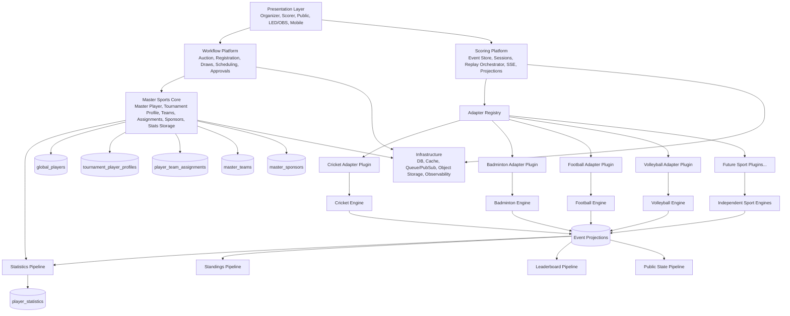

# BidWar Multi-Sport Platform v2 Architecture

**Document Type:** Canonical Architecture Specification  
**Audience:** Platform, Backend, Frontend, Data, DevOps, QA, Product Architecture teams  
**Scope:** Long-term architecture for supporting 20+ sports over 10+ years  
**Status:** Proposed canonical v2 target architecture (design-only, no implementation in this document)

---

## 1. Vision

BidWar v2 is a **single multi-sport platform** where every sport runs as an independent rule engine on shared infrastructure.

The platform must provide:

- One platform, many sports, zero sport coupling
- One identity system across all sports and tournaments
- One scoring platform with sport-agnostic orchestration
- One workflow platform for tournament operations
- One plugin model for onboarding future sports without modifying existing sports

Target philosophy:

> **Shared infrastructure, isolated sport logic, additive evolution, zero-downtime migration.**

Cricket and Badminton remain first-class independent engines.  
Football, Volleyball, Tennis, Kabaddi, and future sports must be onboarded by **adding new adapter plugins only**.

---

## 2. Design Principles

1. **Open/Closed Principle**
   - Core platform is open for extension (new sports) and closed for modification (existing sport code paths).

2. **Zero-Modification Onboarding**
   - Adding a sport must not require edits in Cricket or Badminton adapters or shared sport logic.

3. **Additive Migration**
   - New fields/endpoints are additive first; destructive changes are deferred to controlled deprecations.

4. **Backward Compatibility**
   - Historical event replay, existing APIs, and legacy IDs must continue to work during and after migration.

5. **Event Sourcing First**
   - Scoring truth lives in append-only events; projections are derived and replaceable.

6. **Platform First**
   - Cross-cutting concerns (transactions, persistence, retries, SSE, auth, observability) belong to platform layers.

7. **Adapter First**
   - Sport-specific validation, state transitions, standings formulas, and statistics calculations belong to adapters.

8. **Plugin First**
   - Sports are installable units with manifests, capability declarations, and runtime registration.

9. **No Cross-Sport Rule Logic**
   - Cricket rules never appear in Badminton code paths, and vice versa. Shared layers contain no sport rules.

10. **One Source of Truth per Concern**
    - Identity truth: Master Sports Core.
    - Scoring truth: event store.
    - Workflow truth: workflow platform state.

11. **Deterministic Replay**
    - Given the same event stream + adapter version + upcasters, projected match state is deterministic.

12. **Observable by Default**
    - Every async pipeline must expose metrics, tracing, and failure visibility.

---

## 3. Platform Layers

### Layered Model

```text
Presentation Layer
        ↓
Workflow Platform
        ↓
Scoring Platform
        ↓
Sport Adapter
        ↓
Sport Engine
        ↓
Master Sports Core
        ↓
Infrastructure
```

### Layer Responsibilities

1. **Presentation Layer**
   - Organizer portal, scorer clients, public pages, LED/OBS views, mobile surfaces.
   - Dynamic rendering based on sport manifest + capability metadata.

2. **Workflow Platform**
   - Tournament lifecycle orchestration: registration, auction, draws, scheduling, approvals, check-ins, officials.
   - Does not implement sport scoring rules.

3. **Scoring Platform**
   - Generic event ingestion, sequencing, persistence, replay orchestration, projection execution, SSE publication.
   - Delegates sport logic to adapters.

4. **Sport Adapter**
   - Contract-bound bridge between scoring platform and sport engine.
   - Owns event schema, validation, reducer calls, standings/statistics formulas, public serialization.

5. **Sport Engine**
   - Pure domain rule system for one sport.
   - Deterministic state machine and domain calculations.

6. **Master Sports Core**
   - Shared identity, profile, team assignment, sponsor/media/document metadata, cross-tournament statistics storage.
   - No sport scoring rules.

7. **Infrastructure**
   - DB, cache, queue/pubsub, object storage, CI/CD, observability, secrets, runtime orchestration.

---

## 4. Master Sports Core

### Responsibilities

- **Master Player** (`global_players`): canonical person identity across sports/tournaments.
- **Tournament Profile** (`tournament_player_profiles`): tournament-specific display identity (name, initials, photo override).
- **Master Teams** (`master_teams`): canonical franchise/club identity.
- **Assignments** (`player_team_assignments`): sport/tournament roster ownership history.
- **Statistics Storage** (`player_statistics`): cross-sport stat persistence with sport key + `stats_json`.
- **Sponsors** (`master_sponsors`): shared sponsor entities.
- **Media**: logos/photos/video assets metadata.
- **Documents**: approvals, declarations, compliance artifacts metadata.
- **Identity Services**: dedupe, mapping, source reconciliation, sync audit (`master_sports_sync_log`).

### MUST NEVER Exist Here

- Toss logic, overs logic, rally logic, cards logic, penalties, substitutions rules.
- Sport-specific event reducers.
- Sport-specific score formulas or standings formulas.
- UI-specific rendering rules.

Master Sports Core is **identity + metadata + shared persistence**, not rule execution.

---

## 5. Scoring Platform

Scoring Platform is a generic orchestration layer for all sports.

### Responsibilities

1. **Event Store**
   - Append-only event persistence, sequence guarantees, idempotency/correlation handling.

2. **Match Sessions**
   - Session lifecycle (idle/live/paused/completed), projection pointers, replay checkpoints.

3. **Replay**
   - Adapter-driven deterministic replay over event stream.

4. **Persistence**
   - Transaction boundaries for event write + projection metadata updates.

5. **SSE / Realtime**
   - Generic publish of adapter-projected public state.

6. **Projection Scheduler**
   - Trigger standings/statistics/leaderboard pipelines as adapter capabilities.

7. **Public State Gateway**
   - Adapter-produced public snapshots, normalized API envelope.

8. **Statistics Pipeline**
   - Platform orchestrates execution; adapters compute formulas.

9. **Leaderboard Pipeline**
   - Platform stores/ranks generic snapshots; adapters define category semantics.

### Explicit Non-Responsibilities

- No cricket-only constants, no badminton-only categories, no sport-specific reducer logic.

---

## 6. Workflow Platform

Workflow Platform handles tournament operations independent of live scoring semantics.

### Domains

- Auction
- Registration
- League/Knockout/Round-robin groups/pools
- Draw generation
- Scheduling
- Approvals
- Check-in
- Officials/Courts/Grounds

### Why Workflow Is Different From Scoring

- **Workflow** answers: *What should happen in tournament operations?*
- **Scoring** answers: *What happened in match play-by-play events?*

Workflow creates readiness and structure; scoring records and projects competitive events.

---

## 7. Sport Adapter SDK

Every sport must implement a formal adapter contract.

```ts
export interface SportAdapter {
  readonly sportSlug: string;
  readonly version: string;

  // Match lifecycle
  initializeMatch(ctx: InitializeMatchContext): Promise<InitializeMatchResult>;
  validateLineup?(ctx: ValidateLineupContext): Promise<ValidationResult>;

  // Events
  parseEvent(ctx: ParseEventContext): Promise<ParsedEvent>;
  processEvent(ctx: ProcessEventContext): Promise<ProcessEventResult>;
  replay(ctx: ReplayContext): Promise<ReplayResult>;
  undo?(ctx: UndoContext): Promise<UndoResult>;

  // Projections
  projectScoreboard(ctx: ProjectScoreboardContext): Promise<ProjectedScoreboard>;
  serializePublicState(ctx: SerializePublicStateContext): Promise<PublicStateEnvelope>;

  // Competition outputs
  calculateStatistics(ctx: StatisticsContext): Promise<StatisticsDelta>;
  calculateStandings?(ctx: StandingsContext): Promise<StandingsProjection>;
  calculateLeaderboards?(ctx: LeaderboardContext): Promise<LeaderboardProjection>;

  // Workflow coupling points
  getDrawRules?(): DrawRulesDefinition;
  getValidationRules?(): ValidationRulesDefinition;
}
```

### Optional Capabilities

- `undo`, `calculateStandings`, `calculateLeaderboards`, draw/validation rule providers.
- Optional capabilities are declared via manifest; UI and APIs become capability-aware.

---

## 8. Capability Model

Avoid a giant mandatory interface. Use composable capabilities.

### Core Capability Interfaces

- `MatchLifecycleCapability`
- `EventProcessingCapability`
- `ReplayCapability`
- `PublicProjectionCapability`
- `StatisticsCapability`
- `StandingsCapability` (optional)
- `DrawCapability` (optional)
- `PenaltyCapability` (optional)
- `CardsCapability` (optional)
- `OfficialsCapability` (optional)
- `UndoCapability` (optional)

### Rule

Platform composes behavior by detected capabilities, not by hardcoded sport checks.

---

## 9. Plugin Architecture

Sports are deployable plugins.

```text
sports/
  cricket/
    manifest.json
    adapter/
    engine/
    routes/
    schemas/
    projections/
    statistics/
    events/
  badminton/
  football/
  volleyball/
```

### Plugin Package Contents

- Manifest
- Adapter implementation
- Event schemas + upcasters
- Reducer/replay engine bindings
- Optional adapter routes
- Projection/statistics modules
- Capability declarations

### Auto-Registration

- Platform plugin loader discovers manifests at boot.
- Valid plugins are registered into `AdapterRegistry`.
- Registry key is `sportSlug`.
- Existing sports require no edits when new plugin is added.

---

## 10. Sport Manifest

Manifest defines features and runtime behavior.

```json
{
  "sportSlug": "football",
  "displayName": "Football",
  "adapterVersion": "1.0.0",
  "supportsAuction": true,
  "supportsStandings": true,
  "supportsOfficials": true,
  "supportsCards": true,
  "supportsUndo": true,
  "supportsReplay": true,
  "supportsGroups": true,
  "supportsDraws": true,
  "supportsCourts": false,
  "supportsGrounds": true,
  "supportsScheduling": true,
  "capabilities": [
    "MatchLifecycle",
    "EventProcessing",
    "Replay",
    "Statistics",
    "Standings",
    "Officials",
    "Cards"
  ]
}
```

### Dynamic UI Contract

UI reads manifest/capabilities to render sport-specific forms, actions, tabs, and public surfaces without hardcoded sport switch blocks.

---

## 11. Event Architecture

### Event Flow

```text
Platform Event Envelope
        ↓
Sport Event Payload
        ↓
Adapter Processing
        ↓
State Projection
        ↓
Statistics Projection
        ↓
Leaderboard Projection
        ↓
Public State Projection
```

### Event Versioning

- Envelope has platform version + sport payload version.
- Payload evolution is additive first.
- Breaking payload changes require upcasters.
- Replay always routes through version-aware upcast chain before reducer.

---

## 12. Identity Architecture

### Canonical Identity Chain

```text
Master Player
    ↓
Tournament Profile
    ↓
Assignment (ownership metadata)
    ↓
Participation (match context)
    ↓
Competition Side (left/right/home/away/etc.)
```

### Identity Domains

- **Master Identity:** person-level, cross-tournament and cross-sport.
- **Tournament Identity:** display and tournament metadata.
- **Scoring Identity:** event payload references used at match runtime.
- **Historical Identity:** immutable event references in persisted streams.
- **Future Identity:** additive IDs for future migration without replay breakage.

### Rule

Identity resolution must always support historical replay and additive key evolution.

---

## 13. Statistics Architecture

### Data Flow

```text
Match Events
   ↓
Match Statistics
   ↓
Tournament Statistics
   ↓
Career Statistics
   ↓
Historical Records / Milestones
   ↓
Leaderboards
   ↓
Achievements
   ↓
AI Analytics
```

### Principles

- Adapter computes sport formulas.
- Platform stores normalized snapshots and audit metadata.
- `player_statistics` remains shared storage with sport-scoped payloads.
- Tournament and career pipelines must remain connected through canonical identity mapping.

---

## 14. API Architecture

### API Domains

1. **Platform APIs**
   - Generic scoring/workflow endpoints, plugin discovery, capability metadata.

2. **Adapter APIs**
   - Sport-specific routes exposed by plugin (if needed).

3. **Plugin APIs**
   - Internal extension routes/events used by plugin modules.

4. **Public APIs**
   - Read-only scoreboard, standings, leaderboards, match public state.

5. **Organizer APIs**
   - Tournament administration, scheduling, workflow control.

6. **Scorer APIs**
   - Low-latency event write endpoints with sequence control.

### Contract Rule

API envelope is platform-standard; payload internals are adapter-specific and versioned.

---

## 15. UI Architecture

### Surfaces

- Organizer Portal
- Scorer
- Public Web
- LED
- OBS
- Mobile
- Owner App

### Shared UI Contracts

- Capability-driven rendering (manifest first)
- Platform shell components shared
- Adapter-provided schema metadata drives forms and validation
- Public rendering adapters for sport-specific scorecard/graphics

### Rule

No UI route should hardcode sport logic when manifest/capability metadata can drive behavior.

---

## 16. Future Sports Validation

| Sport | New Code Required | Target Outcome |
|---|---|---|
| Cricket | Existing adapter retained | No platform modification |
| Badminton | Existing adapter retained | No platform modification |
| Football | New plugin (`FootballAdapter`, schemas, engine bindings, manifest) | Create adapter only |
| Volleyball | New plugin | Create adapter only |
| Tennis | New plugin | Create adapter only |
| Table Tennis | New plugin | Create adapter only |
| Kabaddi | New plugin | Create adapter only |
| Kho Kho | New plugin | Create adapter only |

### Remaining Gaps to Close for True Zero-Mod

1. Remove cricket-only assumptions from shared scoring modules.
2. Make active assignment uniqueness index sport-generic in DB bootstrap.
3. Replace cricket-shaped lineup contracts in shared routes/services with adapter schema contracts.
4. Ensure router/plugin auto-registration eliminates manual route wiring per sport.

---

## 17. Migration Strategy

### Phase A — Platform Shell Extraction
- Introduce adapter registry and generic scoring orchestrator interfaces.
- Keep current cricket/badminton runtime untouched via compatibility wrappers.
- Independently deployable.

### Phase B — Cricket Adapter Encapsulation
- Move cricket-specific parsing/reduction/projections behind `CricketAdapter`.
- Preserve endpoints and replay behavior with golden tests.
- Independently deployable.

### Phase C — Badminton Adapter Alignment
- Align badminton scoring integration to same adapter SDK.
- Preserve badminton API contracts and historical matches.
- Independently deployable.

### Phase D — Generic Route + Capability Runtime
- Convert scoring/workflow routes to capability-driven schemas and dispatch.
- Add plugin loader and manifest registration at runtime.
- Independently deployable.

### Phase E — Hardening + Zero-Mod Certification
- Remove final shared-layer sport assumptions.
- Validate onboarding by adding a non-existing sport plugin in staging with no changes to existing sports.
- Independently deployable.

### Global Migration Constraints

- No downtime
- No breaking API removals in migration window
- Historical tournaments and replay preserved
- Additive data migrations first, destructive cleanup only after deprecation windows

---

## 18. Architecture Decision Records

### Accepted ADRs

1. Reuse `global_players` as Master Player canonical table.
2. Keep `tournament_player_profiles` as tournament identity layer.
3. Event-sourced scoring as source of truth.
4. Adapter-based sport isolation.
5. Additive migration and backward-compatible APIs.

### Rejected ADRs

1. Monolithic shared reducer for all sports.
2. Sport-specific stats tables per sport by default.
3. Hardcoded route branching per sport in platform routers.
4. Identity duplication across auction and scoring domains.

### Future ADRs

1. Plugin sandboxing/security model for untrusted adapters.
2. Adapter hot-reload lifecycle and rollout strategies.
3. Multi-tenant adapter marketplace governance.
4. Schema policy for long-term event archival tiers.

---

## 19. Engineering Standards

### Folder Structure

```text
artifacts/api-server/src/
  platform/
    scoring/
    workflow/
    plugin-runtime/
  adapters/
    cricket/
    badminton/
    <new-sport>/
  core/
    identity/
    shared-types/
```

### Dependency Rules

- Platform may depend on interfaces/contracts, never on sport internals.
- Adapters may depend on platform SDK, never on other adapters.
- No adapter-to-adapter imports.
- Master Sports Core has no dependency on adapter rule code.

### Naming Conventions

- `sportSlug` as canonical adapter key.
- `*Adapter` suffix for adapter implementations.
- Capability interfaces end with `Capability`.

### Adapter Conventions

- Must declare manifest + capability list.
- Must expose versioned event schemas.
- Must provide deterministic replay behavior.

### Plugin Conventions

- Self-contained directories/modules.
- Manifest-required boot registration.
- Explicit compatibility matrix with platform API version.

### Testing Conventions

- Golden replay tests per sport
- Contract tests for adapter SDK compliance
- Plugin loading tests
- Cross-version event upcast replay tests

### Documentation Standards

- Each adapter includes architecture note, event catalog, projection catalog.
- Platform ADRs updated for each major design decision.
- Versioned public API contracts documented per release.

---

## 20. Final Architecture Diagram



---

## Closing Statement

BidWar v2 becomes a true multi-sport platform when shared layers are strictly sport-agnostic and all sport rules are fully adapter-owned.  
The architecture defined here preserves existing investments while enabling long-term zero-modification onboarding for future sports.
