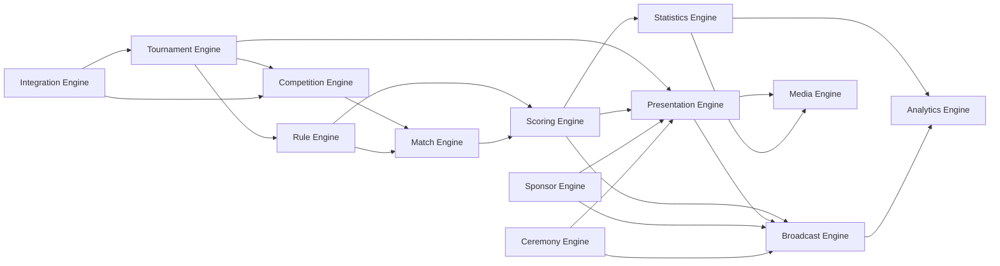

# BidWar Cricket Platform — Master Architecture Plan

**Version:** 3.0  
**Status:** Permanent Single Source of Truth (SSOT) — Product Architecture Bible  
**Document type:** Product & platform architecture constitution (not an implementation PR)  
**Created:** August 2026  
**Updated:** August 2026 (v3.0 — domain model, state machines, error recovery, RBAC, compatibility, performance budget, testing strategy, multi-sport contract)  
**Audience:** Product, engineering, organizers, broadcast partners, and future cricket variant owners  

---

## Document control

| Item | Value |
|------|--------|
| Scope | Complete BidWar Cricket Platform — Outdoor, Box, Tennis Ball, Indoor, and future variants — including organizer OS, broadcast, sponsors, media, and ceremonies |
| Non-goals | Code, SQL, API payloads, React components, UI mockups |
| Precedence | This document is the permanent constitution of BidWar Cricket. Implementation docs refine *how*; this doc defines *what must remain true*. |
| Evolution rule | v2.x expands prior versions. Existing principles and engine chapters are preserved; new chapters are additive only. |
| Related existing docs | [cricket-scoring-architecture.md](./cricket-scoring-architecture.md), [architecture/cricket-auction-dependency-audit.md](./architecture/cricket-auction-dependency-audit.md), scoring PR docs (`scoring-pr1` … `scoring-pr6`), [master-sports-architecture.md](./master-sports-architecture.md) |

### Relationship to existing architecture

BidWar already ships a production-shaped cricket scoring stack:

- Event-sourced match engine in `lib/scoring-core`
- Tournament ops (draws, fixtures, venues, squads)
- Standings, stats, awards, DLS (simplified), super over, free hit
- Player Registry–backed roster reads (Auction optional and write-only into Registry)
- Scorer UI, public match center, LED score-display, SSE live updates

This master plan **reuses that foundation**. It does not discard the event store, reducer, projections, or auction-decoupling boundary. It **extends** the platform so Outdoor, Box, Tennis Ball, Indoor, and future variants share one configurable core — differing only in Rule, Competition, and Presentation profiles.

---

## Table of contents

### Core architecture (v1.0 preserved & expanded)

1. [Vision](#1-vision)
2. [Product Philosophy](#2-product-philosophy)
3. [Platform Architecture](#3-platform-architecture)
4. [Cricket Platform Engines](#4-cricket-platform-engines)
5. [Tournament Engine](#5-tournament-engine)
6. [Competition Engine](#6-competition-engine)
7. [Rule Engine](#7-rule-engine)
8. [Match Engine](#8-match-engine)
8A. [Scoring UX Architecture](#8a-scoring-ux-architecture)
9. [Scoring Engine](#9-scoring-engine)
10. [Statistics Engine](#10-statistics-engine)
11. [Player Identity](#11-player-identity)
12. [Presentation Engine](#12-presentation-engine)
13. [Outdoor Cricket](#13-outdoor-cricket)
14. [Box Cricket](#14-box-cricket)
15. [Tennis Ball Cricket](#15-tennis-ball-cricket)
16. [Database Architecture](#16-database-architecture)
17. [API Architecture](#17-api-architecture)
18. [UI Architecture](#18-ui-architecture)
19. [Development Roadmap](#19-development-roadmap)
20. [Future Vision](#20-future-vision)

### Product operating architecture (v2.0)

21. [Tournament Lifecycle Architecture](#21-tournament-lifecycle-architecture)
22. [Tournament Creation Flow](#22-tournament-creation-flow)
23. [Broadcast Engine Architecture](#23-broadcast-engine-architecture)
24. [Sponsor Engine](#24-sponsor-engine)
25. [Media Engine](#25-media-engine)
26. [Ceremony Engine](#26-ceremony-engine)
27. [Organizer Operating System](#27-organizer-operating-system)
28. [Module Dependency Diagram](#28-module-dependency-diagram)
29. [Architecture Guardrails](#29-architecture-guardrails)
30. [Future Extension Strategy](#30-future-extension-strategy)

### Completeness architecture (v2.1)

31. [Plugin Architecture](#31-plugin-architecture)
32. [Event Taxonomy](#32-event-taxonomy)

### Ambiguity removal (v3.0) — required before implementation

33. [Domain Model](#33-domain-model)
34. [State Machines](#34-state-machines)
35. [Error Recovery Architecture](#35-error-recovery-architecture)
36. [Permissions Architecture](#36-permissions-architecture)
37. [Version Compatibility](#37-version-compatibility)
38. [Performance Budget](#38-performance-budget)
39. [Testing Strategy](#39-testing-strategy)
40. [Multi-Sport Contract](#40-multi-sport-contract)

---

# 1. Vision

## 1.1 Why BidWar Cricket exists

Cricket tournament organizers in India and emerging markets run fragmented stacks: one tool for auction, another for scoring, another for LED/stream graphics, and spreadsheets for standings. Switching costs are high; data does not follow the player across seasons; broadcast quality is reserved for elite leagues.

BidWar already owns live auction, display, registration, and identity. Cricket scoring must become a first-class platform product on that same foundation — not a bolt-on admin screen.

## 1.2 Product vision

**One Cricket Platform. Many variants. Zero duplicate engines.**

Organizers configure a tournament once (variant + rules + presentation + competition model). Scorers run matches on a thumb-first pad. Fans see a public match center. Broadcast operators consume live state through presentation profiles. Career identity and stats compound over years.

A CricHeroes-class workflow remains a north star for outdoor scoring UX, while Box, Tennis Ball, and Indoor become first-class citizens via configuration — not forks.

## 1.3 Long-term goal (5+ years)

- BidWar is the default operating system for franchise-style cricket leagues **and** local Box/society/corporate cricket.
- Every ball ever scored is replayable and projectable into stats, broadcast, fantasy, and analytics.
- New cricket variants ship as Rule + Presentation profiles in days, not as engine rewrites in months.
- Auction remains optional forever; scoring and presentation never require Auction to function.

## 1.4 Problems solved

| Problem | Platform answer |
|---------|-----------------|
| Separate tools for auction vs scoring vs display | Unified tournament + optional Auction + shared Registry |
| Hardcoded T20 assumptions block Box Cricket | Configurable Rule Engine + profiles |
| Graphics coupled to scoring logic | Independent Presentation Engine |
| Stats lost when leagues end | Global player identity + career projections |
| Multi-instance live score fragility | Event store + realtime fanout as a platform concern |
| Variant sprawl (Box / Outdoor / Tennis Ball) | Single Match + Scoring Engine; profiles change behavior |

---

# 2. Product Philosophy

These principles are non-negotiable for all cricket work.

### P1 — Configuration over hardcoding

Match length, playing squad size, legal dismissals, boundary values, powerplay windows, and tie-breakers live in **Rule Profiles**. Code implements *mechanisms*; profiles supply *policy*.

### P2 — Presentation is independent of scoring

LED, OBS, scorebug, public pages, TV, and MC displays subscribe to match/projection state. They never invent scoring rules. Changing a theme or sponsor layout must never require a reducer change.

### P3 — Rule Engine controls gameplay

The scorer UI and Match Engine ask the Rule Engine: “Is this delivery legal? Does this wicket count? What is the target?” Invalid actions fail validation before persistence.

### P4 — Event Store is the source of truth

Append-only cricket events are truth. Scoreboard, scorecard, standings, leaderboards, awards, and career stats are **projections**. Corrections use compensating events (undo), not silent mutation.

### P5 — Auction must always remain optional

```
Platform (Registry, Branding, Auth, Media)
    ↓
Cricket Platform (never reads Auction tables)
    ↓
Auction (optional write-side sync into Registry)
```

This matches the existing cricket ↔ auction dependency audit and must not regress.

### P6 — Outdoor and Box share one core engine

There is **one** Scoring Engine and **one** Match Engine for all cricket variants. Box Cricket is a Variant + Rule Profile + Presentation Profile — never a parallel codebase.

### P7 — Future variants require configuration, not rewrites

Tennis Ball, Indoor, tape-ball leagues, youth formats, and custom society rules should ship primarily as profiles and competition templates.

### P8 — Sport boundary purity

Cricket may depend on Platform. Cricket must not depend on Auction read APIs. Packaging should eventually locate cricket UI under a cricket/scoring host, not auction branding debt.

### P9 — One job = one screen

Organizer, scorer, audience, public, and broadcast surfaces have distinct jobs. Do not merge live scoring into admin dashboards.

### P10 — Design for replay and audit

Every consequential change (ball, DLS, award, rule override for a match) must be attributable, ordered, and replayable.

---

# 3. Platform Architecture

## 3.1 Hierarchy

```
BidWar
  └── Sports Platform          (auth, registry, branding, media, feature flags)
        └── Cricket Platform   (engines below; sport_slug = cricket)
              └── Variant                (outdoor | box | tennis_ball | indoor | …)
                    └── Rule Profile           (gameplay policy)
                    └── Presentation Profile   (visual / broadcast policy)
                          └── Tournament
                                └── Competition (format + entry model)
                                      └── Season / Draw / Fixtures
                                            └── Match
                                                  └── Events → Projections
```

## 3.2 Layer definitions

| Layer | Meaning | Changes when… |
|-------|---------|----------------|
| **BidWar** | Company product surface; multi-sport | Rarely |
| **Sports Platform** | Shared identity, auth, media, branding, tournament shell | Cross-sport platform work |
| **Cricket Platform** | All cricket engines and cricket contracts | Platform-wide cricket capabilities |
| **Variant** | Named cricket family (Outdoor, Box, …) | New cricket family introduced |
| **Rule Profile** | Concrete gameplay numbers and legality | Format/rules differ |
| **Presentation Profile** | Themes, overlays, LED layouts, public chrome | Brand / venue / broadcast differ |
| **Tournament** | One organizer event instance | Every event |
| **Competition** | How teams enter and progress | League vs knockout vs auction hybrid |
| **Match** | One contest under a rule snapshot | Every fixture |

## 3.3 Critical invariant

```
Variant × Rule Profile × Presentation Profile × Competition
        →  same Match Engine + Scoring Engine
```

Only inputs and projections differ. The reducer is variant-agnostic; it consumes a **resolved rule snapshot** at match start.

## 3.4 Runtime topology (reuse)

| Concern | Current home (reuse) | Target ownership |
|---------|----------------------|------------------|
| Pure domain | `lib/scoring-core` | Cricket Platform / Scoring + Rule evaluation |
| Sport package facade | `lib/sports-cricket` | Grow into Cricket Platform package surface |
| HTTP + SSE | `artifacts/api-server` scoring routes | Cricket API boundary |
| UI host | `artifacts/scoring-app` (pages today aliased from auction-platform) | Cricket UI packaging cleanup over time |
| Identity | Player Registry + `global_players` | Unchanged Platform ownership |

---

# 4. Cricket Platform Engines

The Cricket Platform is a family of engines. v1.0 defined ten core engines. v2.0 recognizes additional product engines — **Sponsor**, **Media**, and **Ceremony** — that sit beside Presentation and Broadcast without touching scoring truth. All collaborate; none duplicate the Scoring Engine.



See [§28 Module Dependency Diagram](#28-module-dependency-diagram) for the authoritative dependency constitution.

---

## 4.1 Tournament Engine

| | |
|--|--|
| **Purpose** | Own tournament identity, lifecycle, and bound profiles |
| **Responsibilities** | Create/configure tournament; bind Variant, Rule Profile, Presentation Profile, Competition Type; venues; organizer; scoring enablement; lifecycle transitions |
| **Inputs** | Organizer intent, sport=cricket, variant, profile IDs, metadata |
| **Outputs** | Tournament aggregate; resolved profile references; lifecycle state |
| **Dependencies** | Sports Platform (auth, branding); Rule / Presentation / Competition engines |
| **Future scope** | Multi-season series, franchise continuity across years, template marketplace |

---

## 4.2 Rule Engine

| | |
|--|--|
| **Purpose** | Resolve and enforce gameplay policy without hardcoding variant logic in the reducer |
| **Responsibilities** | Profile inheritance; match rule snapshot; validate events against rules; expose derived limits (XI size, overs, legal dismissals) |
| **Inputs** | Variant defaults, profile ID, tournament overrides, optional match overrides |
| **Outputs** | Immutable **Rule Snapshot** attached to each match; validation decisions |
| **Dependencies** | None on presentation or auction |
| **Future scope** | Visual rule builder; certified ICC/DLS table packs; society custom rule packs |

---

## 4.3 Competition Engine

| | |
|--|--|
| **Purpose** | How teams enter and how the tournament progresses |
| **Responsibilities** | Entry models (auction / registered / hybrid / practice); draw generation; standings policies; qualification; knockout advancement |
| **Inputs** | Team set, format, scheduling constraints, points rules (from Rule Snapshot where relevant) |
| **Outputs** | Draws, fixtures, standings seed, progression graph |
| **Dependencies** | Tournament Engine; Player Registry for team identity; existing schedule generators (reuse) |
| **Future scope** | Swiss, double elim, multi-stage cups, cross-group rankings |

---

## 4.4 Match Engine

| | |
|--|--|
| **Purpose** | Orchestrate a single match lifecycle around the Scoring Engine |
| **Responsibilities** | Pre-match → toss → squad → live → innings/breaks → result → awards; session status (live/paused); abandon/NR |
| **Inputs** | Fixture or ad-hoc match create; Rule Snapshot; squads; toss |
| **Outputs** | Match aggregate status; triggers for projections and presentation |
| **Dependencies** | Rule Engine, Scoring Engine, Registry |
| **Future scope** | Multi-innings first-class; day/night breaks; series of ties |

---

## 4.5 Scoring Engine

| | |
|--|--|
| **Purpose** | Record and derive ball-by-ball state from events |
| **Responsibilities** | Append events; validate; reduce; undo/replay; offline sync contract; live summary |
| **Inputs** | Event commands + Rule Snapshot + expected sequence |
| **Outputs** | Scoreboard state; event log; summary projection hooks |
| **Dependencies** | Rule Engine (validation); Match Engine (lifecycle gates) |
| **Future scope** | Stronger multi-instance fanout; richer correction events; third-party scorer ingest |

**Reuse:** Existing `scoring_events` + reducer + undo + offline queue remain the core.

---

## 4.6 Statistics Engine

| | |
|--|--|
| **Purpose** | Project events into durable stats artifacts |
| **Responsibilities** | Match player stats; tournament aggregates; season/career; leaderboards; awards; milestones/records |
| **Inputs** | Completed/abandoned match events; identity maps |
| **Outputs** | `scoring_match_player_stats`, leaderboard snapshots, awards, career rows |
| **Dependencies** | Scoring Engine; Player Identity |
| **Future scope** | Phase-of-play analytics, wagon wheel, vs-bowler splits — always as projections |

---

## 4.7 Presentation Engine

| | |
|--|--|
| **Purpose** | Render match/tournament state for humans and screens |
| **Responsibilities** | Public pages, LED layouts, themes, sponsor slots, TV/MC modes; bind Presentation Profile |
| **Inputs** | Live/projected state; branding tokens; Presentation Profile |
| **Outputs** | View models for each surface |
| **Dependencies** | Scoring/Statistics projections; Tournament Branding (Platform) |
| **Future scope** | Full graphics package; per-venue layout packs |

---

## 4.8 Broadcast Engine

| | |
|--|--|
| **Purpose** | Low-latency, chroma-safe overlays and director controls for stream/LED |
| **Responsibilities** | OBS/scorebug scenes; graphic cues (boundary/wicket); sponsor rotation; MC prompts; director playlist |
| **Inputs** | Live state stream; Presentation Profile; director commands |
| **Outputs** | Overlay scenes; cue events |
| **Dependencies** | Presentation Engine; realtime fanout (SSE/pubsub) |
| **Future scope** | Auto-graphics from ball events; multi-camera tally; broadcast automation |

**Current gap:** Auction OBS exists; cricket-specific broadcast is largely greenfield. Architecture reserves this engine without coupling it into the reducer.

---

## 4.9 Analytics Engine

| | |
|--|--|
| **Purpose** | Aggregate operational and sporting insight beyond fan leaderboards |
| **Responsibilities** | Organizer dashboards; pace of play; scorer quality; audience engagement metrics |
| **Inputs** | Events, projections, presentation impressions (future) |
| **Outputs** | Analytics models / reports |
| **Dependencies** | Statistics Engine; optional Integration |
| **Future scope** | Predictive win %, fantasy signals, CV-assisted ball detection feeds |

---

## 4.10 Integration Engine

| | |
|--|--|
| **Purpose** | Connect Cricket Platform to Platform modules and external systems |
| **Responsibilities** | Auction→Registry sync hooks; registration import; webhooks; export; third-party score feeds |
| **Inputs** | External events / import files |
| **Outputs** | Registry writes; cricket-facing opaque IDs |
| **Dependencies** | Platform; never reverse cricket→auction reads |
| **Future scope** | Score providers, federation feeds, fantasy partners |

---

## 4.11 Sponsor Engine (v2.0)

| | |
|--|--|
| **Purpose** | Own sponsor inventory, categories, placements, and rotation across cricket surfaces |
| **Responsibilities** | Inventory; category taxonomy; slot binding to Presentation/Broadcast; rotation; impression analytics hooks |
| **Inputs** | Sponsor contracts; Presentation Profile slot map; match/tournament timeline cues |
| **Outputs** | Resolved sponsor creatives per surface/moment |
| **Dependencies** | Presentation Engine, Broadcast Engine; never Scoring Engine |
| **Detail** | [§24 Sponsor Engine](#24-sponsor-engine) |

---

## 4.12 Media Engine (v2.0)

| | |
|--|--|
| **Purpose** | Generate and manage shareable cricket media assets |
| **Responsibilities** | Player cards, posters, certificates, social assets, albums; future AI highlights & auto-publish |
| **Inputs** | Identity, match results, stats projections, Presentation Profile branding |
| **Outputs** | Media artifacts and publish jobs |
| **Dependencies** | Presentation, Statistics, Identity; read-only toward Scoring |
| **Detail** | [§25 Media Engine](#25-media-engine) |

---

## 4.13 Ceremony Engine (v2.0)

| | |
|--|--|
| **Purpose** | Orchestrate ceremonial moments around competition (opening, toss, awards, closing) |
| **Responsibilities** | Ceremony timelines; cue handoff to Broadcast/Presentation; auction presentation bridge (optional) |
| **Inputs** | Tournament lifecycle stage; Presentation Profile; director/MC intent |
| **Outputs** | Ceremony playbooks and cue sequences |
| **Dependencies** | Presentation, Broadcast, optional Auction (presentation only); never Scoring rules |
| **Detail** | [§26 Ceremony Engine](#26-ceremony-engine) |

---

# 5. Tournament Engine

## 5.1 Tournament identity

A tournament is the durable container for one cricket competition instance.

| Attribute | Description |
|-----------|-------------|
| Tournament ID | Platform identifier (existing) |
| Sport | Always `cricket` for this platform |
| Variant | `outdoor` \| `box` \| `tennis_ball` \| `indoor` \| future |
| Code / slug | Public and operator addressing |
| Organizer | Owning account / org |
| Season | Optional series label (e.g. “Season 3”) |

## 5.2 Tournament metadata

Name, city/region, dates, branding tokens, registration settings, communication settings, feature flags (`scoring_enabled`, `scoring_phase`, `scoring_pin` — reuse).

## 5.3 Bound profiles

| Binding | Role |
|---------|------|
| **Rule Profile** | Gameplay policy for all matches unless match-level override |
| **Presentation Profile** | Default look for public + LED + future OBS |
| **Competition Type** | Entry + progression model |

At tournament create/edit time, choosing a Variant suggests default Rule + Presentation profiles; organizers may override.

## 5.4 Venue

Reuse `scoring_venues` (grounds / boxes / indoor halls). Venue is operational metadata for fixtures — not a separate sport.

## 5.5 Lifecycle & states

```
draft → published → registration_open → registration_closed
      → competition_ready → in_progress → completed → archived
```

Orthogonal scoring phase (existing concept):

```
disabled → enabled → in_progress → completed
```

Auction phase (if used) remains an Auction-module concern; Tournament Engine only observes whether Registry squads are populated.

**v2.0 product lifecycle (operator journey)** — Configuration → Registration → optional Auction → Team Formation → Fixtures → Scheduling → Live Matches → Standings → Knockouts → Awards → Complete → Archive — is defined in full in [§21 Tournament Lifecycle Architecture](#21-tournament-lifecycle-architecture). Creation wizard bindings are in [§22](#22-tournament-creation-flow).

## 5.6 Responsibilities summary

- Bind and version profiles
- Gate scoring enablement
- Own venues/officials attachment points
- Expose tournament public identity for Presentation
- Never embed ball-level rules in tournament rows — only profile references + optional overrides JSON

---

# 6. Competition Engine

## 6.1 Entry models

| Model | Description |
|-------|-------------|
| **Auction** | Franchises acquire players via Auction; Registry sync populates squads |
| **Registered Teams** | Pre-formed teams register; no auction |
| **Hybrid** | Core squad registered; remaining slots auctioned |
| **Practice** | Informal matches; minimal standings; scoring still event-sourced |

## 6.2 Progression formats

| Format | Status in platform | Notes |
|--------|--------------------|-------|
| Round Robin | Exists (generators) | Reuse |
| League | Exists | Alias/policy around RR + points |
| Knockout | Exists (R1 bracket) | Strengthen advancement |
| Groups + Knockout | Exists | Reuse league_knockout pattern |
| Swiss | Future | Same fixture table; different pairing algorithm |
| Custom multi-stage | Future | Stage graph on draws |

## 6.3 Architecture

```
Competition Definition
  ├── entry_model
  ├── format_graph (stages)
  ├── points_policy (from Rule Profile or competition override)
  └── scheduling_policy
         ↓
Draw / Groups
         ↓
Fixtures
         ↓
Matches (Match Engine)
         ↓
Standings / Qualification projections
```

## 6.4 Standings

Reuse existing standings projection (points, NRR-style net run metrics). Rule Profile may redefine:

- Points for win / tie / NR / bonus
- Whether NRR or alternative tie-breakers apply
- Qualification cut lines

## 6.5 Practice mode

Practice competitions still use the Scoring Engine. They may skip formal draws and public leaderboards. They must not invent a second event model.

---

# 7. Rule Engine

> The Rule Engine is the most important extensibility surface in the Cricket Platform.

## 7.1 Design goal

**No hardcoded variant branches in product logic.**  
Outdoor vs Box vs Tennis Ball differ by **resolved Rule Snapshots**, not by `if (box) …` throughout the codebase.

Mechanisms in the Scoring Engine (legal ball counting, strike rotation, free-hit eligibility, undo) remain generic. Policy values come from the snapshot.

## 7.2 Rule domains

### Match rules

- Overs per innings (or balls-based innings)
- Max innings count
- Max wickets / all-out threshold
- Playing squad size (e.g. 11 vs 6–8)
- Bench size
- Ball type metadata (leather / tennis / tape) — informational + some legality hooks
- Target calculation mode (standard chase / DLS pack / none)

### Batting rules

- Retire thresholds (optional auto-retire after N runs — common in Box)
- Re-entry allowed?
- Opening pair required?
- Runner / impact player / substitute policy flags

### Bowling rules

- Max overs per bowler
- Max consecutive overs
- Bowler change required at over boundary?
- No-ball / wide run values
- Free hit enabled?

### Dismissal rules

- Enabled dismissal types (subset of ICC set)
- Free-hit allowed dismissals
- LBW enabled? (often off for tennis/box)
- Timed out duration

### Boundary rules

- Four / six run values (almost always 4/6; keep configurable)
- One-bounce four policies if needed later
- Roof/net six rules for indoor/box (custom flags)

### Ground / venue rules

- Boundaries short/long multipliers (future)
- Dead ball conditions catalog
- Interruptions: rain pack (DLS) vs time-box only

### Powerplay rules

- Enabled?
- Overs list / phases
- Fielding restrictions as **policy flags** (presentation may show; enforcement level configurable)

### Super over

- Enabled on tie?
- Overs / wickets / bowl-out fallback

### Tie break

- Super over → shared points → NRR → head-to-head → ranking qualifiers

### Penalty rules

- Penalty run awards enabled
- Default penalty magnitudes

### Player count

- Min/max squad registration
- Min/max playing XI for start
- Gender / category constraints (delegate to Platform registration where possible)

### Overs & balls

- Overs limit
- Balls per over (always 6 for cricket legality unless explicitly experimented — default 6)
- Last over special rules (future flags)

### Custom rules

- Opaque keyed extensions for society/corporate packs
- Must not break replay: unknown keys ignored by older engines with version negotiation

## 7.3 Rule Profiles

A **Rule Profile** is a named, versioned document:

```
RuleProfile
  id, name, variant, version
  inherits_from?   → parent profile id
  body             → structured rule domains above
  status           → draft | published | deprecated
```

### Inheritance

```
Platform Cricket Base
  └── Outdoor T20 Default
        └── Outdoor T20 Corporate Override (tournament)
  └── Box Default
        └── Box Corporate
        └── Box Society
        └── Box College
        └── Box Indoor Hall
  └── Tennis Ball Default (future)
```

Child profiles override only deltas. Resolution produces a flat **Rule Snapshot**.

### Custom overrides

| Level | Allowed | Snapshot impact |
|-------|---------|-----------------|
| Variant default | Yes | Base |
| Published profile | Yes | Standard pack |
| Tournament override | Yes | Tournament-wide snapshot default |
| Match override | Rare, audited | Match snapshot clone + override |

Match start **freezes** the snapshot so mid-tournament profile edits do not rewrite history.

## 7.4 Interaction with Scoring Engine

```
Command (ball / wicket / …)
  → Match Engine lifecycle check
  → Rule Engine validate(command, snapshot, state)
  → Scoring Engine append + reduce
```

Validation failures never write events.

## 7.5 Migration from today’s code

Today many values are implicit (XI=11, overs on match create, dismissal enums in core). The roadmap **externalizes** these into profiles while keeping the same event taxonomy and reducer mechanisms.

## 7.6 Rule Resolution Pipeline (v2.0)

Every match must play under exactly one **Resolved Rule Snapshot**. Resolution is a pure, ordered merge — never ad-hoc UI logic.

```
Platform Default
      ↓
Variant Default
      ↓
Rule Template (published Rule Profile / pack)
      ↓
Tournament Overrides
      ↓
Match Overrides (rare, audited)
      ↓
Resolved Rule Snapshot  ← frozen at match start
```

### Layer meanings

| Layer | Owner | Purpose |
|-------|-------|---------|
| **Platform Default** | Cricket Platform | Universal cricket safety floor (e.g. balls-per-over baseline, event taxonomy compatibility) |
| **Variant Default** | Variant steward | Outdoor vs Box vs Tennis Ball baseline policy |
| **Rule Template** | Product / pack author | Named published profile (T20, Box Corporate, Society Casual, …) |
| **Tournament Overrides** | Organizer | Event-specific deltas (overs, retire-at-N, LBW on/off) |
| **Match Overrides** | Organizer / referee (audited) | Exceptional single-match adjustments |
| **Resolved Rule Snapshot** | Match Engine at start | Immutable document attached to the match |

### Inheritance rules

1. Lower layers win on conflict (Match Overrides beat Tournament Overrides beat Template, etc.).
2. Child templates store **deltas**, not full copies, wherever possible.
3. Resolution always materializes a **flat** snapshot so runtime never walks the inheritance tree mid-ball.
4. Deprecated templates remain readable for historical matches that already froze them.

### Versioning

| Artifact | Versioning rule |
|----------|-----------------|
| Platform Default | Platform release version |
| Variant Default | Variant policy version |
| Rule Template | Explicit `version`; publish creates immutable revision |
| Tournament Overrides | Versioned with tournament config revision |
| Rule Snapshot | Stores full resolved body + provenance (template id/version + override refs) |

Editing a published template creates a **new version**. Existing tournaments continue pointing at the version they bound unless the organizer explicitly upgrades. Matches already started **ignore** upgrades entirely — they keep their frozen snapshot.

### Freezing snapshots

At match start (or at first scoring command, if start is implicit):

1. Resolve the pipeline into a flat snapshot.
2. Persist the snapshot with the match.
3. All validation and reduction for that match use **only** that snapshot.

Mid-tournament profile edits, sponsor changes, or presentation updates **must not** alter a live or completed match’s gameplay rules.

### Why runtime rules must never change

| Reason | Explanation |
|--------|-------------|
| **Fairness** | Both teams agreed (implicitly) to the rules at start |
| **Replay integrity** | Replaying events under different rules yields a different result — unacceptable |
| **Audit / disputes** | Organizers and associations must prove what rules applied |
| **Projections** | Stats and standings must be explainable against a fixed policy |
| **Offline sync** | Scorers may queue events; rule drift mid-queue causes corruption |

**Constitutional rule:** Gameplay policy for a match is immutable after snapshot freeze. Corrections to *scoring mistakes* use compensating events. Corrections to *wrong rules chosen* require an explicit administrative match reset / void path — never silent mutation of the snapshot.

## 7.7 Rule Engine non-negotiables

- No hardcoded Outdoor/Box branches in Scoring Engine product logic.
- No business rules invented in scorer UI.
- No Presentation or Sponsor engine may alter Rule Snapshots.
- Unknown custom keys must fail closed or be ignored per version negotiation — never crash replay of historical matches.

---

# 8. Match Engine

## 8.1 Lifecycle

```
Pre Match
  → Toss
  → Playing Squad
  → Live Match
       ⇄ Innings
       ⇄ Break / Interruption
  → Result
  → Awards
```

## 8.2 Stages

### Pre Match

Fixture exists (Flow B) or ad-hoc match created (Flow A — reuse). Venue/officials optional. Rule Snapshot attached. Status: `scheduled`.

### Toss

Record toss winner + elected bat/bowl (existing event). Unlocks squad confirmation / openers.

### Playing Squad

Playing set + bench from Registry roster (existing match squads). Size bounds from Rule Snapshot (not hardcoded 11 forever). Captain / keeper optional metadata.

### Live Match

Session live. Scoring Engine accepts balls. Bowler/striker selection is Match Engine UX state coordinated with scoreboard state.

### Innings

Start/end reasons driven by rules (all out, overs complete, target reached, declare if allowed, super over required).

### Break / Interruption

Drinks/innings break vs rain/time interruption. Resume or DLS/abandon paths (reuse existing interrupt/resume/DLS events where applicable).

### Result

Winner / tie / NR / abandoned. Margin text. Standings trigger.

### Awards

Auto MoM (existing) + future manual awards. Statistics Engine projects.

## 8.3 Flow A / Flow B (reuse)

- **Flow A:** Direct match create without fixture  
- **Flow B:** Fixture from draw → match  

Both remain first-class.

## 8.4 Scorer experience

Match Engine owns lifecycle stages. The human scorer workflow, safety rules, and interaction philosophy are defined in [§8A Scoring UX Architecture](#8a-scoring-ux-architecture). Scoring UX never invents gameplay rules — it consumes Match + Rule + Scoring engines.

---

# 8A. Scoring UX Architecture

> Scorer experience constitution. Not UI mockups. Not visual design.  
> Defines philosophy, workflow, and safety so implementation cannot invent conflicting scorer behavior.

## 8A.1 Purpose

Design the **scorer experience** as a first-class product surface: the person recording the match must be faster, calmer, and safer than any admin dashboard or broadcast tool.

Scoring UX sits **beside** Match Engine and Scoring Engine:

| Layer | Owns |
|-------|------|
| Match Engine | Lifecycle legality (can we toss? can we end innings?) |
| Rule Engine | Gameplay policy (is this dismissal legal?) |
| Scoring Engine | Event truth, reduce, undo, replay |
| **Scoring UX** | How the human performs the job under pressure |

## 8A.2 Product Principles

These principles are constitutional for every scorer surface (phone, tablet, future watch/keypad).

| Principle | Meaning |
|-----------|---------|
| **One Job = One Screen** | Live scoring is only about the next ball. No organizer finance, no sponsor editor, no fixture generator on this screen. |
| **One Thumb Operation** | Primary actions reachable with one thumb in portrait; no precision pinching required for common balls. |
| **Maximum 2 taps for common actions** | Legal run (0–6), wide, no-ball, bye/leg-bye, and common wickets must not require deep menus. Target: normal ball = 1 tap; wicket = ≤2 taps. |
| **Never interrupt scorer unnecessarily** | No toast spam, no mandatory surveys mid-over, no blocking “tips” during live play. |
| **Offline First** | Network loss must not stop recording intent; queue and sync (existing offline posture remains). |
| **Fastest possible scoring** | Latency of feedback and clarity of state beat decorative motion. |
| **Large touch targets** | Primary pad controls sized for gloves, sun, adrenaline, and imperfect aim. |
| **Night Mode compatibility** | Venue lights and dark pads are first-class; contrast must survive LED glare and night matches. |
| **Error recovery first** | Mistakes are expected; recovery path is designed before novelty features. |
| **Undo always available** | Undo is a permanent control — not hidden behind overflow during live play. |

Additional bindings from platform philosophy:

- Presentation / Broadcast / Sponsor never appear as required steps on the live pad.
- Rule Snapshot is already frozen; UX reflects it, does not edit it mid-match.
- Variant differences (Outdoor vs Box) appear as **enabled actions and limits**, not as a different app.

## 8A.3 Scoring Lifecycle (scorer journey)

```
Pre Match
    ↓
Toss
    ↓
Playing Squad
    ↓
Opening Batter
    ↓
Opening Bowler
    ↓
Live Scoring
    ↓
Over Complete
    ↓
Innings Break
    ↓
Second Innings
    ↓
Match Complete
    ↓
Awards
```

### Pre Match

Scorer confirms they are on the correct match, sees Rule Snapshot summary (overs, squad size, key flags), and connection/offline status. No ball entry yet. Ownership: Match Engine gates; UX shows readiness checklist.

### Toss

Capture toss winner and election (bat/bowl). Minimal controls. Destructive “wrong match” exit is available but confirmed. Ownership: Match Engine event; UX is a short stepper step.

### Playing Squad

Select playing set + bench within Rule Snapshot bounds (e.g. 11 or Box 6–8). Captain/keeper optional. UX must make “ready” obvious when minimums met. Ownership: Match squads; Registry for names.

### Opening Batter

Select striker and non-striker from batting side. Clear labels; prevent same player twice. Ownership: lineup / batting order intent into Match/Scoring.

### Opening Bowler

Select first bowler from fielding side. UX should bias toward quick pick from squad, not free-text. Ownership: Match Engine / scoreboard bowler state.

### Live Scoring

Primary job screen. Score always visible. Pad for runs/extras/wickets. Undo fixed. See §8A.4. Ownership: Scoring commands under Rule validation.

### Over Complete

Signal end of over; force or guide bowler change per rules; strike already handled by engine. UX may briefly celebrate over end **without** blocking the next action for more than a moment. Ownership: Scoring state; UX acknowledgement.

### Innings Break

Between innings: summary of innings just completed, target (if chase), optional break ceremony cues elsewhere — **not** on the critical path of the pad. Scorer path to “start next innings” must stay obvious. Ownership: Match Engine innings transition.

### Second Innings

Same live pad mental model; chase context (target, RR/RRR) visible without cluttering the pad. Super over / DLS affordances appear only when Rule Snapshot and Match state allow.

### Match Complete

Result confirmation; margin/result text from engine. Scorer should not be trapped in admin. Path to leave or review is calm and final. Ownership: Match completed event; Statistics projections kick off asynchronously.

### Awards

MoM / awards may display as confirmation after complete. Manual override (if any) is organizer/ceremony territory — not a live-pad obligation. Ownership: Statistics / Ceremony; UX may show read-only result.

## 8A.4 Live Scoring UX (principles only)

No layouts, no component specs. Interaction contracts only.

| Concern | UX principle |
|---------|----------------|
| **Ball Entry** | Default mode is “next legal ball.” State (striker, bowler, over.ball, free hit) always visible. |
| **Runs** | 0–6 are primary controls; one tap commits when no modifier pending. |
| **Extras** | Wide / no-ball / bye / leg-bye as first-class pad actions; penalty as secondary if enabled by rules. |
| **Wickets** | Second tap or single dedicated path; dismissal types filtered by Rule Snapshot (and free-hit constraints). New batter prompt only when required. |
| **Strike Change** | Engine-owned; UX reflects striker marker — scorer should not manually “swap” except via explicit rare correction flow. |
| **Bowler Change** | Required at over boundary (and when rules demand); sheet/list must be fast, squad-scoped, large targets. |
| **Undo** | Always visible on live pad; confirms only if needed for non-last-ball scope; never buried. |
| **Correction** | Prefer undo + re-enter. Mid-innings arbitrary edit is not a live-pad feature; administrative correction is a separate controlled path. |
| **Pause Match** | Explicit pause/interrupt (e.g. rain) — not accidental. Shows paused state unmistakably. |
| **Resume** | One clear resume action; no ball entry while paused. |
| **Rain** | Interrupt → resume and/or DLS path when Rule Snapshot allows; keep copy short; never force DLS when pack disabled (Box default). |
| **Super Over** | Appears only when rules + match state require/allow; same pad mental model with super-over context banner. |
| **Match End** | End innings / complete / abandon are secondary-but-reachable; abandon and void are destructive and confirmed. |

## 8A.5 UX Safety Rules

| Rule | Rationale |
|------|-----------|
| **Never hide score** | Scorer orientation depends on continuous score/wickets/overs context. |
| **Never hide undo** | Error recovery is part of the primary chrome during live play. |
| **Never block scorer** | Non-critical dialogs, upsells, and analytics prompts are forbidden on the live pad. |
| **Critical buttons always fixed** | Runs cluster, wicket, undo, and bowler affordance stay in stable positions within a match session. |
| **Dialogs only for destructive actions** | Abandon, void, apply DLS, start super over — not for every wide. |
| **Never require scrolling during scoring** | Primary pad must fit the first viewport; secondary sheets may scroll. |
| **Never navigate away on accidental tap** | Back/leave requires intent when match is live. |
| **Show connection honestly** | Offline/queue depth visible without alarming falsely. |
| **Respect free-hit and pause banners** | Illegal actions disabled or rejected with instant, non-modal feedback. |
| **One match lock** | Scorer identity / lock model prevents silent dual-writers when platform provides locks. |

## 8A.6 Relationship to other engines

```
Rule Snapshot + Match state + Scoreboard state
        ↓ (read)
Scoring UX (human intent)
        ↓ (commands)
Match gate → Rule validate → Scoring append
        ↓
Live state → Presentation / Broadcast (other jobs, other screens)
```

## 8A.7 Future Scope

Architecture-ready extensions — each must obey §8A.2 and §29:

| Future input | Constraint |
|--------------|------------|
| **Voice Scoring** | Same command pipeline; confirmation for wickets/destructive |
| **Watch Scoring** | Subset of actions; phone remains authority for complex flows |
| **Gesture Support** | Must not increase accidental commits; undo remains |
| **Hardware Keypads** | Map to same commands; no parallel rule logic in firmware UX |
| **Bluetooth Devices** | Integration Engine ingest → validated commands only |

---

# 9. Scoring Engine

> Keep generic. Never Box-specific.

## 9.1 Reuse of existing architecture

The shipped design remains the SSOT for scoring mechanics:

| Concept | Existing commitment |
|---------|---------------------|
| Event store | Append-only `scoring_events` |
| Sequences | Monotonic per match; optimistic concurrency via expected sequence |
| Reducer | Pure function in `lib/scoring-core` |
| Undo | Compensating `cricket.ball.undone` + replay |
| Offline | Client queue → sync on reconnect |
| Live | Summary/state broadcast to subscribers |

## 9.2 Event Store

- Events are truth  
- No update/delete of historical balls  
- Corrections = compensating events  
- `sport_slug = cricket`  
- Payload schemas versioned (`event_version`)

## 9.3 Reducer

- Input: prior state + event + Rule Snapshot (target architecture)  
- Output: next scoreboard state  
- Mechanisms: runs, extras, wickets, overs, strike change, free hit flag, super over innings kind, penalties, retirements, DLS fields  

Variant policy (e.g. LBW off, retire at 30) is enforced via Rule Engine validation / snapshot flags — not a second reducer.

## 9.4 Replay

Rebuild state by replaying resolved events (undo markers stripped). Used for recovery, projections, and golden tests (already exist).

## 9.5 Undo

Last actionable ball (or defined undo scope) via compensating event. Arbitrary mid-innings rewrite is a future correction-event family — not silent edits.

## 9.6 Offline & sync

- Queue commands locally when network fails  
- Replay in order with sequence reconciliation  
- Conflict → scorer refresh + guided resolve  

## 9.7 Validation

Two layers:

1. **Schema validation** — event payload shape  
2. **Rule validation** — legality under Rule Snapshot + lifecycle  

## 9.8 Scoring pipeline

```
UI / API command
  → auth (organizer / scorer PIN / scorer account)
  → Match Engine gate
  → Rule Engine validate
  → append event
  → reduce → persist session/projection version
  → broadcast live state
  → on terminal match: Statistics Engine projections
```

---

# 10. Statistics Engine

## 10.1 Projection model

```
scoring_events
    → replay / project
        → match_player_stats
        → tournament aggregates / leaderboard snapshots
        → awards
        → career / global statistics
```

**Trigger policy (reuse):** project on match complete (and controlled rebuilds). Avoid dual-writing stats on every live ball unless a future live-stats product requires it.

## 10.2 Layers

| Layer | Description |
|-------|-------------|
| **Match Stats** | Batting / bowling / fielding per player per match (exists) |
| **Tournament Stats** | Aggregates + leaderboard snapshots (exists) |
| **Season Stats** | Across tournaments sharing a season/series id (future) |
| **Career Stats** | Global player rollups (exists foundation) |
| **Leaderboards** | Category boards (runs, wickets, sixes, …) |
| **Awards** | MoM and future awards |
| **Milestones** | 50/100, 5-fors, hat-tricks — derived |
| **Records** | Tournament/season bests — derived |

## 10.3 Variant awareness

Stats store the Rule Snapshot version / variant tag so Box retire-at-N innings are not naïvely compared to Outdoor ODIs without context. Leaderboards are scoped by tournament (and optionally by variant for global boards).

---

# 11. Player Identity

## 11.1 Identity layers (reuse + clarify)

```
global_players                 ← one human
    └── tournament participation (opaque franchise player id via PTA)
            └── team assignment (master_teams / PTA)
                    └── match squad + events (playerId in payloads)
                            └── stats / awards / career projections
```

| Layer | Role |
|-------|------|
| **Global Player** | Canonical person; career anchor; mobile dedup |
| **Tournament Player** | Opaque integer used in scoring events (legacy column names may say auction* — meaning is Registry opaque id) |
| **Auction Player** | Optional Auction-module row; syncs **into** Registry only |
| **Team Assignment** | Franchise/team membership for the tournament |
| **Career History** | Assignments + stats across tournaments |
| **Statistics** | Projections keyed by global and/or tournament player ids |
| **Identity Merge** | Platform operation when duplicates discovered — cricket projections follow merge map |

## 11.2 Dependency rule (reuse)

Cricket reads **Player Registry** only. Auction may write Registry on sell/transfer. Cricket never reads Auction tables for scoring.

## 11.3 Box / Outdoor

Identity is variant-agnostic. A player may appear in Outdoor and Box tournaments under the same `global_players` row; stats remain filterable by variant/tournament.

---

# 12. Presentation Engine

> Presentation is a full product surface family — not “themes.” It never owns gameplay truth.

## 12.1 Principle

**Same live state → many skins.**

```
Live / projected state  (read-only)
        ↓
Presentation Engine (applies Presentation Profile)
        ↓
┌──────────┬─────┬─────┬────┬────────┬──────────┬────────────┐
│ Public   │ LED │ OBS │ TV │ Scorebug│ MC Display│ Ceremonies │
│ Pages    │     │     │    │         │           │ / Graphics │
└──────────┴─────┴─────┴────┴────────┴──────────┴────────────┘
```

Presentation **subscribes**. It does not command the Scoring Engine. It does not invent overs, wickets, or targets.

## 12.2 Why Presentation must never affect Scoring

| Risk if coupled | Consequence |
|-----------------|-------------|
| Theme change mid-match alters displayed “rules” | Fan/trust breakage |
| Sponsor logic inside reducer | Commercial changes corrupt sport truth |
| Overlay bug writes score | Catastrophic integrity failure |
| Outdoor vs Box skins fork engines | Unmaintainable platform |

**Constitutional rule:** Presentation is read-only with respect to match events and Rule Snapshots. All mutations of score state go through Match + Rule + Scoring engines only.

## 12.3 Surface catalog

### Public Pages

Fan-facing match center, live/completed scorecards, standings, team and player profiles, global leaderboards. SEO, share cards, and public branding apply here. Existing cricket public hub is the foundation.

### LED

Venue big screens and wall displays. Layout packs differ by aspect ratio and viewing distance. Must remain glanceable under lights and distance. Existing score-display is the seed; profiles expand layouts.

### OBS

Browser-source overlays for streaming software. Chroma-safe, low-latency. Cricket OBS is a Cricket Broadcast concern (see §23); Auction OBS is not a substitute.

### TV Display

Long-glance living-room or pavilion TV mode — larger type, slower transitions than LED hype modes.

### MC Display

Master of Ceremonies / host console view: next match, sponsor reads, award scripts, crowd prompts. Optimized for a person holding a mic — not for spectators.

### Scorebug

Persistent lower-third / corner strip for streams: score, overs, batsmen, bowler, RR/RRR. Driven by live state + Presentation Profile density rules.

### Graphics

Full-frame or L-bar graphics: toss, playing XI, bowling spell, partnership, result, MoM. Composed from state + Media assets + Sponsor slots.

### Animations

Moment packs: boundary, six, wicket, milestone, super over. Triggered by **cues** derived from events (or director override) — never by embedding animation code in the reducer.

### Sponsor Placements

Slot map owned jointly with Sponsor Engine: boundary sting, wicket sting, powerplay board, LED footer, OBS corner, public page rails. Presentation places; Sponsor Engine fills creatives.

### Opening Ceremony / Award Ceremony

Ceremony visuals and sequences are Presentation outputs orchestrated by the Ceremony Engine (timeline) and Broadcast Engine (live cut). See §26.

### Public Branding

Tournament name, logo, color tokens, typography — from Platform Tournament Branding, resolved through Presentation Profile.

## 12.4 Theme packs

| Pack type | Purpose |
|-----------|---------|
| **Theme Pack** | Base visual language (type, color, motion intensity) |
| **Corporate Theme** | Sponsor-forward, cleaner, brand-safe motion |
| **Tournament Theme** | Event-specific skin over a theme pack |
| **Variant-affinity Theme** | Outdoor stadium vs Box indoor/corporate defaults |

Themes never encode dismissal legality or overs limits.

## 12.5 Presentation Profiles

```
PresentationProfile
  id, name, variant_affinity, version
  theme pack ref
  public layout + branding bindings
  led layouts[]
  tv layout
  mc layout
  obs scenes[] / scorebug config
  graphics set
  animation pack
  sponsor slot map
  ceremony visual bindings
  status: draft | published | deprecated
```

### Outdoor vs Box example

| Concern | Outdoor profile | Box profile |
|---------|-----------------|-------------|
| Public chrome | Stadium / league aesthetic | Compact indoor / corporate aesthetic |
| LED density | Full batting line + RR/RRR | Larger digits, shorter names, retire banner |
| Scorebug | Classic strip | High-contrast short overs |
| Animations | Four/six/wicket packs | Optional hype pack for corporate |
| Sponsor density | Moderate | High (corporate-friendly) |
| Ceremony tone | League formal | Entertainment / host-led |

**Scoring Engine identical.** Only Presentation Profile (and Rule Profile elsewhere) changes.

## 12.6 Presentation pipeline

```
Rule Snapshot + Events → Scoreboard / Stats projections
                              ↓ (read-only)
                    Presentation Profile resolution
                              ↓
              View models per surface (Public, LED, OBS, …)
                              ↓
         Broadcast Engine / Media Engine / Ceremony Engine consume
```

## 12.7 Broadcast Engine relationship

Presentation defines *what can be shown* and default scene kits. Broadcast Engine defines *live director control, OBS runtime, and cue timing*. Broadcast consumes Presentation Profiles + live state + Sponsor creatives. Detail: [§23](#23-broadcast-engine-architecture).

## 12.8 Dependencies (allowed / forbidden)

| May depend on | Must never depend on |
|---------------|----------------------|
| Live/projected match state | Writing scoring commands |
| Statistics projections | Rule Engine mutation |
| Sponsor Engine creatives | Auction tables for score truth |
| Tournament Branding | Variant-specific scoring forks |

---

# 13. Outdoor Cricket

## 13.1 Variant

`variant = outdoor`

Leather-ball limited overs and traditional outdoor grounds. Default product path for franchise T20-style leagues.

## 13.2 Default Rule Profile (conceptual)

| Area | Default orientation |
|------|---------------------|
| Playing squad | 11 + bench |
| Overs | 20 (T20); profiles for T10 / custom |
| Dismissals | Full ICC set enabled |
| LBW | On |
| Free hit | On |
| Powerplay | Configurable overs |
| DLS | Available (simplified pack today; ICC pack later) |
| Super over | On for ties (policy) |
| Retire-at-N | Off |

## 13.3 Default Presentation Profile

League/public sports aesthetic; full scorecard; classic LED; future classic scorebug.

## 13.4 Note

No implementation in this document. Existing shipped scorer + public hub already align closest to this variant.

---

# 14. Box Cricket

## 14.1 Variant

`variant = box`

Short-format cricket in nets/boxes/indoor halls. High volume corporate, society, college events. **Same engines as Outdoor.**

## 14.2 Product philosophy (v2.0)

Box Cricket on BidWar is **not** “small cricket,” “cricket lite,” or a stripped outdoor mode.

It is a **first-class cricket product** optimized for:

| Pillar | Meaning |
|--------|---------|
| **Entertainment First** | Energy, host presence, crowd moments, hype graphics — the night must feel like a show |
| **Corporate Friendly** | Fast to understand for non-cricket execs; brand-safe themes; certificate-ready |
| **Fast Tournament** | Many matches per day; short overs; quick turnaround between fixtures |
| **Broadcast Friendly** | LED + stream-ready by default; scorebug and sponsor stings matter as much as the ball pad |
| **Sponsor Friendly** | High placement density without compromising score integrity |

Outdoor Cricket optimizes for **sporting authenticity and league depth**.  
Box Cricket optimizes for **experience density per hour** — while still recording every ball as truth.

Both are cricket. Both use the same constitution.

## 14.3 What Box Cricket is not

| Misconception | Reality |
|---------------|---------|
| “Cricket Lite” | Full event-sourced scoring; full projections; full identity |
| “Just fewer overs” | Different Rule Profile **and** Presentation / Ceremony / Sponsor posture |
| “Needs its own engine” | Forbidden — see §29 Guardrails |
| “Only corporate” | Corporate is a pack; society, college, indoor, custom are equal citizens |
| “Stats don’t matter” | Stats matter — tagged with variant/snapshot so comparisons stay honest |

## 14.4 Why the same engine powers Outdoor and Box

1. **Ball physics of the product model are shared** — legal deliveries, extras, wickets, overs, strike, undo, replay.
2. **Differences are policy and presentation** — squad size, LBW, retire-at-N, overs, sponsor density, LED layout.
3. **One Event Store** means one career identity, one audit model, one broadcast bus.
4. **Forking engines** would recreate every bug twice and make hybrid organizers (outdoor league + box night) impossible to serve cleanly.

```
Same Scoring Engine
   + Box Rule Profile
   + Box Presentation Profile
   + Box Competition Template
   + Box Ceremony / Sponsor posture
= Box Cricket product
```

## 14.5 Default Rule Profile (conceptual)

| Area | Default orientation |
|------|---------------------|
| Playing squad | 6–8 (profile-defined; not hardcoded 11) |
| Overs | 4–8 typical |
| Max wickets | Align to squad-1 or profile |
| LBW | Often off |
| Retire-at-N | Often on (e.g. 25–30) with re-entry policy |
| Boundaries | Standard or ground-net customs via flags |
| DLS | Usually off; time interruptions simpler |
| Free hit | Profile choice |
| Super over / tie | Profile choice (often bowl-out or shared points) |

## 14.6 Default Presentation Profile

Compact LED; large score digits; retire/re-entry callouts; corporate sponsor density; entertainment animation pack; host-friendly MC display; simpler public hub with strong share cards.

## 14.7 Segment packs (still one engine)

| Pack | Intent |
|------|--------|
| **Corporate** | Fast schedule, sponsor-heavy presentation, retire rules, certificates |
| **Society** | Casual rules, simple standings, low ceremony overhead |
| **College** | Category constraints + youth-friendly profiles |
| **Indoor** | Net/roof custom flags; hall LED layouts |
| **Custom** | Organizer deltas on Box Default |

## 14.8 Explicit non-goal

❌ Separate Box scoring engine  
❌ Forked event taxonomy  
❌ Parallel “box_matches” tables  
❌ “Lite” event store with less auditability  

✅ Box = Variant + Rule Profile + Presentation Profile + Competition templates + Sponsor/Ceremony posture  

---

# 15. Tennis Ball Cricket

**Future architecture only.**

## 15.1 Variant

`variant = tennis_ball`

## 15.2 Architecture stance

- Same Match + Scoring Engines  
- Rule Profile defaults: LBW off (typical), different wide/no-ball customs, possibly different boundary customs  
- Presentation Profile: community-league aesthetic  
- Competition: heavy registered-team + local league formats  

## 15.3 Delivery expectation

Ships primarily as profile packs + competition templates after Rule Engine externalization. No dedicated engine program.

---

# 16. Database Architecture

> No SQL in this document. Conceptual reuse only.

## 16.1 Reuse as-is (core)

| Area | Tables / concepts | Verdict |
|------|-------------------|---------|
| Event store | `scoring_events`, `scoring_sessions` | **Keep** — SSOT |
| Matches | `scoring_matches` | **Keep** — add rule snapshot reference |
| Fixtures / draws / groups | `scoring_fixtures`, `scoring_draws`, `scoring_groups` | **Keep** |
| Venues / officials | `scoring_venues`, `scoring_officials` | **Keep** |
| Squads | `scoring_match_squads` | **Keep** — enforce sizes via rules, not new tables |
| Standings / stats / awards / DLS / leaderboards | existing scoring_* projection tables | **Keep** |
| Identity | `global_players`, PTA, `master_teams`, TPP, `player_statistics` | **Keep** |
| Tournament flags | `scoring_enabled`, `scoring_phase`, `scoring_pin` | **Keep** |
| Scorer accounts | `scorer_accounts` (+ sessions/locks) | **Keep** (sport-agnostic) |

## 16.2 Extend (additive)

| Extension | Purpose |
|-----------|---------|
| Tournament → `variant` | Outdoor / Box / … |
| Tournament → Rule Profile id + optional overrides | Replace ad-hoc hardcoded limits |
| Tournament → Presentation Profile id | Bind skins |
| Match → Rule Snapshot (immutable JSON or versioned row) | Freeze rules at start |
| Competition definition metadata | Entry model + format graph |
| Season / series id | Multi-tournament continuity |
| Presentation / broadcast profile tables | Independent of scoring |
| Sponsor inventory / placements | Commercial layer; no score coupling |
| Media artifacts / album refs | Derived content; rebuildable |
| Ceremony playbook bindings | Lifecycle cues; not match events |

The earlier note in cricket-scoring-architecture about `tournaments.scoring_settings_json` maps into **Rule Profile bindings + overrides**, not a second competing settings system.

## 16.3 New conceptual entities (avoid duplication)

| Entity | Why new | Why not duplicate match/events |
|--------|---------|--------------------------------|
| `cricket_rule_profiles` | Versioned policy packs | Does not store balls |
| `cricket_presentation_profiles` | Skins / layouts | Does not store scores |
| `cricket_competition_definitions` | Entry + stage graph | Fixtures remain in existing tables |
| Optional `broadcast_cues` | Director/overlay cues | Derived from events + director actions |
| Sponsor inventory / flights / placements | Commercial scheduling | Never stores runs/wickets |
| Media assets / render jobs | Content factory | Derived from projections |
| Ceremony playbooks | Show orchestration | Does not replace Match Engine |

## 16.4 Do not create

- `box_matches` / `outdoor_matches`  
- Parallel event stores per variant  
- Auction-coupled cricket tables  

---

# 17. API Architecture

> Boundaries only — no routes implemented here.

## 17.1 API domains

| Domain | Responsibility |
|--------|----------------|
| **Tournament Cricket API** | Variant, profile bindings, lifecycle, scoring enablement |
| **Competition API** | Draws, fixtures, standings rebuild triggers |
| **Rules API** | CRUD/publish profiles; resolve snapshot (admin/organizer) |
| **Match API** | Match create, squads, toss, lifecycle (extends existing scoring match API) |
| **Scoring Command API** | Append event, undo (existing) |
| **Scoring Query API** | State, scorecard, live, SSE (existing) |
| **Stats API** | Leaderboards, profiles, career (existing + season later) |
| **Presentation API** | Profile resolution; view models for public/LED |
| **Broadcast API** | Overlay session, director commands (future) |
| **Sponsor API** | Inventory, flights, placement resolution (future) |
| **Media API** | Asset render jobs, albums, certificates (future) |
| **Ceremony API** | Playbooks and cue schedules (future) |
| **Organizer OS API** | Lifecycle dashboard aggregations (read models) |
| **Integration API** | Auction→Registry sync (Auction-owned), imports/exports |

## 17.2 Boundary rules

- Public read APIs remain unauthenticated where already appropriate  
- Command APIs require organizer or scorer authentication  
- Cricket APIs read Registry; never Auction tables  
- Deprecated sync-on-cricket-route stays retired; Auction owns sync  

## 17.3 Realtime

- Live scoring fanout is a platform capability (SSE today; pub/sub for multi-instance)  
- Broadcast Engine may use the same bus with stricter latency SLOs  

## 17.4 Versioning

- Event payload `event_version`  
- Rule Profile `version`  
- API additive evolution; breaking changes only with dual-read periods  

---

# 18. UI Architecture

## 18.1 Personas & jobs

| Persona | Job | Principle |
|---------|-----|-----------|
| **Organizer** | Configure tournament, competition, venues, enable scoring | Setup ≠ live scoring |
| **Scorer** | Record balls with minimal taps | Thumb-zone; offline-tolerant |
| **Audience (venue)** | Glanceable LED/TV | Large type; low clutter |
| **Public (remote)** | Follow tournament/match/player | Shareable; SEO-capable |
| **Broadcast** | Drive overlays & cues | Director controls; chroma-safe |

## 18.2 Screen hierarchy (logical)

```
Organizer
  ├── Tournament Home (cricket hub)
  ├── Settings (Variant, Rule Profile, Presentation Profile)
  ├── Competition / Schedule
  ├── Venues & Officials
  ├── Matches list
  └── Results / Standings admin

Scorer
  ├── Match entry
  ├── Pre-match stepper (Toss → Squad → Openers/Bowler)
  └── Live pad (one job: next ball)

Public
  ├── Tournament match center
  ├── Match scorecard
  ├── Team / Player
  └── Leaderboards / Global profile

Presentation / Broadcast
  ├── LED / TV display
  ├── OBS / Scorebug (future)
  └── MC display (future)
```

## 18.3 One Job = One Screen

- Do not embed live pad inside auction admin  
- Do not require broadcast controls on the scorer pad  
- Public pages do not expose organizer mutations  

## 18.4 Packaging direction

Today scoring UI is hosted via scoring-app with sources under auction-platform. Target: cricket screens owned as Cricket Platform UI while continuing to share Platform design system components.

---

# 19. Development Roadmap

Epics only. No code. Order respects dependencies.

---

### Epic A — Cricket Platform SSOT & packaging

| | |
|--|--|
| **Objective** | Adopt this document; clarify package ownership; stop architecture drift |
| **Dependencies** | None |
| **Expected output** | Engineering alignment; ownership of `sports-cricket` / scoring-core boundaries; doc cross-links from older cricket docs |

---

### Epic B — Rule Profile foundation

| | |
|--|--|
| **Objective** | Externalize gameplay policy into versioned Rule Profiles + match snapshots |
| **Dependencies** | Epic A |
| **Expected output** | Profile model; Outdoor default profile equivalent to today’s behavior; match start freezes snapshot; validation path wired conceptually to commands |

---

### Epic C — Variant + Tournament bindings

| | |
|--|--|
| **Objective** | Tournament declares Variant + Rule + Presentation profile bindings |
| **Dependencies** | Epic B |
| **Expected output** | Outdoor/Box selectable at tournament setup; Box default profile (squad size, overs, LBW/retire flags) without forking engine |

---

### Epic D — Competition Engine hardening

| | |
|--|--|
| **Objective** | Unify entry models + strengthen knockout progression + points policies from rules |
| **Dependencies** | Epic C |
| **Expected output** | Auction / registered / hybrid / practice as first-class competition modes; better stage progression |

---

### Epic E — Scorer UX parameterization

| | |
|--|--|
| **Objective** | Live pad and pre-match respect Rule Snapshot (XI size, dismissals enabled, retire, etc.) |
| **Dependencies** | Epic B, C |
| **Expected output** | One scorer product; Outdoor and Box both operable |

---

### Epic F — Presentation Profiles + LED expansion

| | |
|--|--|
| **Objective** | Split presentation from scoring; expand LED layouts |
| **Dependencies** | Epic C |
| **Expected output** | Outdoor vs Box presentation packs on the same live state |

---

### Epic G — Broadcast Engine (cricket)

| | |
|--|--|
| **Objective** | Cricket OBS/scorebug/MC — independent of Auction OBS |
| **Dependencies** | Epic F; realtime fanout hardening |
| **Expected output** | Scorebug MVP; cue hooks for boundary/wicket; sponsor slots |

---

### Epic H — Statistics depth & seasons

| | |
|--|--|
| **Objective** | Season aggregates, milestones/records, variant-aware global boards |
| **Dependencies** | Epic B (variant tags on snapshots) |
| **Expected output** | Richer projections without changing event store |

---

### Epic I — Officials, reports, organizer hub IA

| | |
|--|--|
| **Objective** | Close operator gaps (officials UI, reports/export, cricket sports shell) |
| **Dependencies** | Epic C |
| **Expected output** | Organizer IA parity closer to badminton shell quality |

---

### Epic J — Realtime multi-instance & hardening

| | |
|--|--|
| **Objective** | Production-grade live fanout and scorer concurrency |
| **Dependencies** | Existing SSE; lessons from badminton pub/sub |
| **Expected output** | Reliable LED/OBS at scale |

---

### Epic K — Tennis Ball & Indoor profile packs

| | |
|--|--|
| **Objective** | Ship new variants as profiles |
| **Dependencies** | Epics B–F |
| **Expected output** | No new engine; marketplace-ready packs |

---

### Epic L — Organizer OS (cricket) (v2.0)

| | |
|--|--|
| **Objective** | Unified organizer cockpit for §21 lifecycle |
| **Dependencies** | Epic C |
| **Expected output** | Dashboard + registrations/teams/fixtures/venues/officials/scorers navigation aligned to engines |

---

### Epic M — Sponsor + Media + Ceremony foundations (v2.0)

| | |
|--|--|
| **Objective** | Establish commercial and show layers without touching Scoring |
| **Dependencies** | Epic F; Epic G for broadcast placements |
| **Expected output** | Slot map, basic inventory, result posters/certificates hooks, opening/award playbooks |

---

### Epic N — Tournament Creation Flow (v2.0)

| | |
|--|--|
| **Objective** | Guided create wizard per §22 |
| **Dependencies** | Epics B, C, L |
| **Expected output** | Sport → Variant → Competition → Rule → Presentation → settings → review → create |

---

# 20. Future Vision

Reserve capacity without compromising the core.

| Future capability | Where it plugs in | Must not |
|-------------------|-------------------|----------|
| **AI insights** | Analytics Engine | Mutate event history |
| **Computer Vision ball detection** | Integration → Scoring Command API (suggested events) | Bypass validation / rule checks |
| **Auto Highlights** | Broadcast + Analytics on event stream | Require reducer changes |
| **Fantasy** | Read-only projections + Integration | Write scoring events |
| **Wearables / smart ball** | Integration → commands | Become a second source of truth |
| **Broadcast Automation** | Broadcast Engine playbooks | Embed sponsor logic in Scoring Engine |
| **Advanced Analytics** | Projections from events | Dual-write during live unless explicitly designed |

### Extension rule

> New products may **subscribe** to events and projections or **submit** validated commands.  
> They may not fork the Scoring Engine or create variant-specific event stores.

---

# 21. Tournament Lifecycle Architecture

> The tournament is a living product journey — not only a database row with a status flag.

## 21.1 End-to-end lifecycle

```
Tournament
    ↓
Configuration
    ↓
Registration
    ↓
Auction (Optional)
    ↓
Team Formation
    ↓
Fixtures
    ↓
Scheduling
    ↓
Live Matches
    ↓
Standings
    ↓
Knockouts
    ↓
Awards
    ↓
Tournament Complete
    ↓
Archive
```

Stages may loop where noted (e.g. Live Matches ⇄ Standings during a league). Optional stages are skipped without breaking the chain.

## 21.2 Stage catalog

| Stage | What happens | Primary owner | Cricket engines involved | Notes |
|-------|--------------|---------------|--------------------------|-------|
| **Tournament** | Identity created; sport=cricket | Tournament Engine + Organizer OS | Tournament | Birth of the event |
| **Configuration** | Variant, Rule Profile, Presentation Profile, Competition, registration/auction/fixture settings bound | Tournament Engine | Rule, Presentation, Competition, Sponsor (slots) | See §22 Creation Flow |
| **Registration** | Players/teams enter; payments/forms as Platform allows | Organizer OS + Platform Registration | Integration → Registry | Scoring still idle |
| **Auction (Optional)** | Franchises acquire players | **Auction module** | Integration writes Registry only | Skippable forever |
| **Team Formation** | Squads finalized in Registry; readiness checks | Competition + Registry | Competition, Match (readiness) | Required before serious fixtures |
| **Fixtures** | Draws/groups generated; fixture rows exist | Competition Engine | Competition | Reuse generators |
| **Scheduling** | Dates, venues, officials, match order | Competition + Organizer OS | Competition, Tournament (venues/officials) | Multi-pitch for Box |
| **Live Matches** | Toss → squad → balls → results | Match + Scoring | Match, Rule, Scoring, Presentation, Broadcast | Core cricket runtime |
| **Standings** | Points/NRR (or policy) update | Statistics + Competition | Statistics, Competition | Continuous during league |
| **Knockouts** | Qualification → bracket advancement | Competition Engine | Competition, Match, Scoring | May follow or replace league |
| **Awards** | MoM, tournament awards, ceremonies | Statistics + Ceremony + Media | Statistics, Ceremony, Media, Sponsor | After matches / at close |
| **Tournament Complete** | Scoring phase completed; public results final | Tournament Engine | Tournament, Statistics | No more competitive matches |
| **Archive** | Read-only historical mode; profiles retained | Tournament Engine + Platform | All read-only | Snapshots remain frozen |

## 21.3 Ownership principles

1. **Auction owns auction.** Cricket observes Registry outcomes only.
2. **Competition owns progression.** Scoring does not decide who plays next.
3. **Scoring owns ball truth.** Presentation never writes balls.
4. **Organizer OS owns operator workflow.** Engines own domain invariants.
5. **Archive is sacred.** Historical Rule Snapshots and events remain immutable.

## 21.4 Parallel tracks

Lifecycle is not strictly single-threaded:

- **Registration** may overlap late **Configuration**.
- **Live Matches** continuously feed **Standings**.
- **Media / Sponsor / Ceremony** run alongside Live Matches without changing lifecycle ownership.
- **Practice matches** may occur before formal Fixtures under Practice competition mode.

## 21.5 Relationship to scoring phase

Orthogonal scoring phase (existing concept) rides inside the lifecycle:

```
disabled → enabled → in_progress → completed
```

Typical mapping: enable at/after Team Formation; `in_progress` during Live Matches; `completed` at Tournament Complete.

---

# 22. Tournament Creation Flow

> Organizer creation is a guided binding of constitution — not a single form dump.

## 22.1 Flow

```
Choose Sport
    ↓
Choose Variant
    ↓
Choose Competition
    ↓
Choose Rule Profile
    ↓
Choose Presentation Profile
    ↓
Registration Settings
    ↓
Auction Settings
    ↓
Fixture Settings
    ↓
Review
    ↓
Create Tournament
```

## 22.2 Step-by-step bindings

### Choose Sport

| Configures | Binds |
|------------|-------|
| Sport = Cricket | Platform sport slug; Cricket Platform activation |

### Choose Variant

| Configures | Binds |
|------------|-------|
| Outdoor / Box / Tennis Ball / Indoor / … | `variant`; suggests default Rule + Presentation templates |

### Choose Competition

| Configures | Binds |
|------------|-------|
| Entry model (Auction / Registered / Hybrid / Practice) | Competition definition |
| Format (RR / League / Knockout / Groups+KO / …) | Format graph seed |
| Points policy preference | May default from Rule Profile |

### Choose Rule Profile

| Configures | Binds |
|------------|-------|
| Published Rule Template (+ optional tournament overrides later) | Rule Profile id + version |
| Preview of overs, squad size, LBW, retire rules | Not yet frozen per-match snapshots |

### Choose Presentation Profile

| Configures | Binds |
|------------|-------|
| Theme / LED / public / ceremony visual pack | Presentation Profile id + version |
| Sponsor slot map defaults | Handoff to Sponsor Engine inventory (empty until filled) |

### Registration Settings

| Configures | Binds |
|------------|-------|
| Open/close windows, fees, forms, categories | Platform registration config |
| Eligibility tied to variant packs (e.g. college) | Registration constraints |

### Auction Settings

| Configures | Binds |
|------------|-------|
| Whether auction runs; purse; categories; schedule | **Auction module** settings (optional) |
| Sync posture into Registry | Integration contract — not cricket reads |

If Auction is off, this step is a clear “Skip — Registered Teams” confirmation.

### Fixture Settings

| Configures | Binds |
|------------|-------|
| Start date, matches/day, venue defaults, overs hint | Scheduling policy + venue defaults |
| Whether to auto-generate on create vs later | Competition scheduling flags |

### Review

| Configures | Binds |
|------------|-------|
| Human-readable summary of all bindings | Validation that required profiles exist |
| Warnings (e.g. Auction on but no teams yet) | Non-blocking or blocking per policy |

### Create Tournament

| Configures | Binds |
|------------|-------|
| Persist tournament aggregate | Identity + all bindings |
| Lifecycle = draft or published per choice | Ready for Registration stage |

## 22.3 What is *not* created yet

- Match Rule Snapshots (frozen later per match)
- Fixtures (unless organizer opts into immediate generate)
- Broadcast director session
- Sponsor creatives (inventory may be empty)

## 22.4 Post-create continuation

Creation lands the tournament in **Configuration → Registration**. Organizer OS dashboard becomes the home for the rest of §21 lifecycle.

---

# 23. Broadcast Engine Architecture

> Dedicated live production architecture. No implementation. Auction OBS is a sibling product — not this engine.

## 23.1 Purpose

Turn cricket live state into **broadcast-grade outputs**: streams, venue screens, host tools, and automated cues — without owning scoring truth.

## 23.2 Module map

| Module | Responsibility |
|--------|----------------|
| **Broadcast Director** | Human (or future automation) control plane: scene select, take, hold, lower-third, bug on/off |
| **Graphics Engine** | Composes full-frame / L-bar graphics from view models + media + sponsors |
| **Replay Engine** | (Future) Event-adjacent replay markers and clip in/out; does not reinterpret rules |
| **Scorebug Engine** | Persistent score strip; density from Presentation Profile |
| **Animation Engine** | Plays moment packs on cues (boundary, wicket, milestone) |
| **Sponsor Rotation** | Consumes Sponsor Engine schedule; never invents inventory |
| **OBS** | Browser-source runtime for streaming software |
| **Streaming** | External RTMP/platform handoff; Cricket provides overlays, not the CDN |
| **LED** | Venue output path (may share view models with Presentation LED) |
| **MC Display** | Host-facing companion surface |
| **Broadcast Automation (future)** | Playbooks that fire cues from event stream under director policy |

## 23.3 Interaction model

```
Scoring live state / projections ──read──▶ Presentation view models
                                              ↓
                                    Broadcast Director
                                         ╱    │    ╲
                                        ╱     │     ╲
                                 Scorebug  Graphics  Animation
                                        ╲     │     ╱
                                         ╲    │    ╱
                                      OBS / LED / MC / Stream
                                              ↑
                                      Sponsor Rotation
                                              ↑
                                       Sponsor Engine
```

## 23.4 Communication direction

- **Inbound (read):** live state, stats, Presentation Profile, Sponsor creatives, Ceremony cues  
- **Outbound:** scene frames, cue acknowledgements, analytics impressions  
- **Forbidden outbound:** scoring commands, rule mutations, auction reads for score

## 23.5 Latency posture

Broadcast prefers the same realtime bus as live scoring, with stricter SLO ambition (multi-instance fanout). Director actions are local-priority; score truth remains server-authoritative.

## 23.6 Separation from Presentation

| Presentation Engine | Broadcast Engine |
|---------------------|------------------|
| Defines kits, layouts, defaults | Runs live takes and overrides |
| Publishes profiles | Runs sessions |
| Works for public web too | Optimized for chroma / venue / director |

---

# 24. Sponsor Engine

> Architecture only. Commercial surface of cricket — never sporting truth.

## 24.1 Purpose

Manage **who appears where and when** across cricket surfaces, with rotation and analytics, without touching the Event Store.

## 24.2 Concepts

### Sponsor Inventory

Catalog of sponsor entities, creatives (image/video/copy), flight dates, exclusivity rules.

### Sponsor Categories

Taxonomy examples: Title, Associate, Boundary, Digital, Award, Beverage, Apparel. Categories constrain eligible slots.

## 24.3 Placement types

| Placement | Typical trigger / home |
|-----------|------------------------|
| **Boundary Sponsor** | Four/six animation sting; LED flash |
| **Wicket Sponsor** | Wicket animation sting |
| **Powerplay Sponsor** | Powerplay board / scorebug chip |
| **Strategic Timeout Sponsor** | Break / timeout boards (when format uses them) |
| **Award Sponsors** | MoM / tournament award graphics & certificates |
| **LED Sponsor** | Persistent or rotating LED footer/header |
| **OBS Sponsor** | Overlay corners / L-bars |
| **Public Page Sponsor** | Web rails / interstitial (policy-safe) |

## 24.4 Rotation Engine

Resolves which creative wins for a slot at a moment:

```
Slot + Timeline cue + Exclusivity + Flight window + Weighting
        → Chosen creative
```

Rotation never changes score, overs, or Rule Snapshots.

## 24.5 Analytics

Impressions, cue plays, completion rates — feed Analytics Engine. Used for organizer reporting and future dynamic ads — not for match outcomes.

## 24.6 Future Dynamic Ads

Server-side creative selection based on audience/geo/time — still Presentation/Broadcast consumption only.

## 24.7 Dependencies

| May use | Must never use |
|---------|----------------|
| Presentation slot maps | Scoring Engine writes |
| Broadcast cues | Rule Snapshot mutation |
| Tournament identity | Auction as score source |
| Media Engine for packaged creatives | Variant-specific DB forks |

---

# 25. Media Engine

> Architecture only. The cricket content factory.

## 25.1 Purpose

Produce shareable and archival media from identity + results + branding — without becoming a second scoreboard.

## 25.2 Asset catalog

| Asset | Source inputs |
|-------|---------------|
| **Player Cards** | Identity, team, tournament theme |
| **Match Posters** | Fixture, teams, schedule, branding |
| **Result Posters** | Match result projection + theme |
| **Certificates** | Awards, participation, corporate packs |
| **Social Media Assets** | Square/vertical crops of posters & cards |
| **Reels** | Short motion templates (future) |
| **Highlight Cards** | Milestone moments from events/stats |
| **Tournament Album** | Curated gallery for public/organizer |

## 25.3 Future capabilities

| Capability | Notes |
|------------|-------|
| **AI Highlights** | Clip suggestions from event timeline + optional CV — never rewrite events |
| **Auto Publishing** | Push to social channels via Integration — organizer-approved policies |

## 25.4 Pipeline

```
Stats / Result / Identity / Presentation branding
        ↓
Media templates (profile-bound)
        ↓
Rendered artifacts
        ↓
Album / Share / Certificate / Broadcast graphics handoff
```

## 25.5 Dependencies

Read-only toward Scoring. May be triggered by match completion or Ceremony moments. Sponsor logos on assets come from Sponsor Engine, not hardcoding.

---

# 26. Ceremony Engine

> Architecture only. The emotional arc of the tournament.

## 26.1 Purpose

Orchestrate **ceremonial moments** so organizers and hosts run a show — while sport truth remains untouched.

## 26.2 Ceremony catalog

| Ceremony | Intent |
|----------|--------|
| **Opening Ceremony** | Event launch, title sponsor, team parade cues |
| **Player Entry** | Walkouts, card stings, music cues |
| **Auction Presentation** | Optional bridge to Auction show visuals (Auction owns auction; Ceremony owns cricket-night framing) |
| **Walk-in** | Team/player entrance before toss |
| **Toss Ceremony** | Toss graphic + MC script |
| **Innings Break** | Break boards, sponsor reads, entertainment |
| **Awards** | MoM, series awards, certificates |
| **Closing Ceremony** | Champions, thanks, archive handoff |

## 26.3 Orchestration model

```
Lifecycle stage + Organizer/MC intent
        ↓
Ceremony playbook (steps + timings)
        ↓
Cues → Broadcast Director / Presentation / Media / Sponsor
```

Ceremony Engine **does not** start innings or award runs. It may *announce* awards that Statistics already projected or organizers confirmed.

## 26.4 Future automation

Playbooks auto-advance on match events (e.g. innings end → break ceremony) under director supervision.

---

# 27. Organizer Operating System

> BidWar is not only a cricket engine — it is the organizer’s daily OS.

## 27.1 Purpose

Provide the **operator cockpit** that sequences §21 lifecycle work. The Organizer OS sits at the Sports Platform / product shell layer and **calls** Cricket Platform engines — it does not replace them.

## 27.2 Modules

| Module | Job | Talks to |
|--------|-----|----------|
| **Dashboard** | Lifecycle status, today’s matches, alerts | Tournament, Competition, Scoring (read) |
| **Registrations** | Intake, approvals, categories | Platform Registration, Registry |
| **Teams** | Franchise/team management | Registry |
| **Players** | Roster, imports, profiles | Registry, Identity |
| **Fixtures** | Generate/manage draws & fixtures | Competition Engine |
| **Venues** | Grounds / boxes / halls | Tournament / venues |
| **Officials** | Umpires, referees roster | Tournament officials |
| **Scorers** | PIN/accounts, assignments, locks | Scorer identity (platform) |
| **Sponsors** | Inventory & flights | Sponsor Engine |
| **Finance** | Fees, payouts, budgets (Platform) | Platform finance |
| **Certificates** | Issue from awards/participation | Media + Ceremony |
| **Reports** | Exports, summaries | Statistics, Analytics |
| **Analytics** | Engagement & ops insight | Analytics Engine |

## 27.3 Relationship with Cricket Platform

```
Organizer OS  (workflow + permissions + navigation)
        ↓ commands / reads
Cricket Platform engines  (invariants + truth)
        ↓
Event Store / Projections / Profiles
```

- OS **may** orchestrate “generate fixtures” or “enable scoring.”
- OS **may not** bypass Rule validation to write illegal balls.
- OS **may** deep-link to Scorer / LED / Broadcast tools as separate jobs (One Job = One Screen).

## 27.4 Cricket-specific OS extensions

When `sport=cricket`, Dashboard surfaces Variant, Rule Profile, Presentation Profile, scoring phase, and live match health. Badminton and other sports have their own OS extensions; shared modules (Registrations, Finance) remain Platform-common.

---

# 28. Module Dependency Diagram

> Mandatory constitution of communication direction.

## 28.1 Primary dependency flow

```
Tournament Engine
      ↓
Competition Engine
      ↓
Rule Engine
      ↓
Match Engine
      ↓
Scoring Engine
      ↓
Statistics Engine
      ↓
Presentation Engine
      ↓
Broadcast Engine
      ↓
Media Engine
      ↓
Analytics Engine
```

**Lateral (allowed) engines** attach without inverting the spine:

- **Sponsor Engine** → Presentation + Broadcast (creatives only)
- **Ceremony Engine** → Presentation + Broadcast + Media (cues only)
- **Integration Engine** → Tournament + Competition + Registry writes (never Scoring bypass)
- **Organizer OS** → commands into Tournament / Competition / Integration; reads everywhere permitted

## 28.2 Responsibilities (spine)

| Engine | Responsibility in the chain |
|--------|-----------------------------|
| Tournament | Identity, bindings, lifecycle |
| Competition | Entry, fixtures, progression |
| Rule | Policy resolution + validation |
| Match | Single-match lifecycle orchestration |
| Scoring | Event truth + reduce/replay |
| Statistics | Projections from truth |
| Presentation | Read-only view models / profiles |
| Broadcast | Live production runtime |
| Media | Derived content artifacts |
| Analytics | Insight over ops + sport projections |

## 28.3 Communication direction

- **Down the spine:** configuration and commands flow toward Scoring.  
- **Up the spine:** projections and read models flow toward Presentation/Broadcast/Media/Analytics.  
- **Never upward mutation:** Presentation/Broadcast/Media/Sponsor/Ceremony must not mutate Rule Snapshots or Event Store.

## 28.4 Forbidden dependencies

| From | To | Why forbidden |
|------|----|---------------|
| Scoring Engine | Presentation / Sponsor / Ceremony | Truth must not depend on skins or ads |
| Presentation | Rule Engine (write) | Skins ≠ laws |
| Broadcast | Auction tables | Wrong domain; use live cricket state |
| Cricket Scoring | Auction reads | Violates optional-auction constitution |
| Statistics | Presentation | Stats must not require a theme to exist |
| Media | Scoring writes | Posters never create runs |
| Box Variant module (if any) | Private event store | No variant databases |
| UI screens | Hardcoded rule numbers | Rules live in Rule Engine |

## 28.5 Allowed “read sideways”

- Broadcast **reads** Statistics projections (e.g. MoM graphic).  
- Media **reads** Identity + Statistics + Presentation branding.  
- Analytics **reads** everything non-destructively.  
- Competition **reads** Rule Profile points policy (not live ball state).

---

# 29. Architecture Guardrails

> The permanent constitution. Violations are design defects — not style nits.

## 29.1 Absolute guardrails

1. **No duplicate scoring engines.** Outdoor, Box, Tennis Ball, Indoor share one Scoring Engine.
2. **No variant-specific databases.** No `box_matches`, no parallel event stores.
3. **No direct Auction dependency for cricket reads.** Auction may write Registry only.
4. **No Presentation logic inside the reducer.** Themes, sponsors, animations never belong in reduce().
5. **No hardcoded gameplay rules in product code paths.** Mechanisms yes; policy values from Rule Snapshots.
6. **No business rules inside UI.** UI asks Rule Engine / Match Engine; it does not invent legality.
7. **Configuration over development.** New formats prefer profiles/templates over new engines.
8. **Event Store is Truth.** Projections are disposable and rebuildable; events are not.
9. **Presentation is read-only** toward scoring truth.
10. **Rule Engine owns gameplay** validation policy.
11. **Frozen snapshots never change** for a started match.
12. **One Job = One Screen.** Scorer ≠ Organizer dashboard ≠ Broadcast director.
13. **Sponsor / Media / Ceremony never award runs.**
14. **Broadcast must not require Auction OBS.**
15. **Archive is immutable.** Historical tournaments remain replayable under their snapshots.

## 29.2 PR / design review checklist

Before any cricket change merges conceptually:

- [ ] Single Scoring Engine preserved?
- [ ] No Cricket → Auction reads introduced?
- [ ] Gameplay difference expressed as Rule Profile / snapshot data?
- [ ] Visual / commercial difference expressed as Presentation / Sponsor / Ceremony data?
- [ ] Event Store still source of truth?
- [ ] Outdoor and Box both runnable without forks?
- [ ] No business rule added only in UI?
- [ ] Match snapshot freeze respected?

If any box is unchecked, the design is rejected.

## 29.3 Exception process

True exceptions (e.g. new event type for a new mechanism) require:

1. Explicit amendment note to this SSOT  
2. Backward-compatible event versioning strategy  
3. Proof that Box and Outdoor still share the engine  

---

# 30. Future Extension Strategy

> How BidWar adds cricket variants for the next 5+ years — without rewriting the platform.

## 30.1 Happy path for a new variant

```
New Cricket Variant
      ↓
Rule Profile (from Variant Default + Template)
      ↓
Presentation Profile (theme + LED + scorebug + ceremony tone)
      ↓
Competition Template (entry + format defaults)
      ↓
Sponsor / Ceremony posture (optional packs)
      ↓
Ready
```

**No new Scoring Engine. No new Event Store. No new Match Engine.**

## 30.2 What each artifact contributes

| Artifact | Adds |
|----------|------|
| Variant id | Name + default bindings |
| Rule Profile | Gameplay policy |
| Presentation Profile | Look, density, animation pack |
| Competition Template | How teams enter and progress |
| Organizer OS checklist | Creation-flow defaults for that variant |
| Optional Media templates | Posters/certificates tone |

## 30.3 When is a new *mechanism* allowed?

Only when a profile flag cannot express the behavior (e.g. genuinely new dismissal physics). Then:

1. Add a generic mechanism to Scoring Engine  
2. Expose it as a Rule Profile flag/value  
3. Keep all variants on the same engine  
4. Version events  

## 30.4 Examples

| Future variant | Primarily ships as |
|----------------|--------------------|
| Tennis Ball League | Rule + Presentation + Competition packs |
| Indoor Arena | Rule flags (roof/net) + LED layouts |
| Youth / U16 | Player-count + category constraints + softer presentation |
| Celebrity Box Night | Box rules + entertainment Presentation + Ceremony + Sponsor density |

## 30.5 Marketplace direction

Over time, Rule Templates, Presentation Profiles, and Competition Templates become a **pack marketplace** for organizers — still governed by §29 guardrails.

---

# 31. Plugin Architecture

> Future-proofing constitution. Architecture only. No implementation.  
> The core Cricket Platform must outlive every plugin — including total plugin failure.

## 31.1 Purpose

Enable BidWar Cricket to grow through **Official**, **Third Party**, and **Tournament-scoped** plugins without forking the Scoring Engine, Event Store, or Rule Engine.

Plugins may **observe**, **suggest**, **enrich**, and **integrate**.  
Plugins may **never** become a second source of sporting truth.

## 31.2 Topology

```
Core Platform
      ↓
Plugin Bus
      ↓
┌─────────────────┬──────────────────┬───────────────────┐
│ Official Plugins│ Third Party      │ Tournament Plugins│
│ (BidWar-signed) │ Plugins          │ (event-scoped)    │
└─────────────────┴──────────────────┴───────────────────┘
```

| Layer | Role |
|-------|------|
| **Core Platform** | Tournament, Competition, Rule, Match, Scoring, Statistics, Presentation contracts, Event Store |
| **Plugin Bus** | Registration, authz, event subscription/publication sandbox, health, isolation |
| **Official Plugins** | BidWar-maintained extensions (e.g. certified CV assist, first-party fantasy export) |
| **Third Party Plugins** | External vendors under permission manifest |
| **Tournament Plugins** | Enabled only for one tournament/organizer; cannot affect platform globals |

## 31.3 Plugin categories

| Category | Intent | Typical bus posture |
|----------|--------|---------------------|
| **AI Commentary** | Generate commentary text/audio cues from events | Subscribe to match/ball events; publish media/presentation suggestions |
| **Computer Vision** | Suggest ball/wicket observations from cameras | Publish *suggested* scoring commands → still Rule-validated |
| **Fantasy** | Points feeds for fantasy products | Read projections only |
| **Wearables** | Smartwatch / sensor inputs | Suggested commands or analytics signals |
| **QR Devices** | Check-in, player present, MC triggers | Integration / ceremony cues |
| **External Cameras** | Multi-cam metadata, angle tags | Broadcast / media enrichment |
| **Drone Camera** | Aerial angle metadata / clips | Media / broadcast |
| **Sponsor Integrations** | External ad servers / creatives | Sponsor Engine fill — never score writes |
| **Payment Gateways** | Registration/auction payments | Platform Integration — outside scoring spine |
| **Analytics Providers** | Export ops/sport metrics | Subscribe to analytics/statistics events |

## 31.4 Plugin lifecycle

```
Register → Verify → Enable → Load → Subscribe/Publish → Health check → Disable/Unload → Revoke
```

| Phase | Meaning |
|-------|---------|
| **Registration** | Plugin declares id, version, permissions manifest, event interests |
| **Loading** | Bus loads in isolation; failure here must not boot-loop Core |
| **Permissions** | Least privilege: which event families, which command suggestions, which surfaces |
| **Events** | Consume and/or emit only allowed families (see §32) |
| **Isolation** | Process/sandbox boundary such that plugin memory/CPU faults stay contained |
| **Failure Recovery** | Circuit-break, restart policy, dead-letter; Core continues |

## 31.5 Permissions model (architectural)

Plugins request capabilities, for example:

- `events.read.match.*`
- `events.read.ball.*`
- `commands.suggest.scoring` (suggestions only)
- `presentation.cue.suggest`
- `media.generate`
- `analytics.export`

**Forbidden capabilities (non-grantable):**

- Silent direct write to Event Store bypassing Match → Rule → Scoring  
- Mutation of frozen Rule Snapshots  
- Cricket → Auction table reads for score truth  
- Disabling Undo or scorer safety rules  

## 31.6 Events & the bus

```
Core produces canonical events (§32)
        ↓
Plugin Bus fans out to subscribers
        ↓
Plugin may emit *extension* events or *suggestions*
        ↓
Suggestions re-enter Core through validated command ports
```

Extension events must be namespaced and optional for Core replay. Core match replay **must succeed with all plugins absent**.

## 31.7 Isolation & failure recovery

| Requirement | Constitutional meaning |
|-------------|------------------------|
| **Crash isolation** | One plugin crash never stops scoring or standings projection |
| **Timeout isolation** | Slow plugins get disconnected from the hot path |
| **Data isolation** | Plugins see only permitted projections/events |
| **Version isolation** | Plugin built for event vN must not break Core on vN+1 if Core remains backward compatible |
| **Tournament scope** | Tournament plugins cannot leak into other tournaments |

## 31.8 Prime directive

> **Core Platform must continue working if every plugin crashes, is revoked, or never loads.**

Live scoring, Rule validation, Event Store append, undo/replay, and standings must have **zero hard dependency** on any plugin.

## 31.9 Relationship to engines

| Engine | Plugin interaction |
|--------|--------------------|
| Scoring | May accept *suggested* commands only after Rule validation |
| Presentation / Broadcast | May accept cue suggestions; director remains authoritative |
| Media | May outsource render workers as plugins |
| Analytics | Primary consumer of export plugins |
| Integration | Hosts payment/QR/camera bridges |

---

# 32. Event Taxonomy

> Mandatory event constitution for the Cricket Platform.  
> Architecture only. No payloads, no SQL, no transport code.

## 32.1 Purpose

Define the **complete event architecture**: categories, ownership, producers, consumers, naming, versioning, immutability, and replay compatibility.

Events are how the platform remembers and communicates. Not all events live in the match scoring Event Store — but all cricket domain events obey the same naming and evolution laws.

## 32.2 Event store vs event bus

| Plane | Holds | Examples |
|-------|-------|----------|
| **Match Event Store** (truth) | Append-only sporting facts for a match | `cricket.match.started`, `cricket.ball.recorded`, `cricket.ball.undone` |
| **Domain / Platform Events** | Lifecycle & projection notifications | `cricket.tournament.created`, `cricket.statistics.generated` |
| **Experience Events** | Presentation/broadcast/media cues | `cricket.broadcast.cue`, `cricket.media.generated` |

Experience events are **never** required to rebuild scoreboard state.

## 32.3 Naming convention

```
cricket.<domain>.<action>
```

Optional version suffix in metadata / envelope — not in the unstable short name:

```
cricket.ball.recorded   + envelope.event_version = 1
```

### Examples (canonical)

| Event name | Intent |
|------------|--------|
| `cricket.tournament.created` | Tournament identity born |
| `cricket.match.started` | Toss/rules accepted; match live path open |
| `cricket.ball.completed` | Alias family for a finished delivery fact (*recorded* remains acceptable synonym in existing store) |
| `cricket.ball.recorded` | Existing shipped ball fact (preserve) |
| `cricket.wicket.recorded` | Wicket aspect (may be embedded in ball fact or sibling — evolution must stay replay-safe) |
| `cricket.over.completed` | Over boundary reached |
| `cricket.innings.completed` | Innings ended (*innings.ended* synonym family) |
| `cricket.match.completed` | Terminal sporting result |
| `cricket.statistics.generated` | Projection build finished |
| `cricket.award.generated` | Award projected/confirmed |
| `cricket.media.generated` | Media artifact ready |
| `cricket.broadcast.cue` | Broadcast/presentation cue fired |
| `cricket.presentation.changed` | Presentation profile/view model binding changed |

**Rules:**

- Lowercase, dot-separated  
- Domain noun before verb  
- Past-tense / completed actions for facts (`created`, `recorded`, `completed`, `generated`)  
- No sponsor brand names in event type strings  
- No UI component names in event type strings  

## 32.4 Event categories

### Tournament Events

| | |
|--|--|
| **Purpose** | Tournament identity, configuration bindings, lifecycle transitions |
| **Ownership** | Tournament Engine |
| **Producers** | Tournament Engine, Organizer OS (via Tournament Engine) |
| **Consumers** | Competition, Presentation, Sponsor, Analytics, Integration, Organizer OS |

Examples: `cricket.tournament.created`, `cricket.tournament.configuration_bound`, `cricket.tournament.completed`, `cricket.tournament.archived`

### Competition Events

| | |
|--|--|
| **Purpose** | Draws, fixtures, qualification, knockout advancement |
| **Ownership** | Competition Engine |
| **Producers** | Competition Engine |
| **Consumers** | Match Engine, Organizer OS, Presentation (fixtures public), Analytics |

Examples: `cricket.competition.draw_generated`, `cricket.fixture.scheduled`, `cricket.competition.stage_advanced`

### Match Events

| | |
|--|--|
| **Purpose** | Match lifecycle facts (start, interrupt, resume, complete, abandon) |
| **Ownership** | Match Engine (persisted via Scoring Event Store where applicable) |
| **Producers** | Match Engine / Scoring command path |
| **Consumers** | Statistics, Presentation, Broadcast, Ceremony, Media, Analytics, Plugins |

Examples: `cricket.match.started`, `cricket.match.interrupted`, `cricket.match.resumed`, `cricket.match.completed`, `cricket.match.abandoned`

### Ball Events

| | |
|--|--|
| **Purpose** | Delivery-level sporting truth |
| **Ownership** | Scoring Engine (Event Store) |
| **Producers** | Scoring command path (scorer UX, validated suggestions) |
| **Consumers** | Reducer/replay, Statistics, live Presentation/Broadcast, Plugins (read) |

Examples: `cricket.ball.recorded`, `cricket.ball.undone`, `cricket.over.completed` (derived or explicit)

### Player Events

| | |
|--|--|
| **Purpose** | Player-centric facts within cricket context (retire, award eligibility signals) |
| **Ownership** | Match/Scoring for in-match; Identity/Statistics for career-facing |
| **Producers** | Scoring/Match; Statistics for award generation signals |
| **Consumers** | Statistics, Media (cards), Presentation, Plugins |

Examples: `cricket.player.retired`, `cricket.award.generated` (player-targeted)

### Team Events

| | |
|--|--|
| **Purpose** | Team formation/readiness and result-facing team facts |
| **Ownership** | Competition / Registry integration / Match |
| **Producers** | Competition, Integration (Registry sync notifications), Match |
| **Consumers** | Organizer OS, Presentation, Standings, Media |

Examples: `cricket.team.squad_finalized`, `cricket.team.match_result_recorded` (projection-facing)

### Presentation Events

| | |
|--|--|
| **Purpose** | Skin/profile/view-model changes — never score truth |
| **Ownership** | Presentation Engine |
| **Producers** | Presentation Engine, Organizer OS (profile bind) |
| **Consumers** | Broadcast, Public surfaces, Media templates |

Examples: `cricket.presentation.changed`, `cricket.presentation.profile_bound`

### Broadcast Events

| | |
|--|--|
| **Purpose** | Director cues, scene takes, scorebug toggles, automation playbook steps |
| **Ownership** | Broadcast Engine |
| **Producers** | Broadcast Director, Broadcast Automation, Ceremony (cue request) |
| **Consumers** | OBS/LED/MC runtimes, Sponsor rotation, Analytics (impressions) |

Examples: `cricket.broadcast.cue`, `cricket.broadcast.scene_taken`, `cricket.broadcast.automation_step`

### Media Events

| | |
|--|--|
| **Purpose** | Asset generation lifecycle |
| **Ownership** | Media Engine |
| **Producers** | Media Engine, Plugins (render workers) |
| **Consumers** | Public share, Ceremony, Broadcast graphics, Organizer OS |

Examples: `cricket.media.generated`, `cricket.media.failed`, `cricket.media.published`

### Analytics Events

| | |
|--|--|
| **Purpose** | Telemetry and derived insight signals (not sporting truth) |
| **Ownership** | Analytics Engine |
| **Producers** | Analytics Engine, optional provider plugins |
| **Consumers** | Organizer OS reports, external analytics providers |

Examples: `cricket.analytics.insight_ready`, `cricket.statistics.generated` (stats projection completion may dual-announce to analytics)

## 32.5 Category map (summary)

| Category | Truth class | Replay-required for scoreboard? |
|----------|-------------|----------------------------------|
| Tournament | Domain | No |
| Competition | Domain | No |
| Match | Sporting | Yes (match-level) |
| Ball | Sporting | **Yes** |
| Player / Team | Mixed | Only in-match sporting subset |
| Presentation | Experience | No |
| Broadcast | Experience | No |
| Media | Experience | No |
| Analytics | Derived | No |

## 32.6 Versioning

- Every persisted sporting event carries `event_version`.  
- Consumers must ignore unknown optional fields (forward compatible).  
- Removing/renaming a field requires a new version and dual-read period.  
- Plugin extension events version independently and must not block Core.

## 32.7 Event evolution & backward compatibility

| Change type | Allowed? | How |
|-------------|----------|-----|
| Add optional field | Yes | Same type name, bump version |
| Add new event type | Yes | New name; old replays unaffected |
| Split compound event | Careful | Emit dual-write or upcast on replay |
| Delete event type | No (soft-deprecate) | Stop producing; keep replaying forever |
| Change meaning of field | No | New field or new version with upcaster |

## 32.8 Replay compatibility

- Scoreboard rebuild uses **Match + Ball (+ in-match Player)** sporting events only.  
- Undo markers resolved before reduce (existing architecture).  
- Presentation/Broadcast/Media/Analytics events must not be required for replay.  
- Rule Snapshot bound at match start is an input to validation/reduce — not rewritten by later presentation events.

## 32.9 Event ownership

| Question | Answer |
|----------|--------|
| Who may append sporting facts? | Scoring command path only (after Match gate + Rule validate) |
| Who may emit presentation/broadcast cues? | Presentation / Broadcast / Ceremony — never as score substitutes |
| Who may suggest balls? | Plugins with permission — still validated as commands |
| Who owns the name registry? | Cricket Platform architecture (this document) |

## 32.10 Event immutability

- Append-only for sporting Event Store facts.  
- No silent update/delete of historical balls.  
- Corrections = compensating events (e.g. undo).  
- Experience events may be ephemeral or stored separately; they still must not mutate sporting history.

## 32.11 Alignment with shipped events

Existing shipped types remain first-class (including `cricket.ball.recorded`, `cricket.innings.ended`, `cricket.dls.applied`, `cricket.super_over.started`, etc.). This taxonomy **names the categories and evolution laws**; it does not invalidate the current event set. New names in §32.3 are targets for consistency — migration is additive and replay-safe.

---

# 33. Domain Model

> Highest-priority language contract.  
> Engines implement behavior; **entities are the shared vocabulary**. Every PR, API, and UI label must map to this model.

## 33.1 Purpose

Define the **canonical cricket domain hierarchy** so Product, Engineering, and Ops stop inventing parallel names (`game` vs `match`, `slot` vs `fixture`, etc.).

```
Sport
  ↓
Tournament
  ↓
Competition
  ↓
Stage
  ↓
Round
  ↓
Fixture
  ↓
Match
  ↓
Innings
  ↓
Over
  ↓
Ball
  ↓
Player / Team   (identity plane; referenced throughout)
  ↓
Event           (facts about the above)
```

Player and Team are **cross-cutting identity entities** (Platform Registry). Event is the **fact plane** spanning levels (§32).

## 33.2 Entity catalog

For each entity: Owner · Lifecycle · Parent · Child · Immutable fields · Mutable fields.

Immutability means: after the stated freeze point, values change only via compensating process (new version, void, compensating event) — not silent edit.

---

### Sport

| | |
|--|--|
| **Owner** | Sports Platform |
| **Lifecycle** | Platform-catalogued; rarely changes |
| **Parent** | BidWar / Sports Platform |
| **Child** | Tournament (instances), Sport Adapter (§40) |
| **Immutable** | `sport_slug` (e.g. `cricket`), public identity once published |
| **Mutable** | Display name, feature flags, adapter registration metadata |

---

### Tournament

| | |
|--|--|
| **Owner** | Tournament Engine |
| **Lifecycle** | See §34 Tournament state machine |
| **Parent** | Sport (+ optional Season/Series) |
| **Child** | Competition, Venues/Officials bindings, Profile bindings, Registration config |
| **Immutable** | Tournament id; sport slug; creation provenance |
| **Mutable** | Name/metadata; lifecycle state; bound Rule/Presentation profile refs (until matches freeze snapshots); scoring phase flags |

Variant binding is tournament-scoped configuration (mutable until Running policies say otherwise; never rewrites frozen match snapshots).

---

### Competition

| | |
|--|--|
| **Owner** | Competition Engine |
| **Lifecycle** | Defined → Generating → Active → Completed |
| **Parent** | Tournament |
| **Child** | Stage(s) |
| **Immutable** | Competition id; entry model chosen at create (change requires explicit redesign path) |
| **Mutable** | Format graph details before fixtures lock; scheduling policy; points policy ref |

---

### Stage

| | |
|--|--|
| **Owner** | Competition Engine |
| **Lifecycle** | Pending → Active → Completed |
| **Parent** | Competition |
| **Child** | Round(s); optional Groups |
| **Immutable** | Stage id; stage type (league / group / knockout / …) once fixtures generated for that stage |
| **Mutable** | Status; qualification cut lines (before stage completes) |

---

### Round

| | |
|--|--|
| **Owner** | Competition Engine |
| **Lifecycle** | Scheduled → In Progress → Completed |
| **Parent** | Stage |
| **Child** | Fixture(s) |
| **Immutable** | Round id; round index/name once published to public schedule |
| **Mutable** | Status; ordering tweaks before first fixture in round starts |

---

### Fixture

| | |
|--|--|
| **Owner** | Competition Engine |
| **Lifecycle** | See §34 Fixture state machine |
| **Parent** | Round (or Stage when undivided) |
| **Child** | Match (0..1 sporting match instance; Flow A may create Match without Fixture) |
| **Immutable** | Fixture id; home/away team ids once generated (swap is an explicit reschedule event) |
| **Mutable** | scheduledAt, venue, officials assignment, status |

---

### Match

| | |
|--|--|
| **Owner** | Match Engine (aggregate); Scoring Engine (event truth) |
| **Lifecycle** | See §34 Match state machine |
| **Parent** | Fixture (Flow B) or Tournament directly (Flow A) |
| **Child** | Innings; Match Rule Snapshot; Match Squads; Awards |
| **Immutable** | Match id; Rule Snapshot after freeze; sport slug |
| **Mutable** | Status; summary/result fields derived from events; projection version |

---

### Innings

| | |
|--|--|
| **Owner** | Scoring Engine (state derived from events) |
| **Lifecycle** | See §34 Innings state machine |
| **Parent** | Match |
| **Child** | Overs; batting/bowling participation facts |
| **Immutable** | Innings number; batting/bowling team ids once innings started |
| **Mutable** | Runs, wickets, overs progress, status (via events only) |

---

### Over

| | |
|--|--|
| **Owner** | Scoring Engine (derived) |
| **Lifecycle** | In Progress → Completed |
| **Parent** | Innings |
| **Child** | Ball(s) |
| **Immutable** | Over index once first ball of over is committed |
| **Mutable** | Balls in over; completion flag (via events) |

---

### Ball

| | |
|--|--|
| **Owner** | Scoring Engine (Event Store fact) |
| **Lifecycle** | See §34 Ball state machine |
| **Parent** | Over / Innings (positional) |
| **Child** | None (atomic sporting fact; may embed wicket/extras) |
| **Immutable** | Event id; sequence; payload after append; recorded timestamps |
| **Mutable** | **None** — corrections only via compensating events (undo) |

---

### Player

| | |
|--|--|
| **Owner** | Platform Identity / Player Registry (`global_players` + tournament opaque id) |
| **Lifecycle** | Global: durable person; Tournament: assigned → active → released |
| **Parent** | Global Player plane; tournament participation |
| **Child** | Match squad membership; stats rows; awards |
| **Immutable** | Global player id (after merge resolution); opaque tournament player id once used in events |
| **Mutable** | Display name/profile fields; team assignment (via Registry rules); media |

---

### Team

| | |
|--|--|
| **Owner** | Platform Registry (`master_teams` + tournament franchise binding) |
| **Lifecycle** | Formed → Active → Tournament Complete |
| **Parent** | Tournament |
| **Child** | Player assignments; fixtures as home/away |
| **Immutable** | Opaque tournament team id once used in fixtures/matches |
| **Mutable** | Name, colors, branding; roster membership |

---

### Event

| | |
|--|--|
| **Owner** | By category (§32) — sporting facts owned by Scoring Engine |
| **Lifecycle** | Appended → (optional) Compensated by later event |
| **Parent** | Match (sporting); or Tournament/Competition/Experience planes |
| **Child** | None |
| **Immutable** | Type, sequence, payload, actor metadata after append |
| **Mutable** | **None** |

## 33.3 Cardinality notes

| Relation | Cardinality |
|----------|-------------|
| Tournament → Competition | 1..n (usually 1 primary) |
| Competition → Stage | 1..n |
| Fixture → Match | 0..1 |
| Match → Innings | 1..n (incl. super over innings kinds) |
| Innings → Over | 0..n |
| Over → Ball | 0..n (legal + extras semantics per rules) |
| Match → Events | 1..n append-only |

## 33.4 Naming law

- Prefer **Match** over “game.”  
- Prefer **Fixture** over “slot” for scheduled pairing.  
- Prefer **Ball** (event) over “delivery record” in product language.  
- Prefer **Rule Snapshot** over “match settings” once frozen.

---

# 34. State Machines

> Lifecycle prose (§5, §21) remains valid. This chapter is the **normative state machine** set that removes implementation ambiguity.

## 34.1 Conventions

- Transitions are named; illegal transitions must fail closed.  
- Side effects (projections, cues) fire on transition, not by polling guesses.  
- Experience engines may mirror state for display; they do not redefine it.

---

## 34.2 Tournament

```
Draft
  ↓
Configured
  ↓
Registration Open
  ↓
Registration Closed
  ↓
Ready
  ↓
Running
  ↓
Completed
  ↓
Archived
```

| State | Meaning |
|-------|---------|
| **Draft** | Identity exists; bindings incomplete |
| **Configured** | Variant + Rule + Presentation + Competition bound; creation review passed |
| **Registration Open** | Intake accepting |
| **Registration Closed** | Intake stopped; roster may still finalize |
| **Ready** | Teams formed; competition can start (fixtures may exist) |
| **Running** | Live matches / active stages |
| **Completed** | Competitive cricket finished; awards may finalize |
| **Archived** | Read-only historical |

Optional Auction occupies a parallel Auction-module phase overlapping Registration Closed → Ready; Cricket observes Registry readiness only.

---

## 34.3 Fixture

```
Planned
  ↓
Scheduled
  ↓
Match Linked   (optional explicit)
  ↓
In Progress    (match live)
  ↓
Completed
```

Alternate terminals: **Cancelled**, **Walkover**, **Rescheduled** (returns toward Scheduled with new time).

| State | Meaning |
|-------|---------|
| **Planned** | Pairing exists without firm time |
| **Scheduled** | Time/venue assigned |
| **Match Linked** | Sporting Match aggregate attached |
| **In Progress** | Linked match live |
| **Completed** | Linked match terminal |

---

## 34.4 Match

```
Scheduled
  ↓
Toss Pending
  ↓
Squad Pending
  ↓
Ready to Start
  ↓
Live
  ⇄ Paused / Interrupted
  ↓
Completed
```

Alternate terminals: **Abandoned**, **Void** (administrative).

| State | Meaning |
|-------|---------|
| **Scheduled** | Created; Rule Snapshot may freeze at start of toss or first command |
| **Toss Pending** | Awaiting toss |
| **Squad Pending** | Toss done; squads/openers incomplete |
| **Ready to Start** | Openers + bowler set |
| **Live** | Accepting balls |
| **Paused / Interrupted** | No balls; rain/other |
| **Completed** | Result recorded |
| **Abandoned** | NR / no result path |
| **Void** | Administrative nullification (rare; audited) |

---

## 34.5 Innings

```
Not Started
  ↓
In Progress
  ⇄ Interrupted
  ↓
Completed
```

| State | Meaning |
|-------|---------|
| **Not Started** | Innings slot exists or is next |
| **In Progress** | Balls accepted for this innings |
| **Interrupted** | Match paused during this innings |
| **Completed** | End reason recorded (all out, overs, target, declare, super over required, …) |

---

## 34.6 Ball (command lifecycle)

Ball as a **user** is immutable once appended. The command lifecycle before append:

```
Intent Captured   (scorer UX / suggestion)
  ↓
Validated         (Match gate + Rule Engine)
  ↓
Appended          (Event Store)  ← immutable fact
  ↓
Projected         (live state / later stats)
```

Compensation path:

```
Appended
  ↓
Compensated       (e.g. cricket.ball.undone) — original remains, replay skips
```

There is no `Edited` state for a ball fact.

---

## 34.7 Broadcast Session

```
Idle
  ↓
Armed        (profile + outputs selected)
  ↓
Live
  ⇄ Holding  (director hold)
  ↓
Ended
```

| State | Meaning |
|-------|---------|
| **Idle** | No session |
| **Armed** | Bound to tournament/match; waiting for take |
| **Live** | Emitting to OBS/LED/MC |
| **Holding** | Output frozen/last frame policy |
| **Ended** | Session closed; Core cricket unaffected |

Broadcast Session failure must not transition Match state.

---

## 34.8 Cross-machine rules

1. Tournament **Archived** ⇒ all Matches read-only.  
2. Match **Live** ⇒ Fixture **In Progress** (if linked).  
3. Match **Paused** ⇒ Innings **Interrupted** if an innings was in progress.  
4. Ball **Appended** only when Match **Live**.  
5. Plugin crashes never force Match transitions.

---

# 35. Error Recovery Architecture

> Undo is necessary but not sufficient. Production systems fail.  
> This chapter defines the recovery constitution.

## 35.1 Recovery pipeline

```
Failure
  ↓
Detection
  ↓
Recovery
  ↓
Audit
  ↓
Replay
```

Every serious failure path must be explainable in these five words.

## 35.2 Failure classes

| Class | Examples |
|-------|----------|
| **Connectivity** | Scorer disconnect, intermittent network, offline queue backlog |
| **Concurrency** | Two scorers, duplicate submit, stale sequence |
| **Data integrity** | Partial sync, missing events, projection lag |
| **Human error** | Wrong bowler, wrong batter, wrong extra |
| **System** | Process crash, multi-instance fanout gap |

## 35.3 Detection

| Signal | Meaning |
|--------|---------|
| Sequence mismatch | Client expectedSequence ≠ server head |
| Lock conflict | Second scorer blocked / steal policy |
| Heartbeat loss | SSE/client disconnect |
| Queue depth | Offline intents piling up |
| Projection lag | Live summary version behind event head |
| Validation reject | Rule/Match gate failures (not always “failure”—often correct prevention) |

## 35.4 Recovery playbooks

### Scorer disconnect

1. Detect via heartbeat / request failure.  
2. UX enters offline-first queue (§8A).  
3. On reconnect: flush in order; resolve sequence conflicts.  
4. Audit: disconnect window + sync result.  
5. Replay: server state remains authoritative.

### Two scorers

1. Detect via match lock / concurrent write.  
2. Recovery: one writer wins per lock policy; loser refreshes.  
3. Never interleave uncoordinated appends.  
4. Audit both actors.  
5. Replay remains single ordered log.

### Duplicate event

1. Detect via idempotency key / identical correlation + sequence.  
2. Recovery: acknowledge existing; do not double-apply.  
3. Audit duplicate attempt.  
4. Replay unchanged.

### Partial sync

1. Detect via gap in sequences or failed batch item.  
2. Recovery: stop at gap; pull server head; requeue only unacked intents.  
3. Forbid silent hole-filling without audit.  
4. Replay from store after heal.

### Wrong bowler / wrong batter

1. Prefer **Undo** + re-enter (live pad).  
2. If discovered later: compensating events or controlled administrative correction path — never silent payload edit.  
3. Audit actor + reason.  
4. Rebuild projections after compensation.

### Rollback

- **Product meaning:** compensate recent sporting intents (undo chain), not DB delete.  
- Match **Void** is administrative terminal, not casual rollback.

### Rebuild

1. Detect projection corruption / version skew.  
2. Recovery: rebuild scoreboard/stats from Event Store + Rule Snapshot.  
3. Audit rebuild job.  
4. Replay proves equality with golden expectations (§39).

## 35.5 Audit requirements

Every recovery must record: failure class, detector, actor, match/tournament ids, before/after sequence head, action taken, timestamp.

## 35.6 Replay requirements

- Sporting truth always rebuildable from Event Store.  
- Experience planes (broadcast/media) may rebuild best-effort; they must not block sporting rebuild.  
- Plugins absent ⇒ replay still succeeds (§31).

## 35.7 Non-negotiables

- No silent mutation of appended ball payloads.  
- No “fix score in admin JSON” as recovery.  
- No recovery path that bypasses Rule validation for new facts.  
- Scorer UX must surface recovery state without hiding score or undo (§8A.5).

---

# 36. Permissions Architecture

> RBAC constitution for Organizer OS, Scoring, Broadcast, and Platform.  
> Architecture only — not an implementation matrix in code.

## 36.1 Purpose

Define **who may Read, Write, Approve, Delete, Publish** across cricket surfaces so engines do not invent ad-hoc checks.

## 36.2 Role catalog

| Role | Intent |
|------|--------|
| **Super Admin** | BidWar sovereign; break-glass |
| **Platform Admin** | Cross-tournament platform ops |
| **Organizer** | Owns organizer account / org |
| **Tournament Admin** | Day-to-day tournament operator |
| **Auction Operator** | Runs auction (Auction module) |
| **Scorer** | Records live match |
| **Umpire** | Official role; limited sporting confirms (future) |
| **MC** | Ceremony / host cues |
| **Broadcaster** | Broadcast Director / overlay operator |
| **Team Owner** | Franchise/team self-service |
| **Viewer** | Public or authenticated read-only fan |

Roles may stack (e.g. Tournament Admin who also scores) but capabilities are still unioned explicitly.

## 36.3 Capability verbs

| Verb | Meaning |
|------|---------|
| **Read** | View data / join SSE |
| **Write** | Create/update non-terminal config or commands |
| **Approve** | Accept registrations, awards overrides, void requests |
| **Delete** | Soft-delete or remove non-truth config (never raw event delete) |
| **Publish** | Make public / go-live (registration, schedules, broadcast take, media publish) |

## 36.4 Role × capability matrix (normative summary)

Legend: ● full · ◐ limited/scoped · ○ none

| Role | Tournament config | Registration | Auction | Fixtures | Live scoring | Standings rebuild | Broadcast | Sponsors | Media publish | Archive void |
|------|-------------------|--------------|---------|----------|--------------|-------------------|-----------|----------|---------------|--------------|
| Super Admin | ● | ● | ● | ● | ● | ● | ● | ● | ● | ● |
| Platform Admin | ● | ● | ◐ | ● | ◐ | ● | ◐ | ● | ● | ● |
| Organizer | ● | ● | ● | ● | ◐ | ◐ | ◐ | ● | ● | ◐ |
| Tournament Admin | ● | ● | ◐ | ● | ◐ | ◐ | ◐ | ● | ● | ○ |
| Auction Operator | ○ | ◐ | ● | ○ | ○ | ○ | ○ | ○ | ○ | ○ |
| Scorer | ○ | ○ | ○ | ○ | ● (assigned match) | ○ | ○ | ○ | ○ | ○ |
| Umpire | ○ | ○ | ○ | ○ | ◐ (confirmations) | ○ | ○ | ○ | ○ | ○ |
| MC | ○ | ○ | ○ | Read | ○ | ○ | ◐ cues | Read | ◐ | ○ |
| Broadcaster | Read | ○ | ○ | Read | Read live | ○ | ● | ◐ rotation | ◐ | ○ |
| Team Owner | Read scoped | ◐ own team | ◐ bid | Read | ○ | Read | ○ | ○ | ○ | ○ |
| Viewer | Public read | ○ | Public read | Public read | Public read | Public read | Public view | Public view | Public view | ○ |

## 36.5 Object-level scoping

Permissions are worthless without scope:

| Scope | Applies to |
|-------|------------|
| Platform | Super/Platform Admin |
| Organization | Organizer |
| Tournament | Tournament Admin and delegated roles |
| Match | Scorer lock / assignment |
| Team | Team Owner |
| Public | Viewer |

## 36.6 Engine enforcement points

| Engine | Must check |
|--------|------------|
| Tournament / Competition | Organizer / Tournament Admin for writes |
| Scoring commands | Scorer or elevated admin; PIN/account per existing posture |
| Broadcast | Broadcaster / MC capabilities |
| Sponsor / Media Publish | Publish verb |
| Void / Archive | Approve + elevated roles |

UI hiding is not authorization. Engines enforce.

## 36.7 Auction boundary

Auction Operator powers live in the **Auction module**. Cricket RBAC must not grant Auction table reads to scorers. Registry remains the cricket-facing roster plane.

---

# 37. Version Compatibility

> What happens when Tournament, Rule Profile, Presentation, Broadcast, and Plugins version independently.

## 37.1 Versioned artifacts

| Artifact | Versioned? |
|----------|------------|
| Tournament config revision | Yes |
| Rule Profile | Yes (published immutable revisions) |
| Rule Snapshot (per match) | Yes (frozen resolved body + provenance) |
| Presentation Profile | Yes |
| Broadcast kit / scene pack | Yes |
| Plugin | Yes (manifest) |
| Event `event_version` | Yes |
| Sport Adapter contract (§40) | Yes |

## 37.2 Independence principle

```
Tournament
  ├── Rule Profile v3
  ├── Presentation Profile v2
  ├── Broadcast kit v4
  └── Plugin A v1
```

These versions are **intentionally independent**. Upgrading one must not force a silent upgrade of others.

## 37.3 Compatibility policy

### Rule Profile upgrade on a tournament

| Situation | Policy |
|-----------|--------|
| No matches started | Allowed; new matches resolve against new profile version |
| Matches in progress / completed | **Existing match snapshots unchanged** |
| Organizer wants global switch | Explicit “upgrade tournament default” action; never mutates past snapshots |

### Presentation Profile upgrade

| Situation | Policy |
|-----------|--------|
| Anytime | Allowed for future views |
| Live Broadcast Session | Session keeps armed kit until director reloads; no score impact |
| Public pages | May switch on next resolve |

### Broadcast kit upgrade

| Situation | Policy |
|-----------|--------|
| Idle session | Load new kit |
| Live session | Explicit director migrate/reload; failure falls back to last good kit |

### Plugin upgrade

| Situation | Policy |
|-----------|--------|
| Compatible manifest | Rolling enable |
| Incompatible | Bus blocks load; Core unaffected |
| Tournament plugin | Scoped; cannot break other tournaments |

### Event version skew

Consumers must tolerate older events forever (replay). Newer producers may emit newer versions; old consumers ignore unknown fields.

## 37.4 Compatibility matrix declaration

Every published Rule / Presentation / Broadcast / Plugin revision declares:

- `min_platform_contract`
- `min_event_version_supported` (for consumers)
- `variant_affinity`

Tournament create/bind validates declarations; incompatible binds fail closed at configuration time — not mid-ball.

## 37.5 Broken combination rule

If Presentation v5 requires Broadcast v6 but tournament arms Broadcast v4:

1. Configuration warning/block at arm time.  
2. Never degrade by inventing scores.  
3. Prefer last-known-good presentation kit.

## 37.6 Long-term storage

Archived tournaments must remain replayable with:

- Frozen Rule Snapshots  
- Historical event versions  
- Optional best-effort presentation (may fall back to generic theme)

---

# 38. Performance Budget

> Architecture targets — not implementation tricks.  
> Future teams treat these as product SLOs for the live path.

## 38.1 Hot path

```
Ball (validated command accepted)
  ↓
Database (Event Store append)
  ↓
Projection (live scoreboard state)
  ↓
Broadcast bus
  ↓
LED
  ↓
OBS
  ↓
Public  (may be eventually consistent; see budget tiers)
```

## 38.2 Target budget

| Segment | Target |
|---------|--------|
| **Scorer ack** (accept → client confirmation of sequence) | **≤ 150ms** p95 regional |
| **Append → live projection ready** | **≤ 50ms** p95 in-process / warm instance |
| **Projection → Broadcast/LED/OBS cue path** | **≤ 100ms** p95 fanout |
| **End-to-end Ball → LED/OBS visible** | **≤ 300ms** p95 target |
| **Public page catch-up** | **≤ 1–2s** p95 acceptable (SSE/poll); must not block scorer |

**Headline SLO:** Ball → LED/OBS **under 300ms** p95 under normal venue load.

## 38.3 Degraded modes

| Mode | Behavior |
|------|----------|
| Offline scorer | Local intent immediate; sync later; LED may lag |
| Fanout congestion | Drop experience consumers first; never block append |
| Plugin slowness | Circuit-break plugins; Core path protected (§31) |
| Multi-instance | Pub/sub required for SLO; single-node SSE is transitional |

## 38.4 What must never be on the hot path

- Media render jobs  
- Certificate generation  
- Heavy analytics  
- Sponsor creative downloads (pre-cache)  
- Full stats rebuild  

## 38.5 Measurement constitution

Budgets are meaningless without measurement points aligned to the pipeline stages above. Performance tests (§39) must track these stages separately.

---

# 39. Testing Strategy

> Architecture-level test constitution. Not a unit-test checklist for one package.

## 39.1 Purpose

Prove that the **constitution holds** across time: rules, replay, projections, compatibility, migrations, and performance.

## 39.2 Test families

### Golden Replay Tests

| | |
|--|--|
| **Prove** | Known event sequences rebuild exact scoreboard/summary |
| **Scope** | Outdoor + Box snapshots; undo chains; super over; DLS paths |
| **Fail if** | Replay diverges from golden fixtures |

### Rule Tests

| | |
|--|--|
| **Prove** | Rule Resolution Pipeline + validation decisions |
| **Scope** | Inheritance/overrides; freeze; illegal dismissals; retire-at-N; LBW off packs |
| **Fail if** | UI-only rules appear; snapshot mutation after freeze |

### Projection Tests

| | |
|--|--|
| **Prove** | Stats, standings, awards, leaderboards match replayed truth |
| **Scope** | Complete/abandon triggers; rebuild jobs |
| **Fail if** | Projection requires Presentation/Plugins |

### Compatibility Tests

| | |
|--|--|
| **Prove** | §37 version policy |
| **Scope** | Old events on new code; new Presentation with old Broadcast kit; plugin deny-load |
| **Fail if** | Upgrade rewrites historical snapshots |

### Migration Tests

| | |
|--|--|
| **Prove** | Additive schema/profile migrations leave replay intact |
| **Scope** | Tournament bind upgrades; event_version dual-read |
| **Fail if** | Migration needs downtime that drops Event Store integrity |

### Performance Tests

| | |
|--|--|
| **Prove** | §38 budgets |
| **Scope** | Ball → append → projection → fanout; multi-scorer contention; offline flush |
| **Fail if** | Hot path includes media/analytics; p95 exceeds budget without declared degrade mode |

## 39.3 Cross-cutting obligations

- Every new sporting event type ships with golden replay coverage.  
- Every new Rule Profile pack ships with rule tests.  
- Plugins ship isolation tests proving Core works when plugin crashes.  
- Multi-sport adapters (§40) ship contract conformance tests.

## 39.4 Non-goals of this chapter

Pixel-perfect UI tests, visual regression of themes, and sponsor creative QA are product-quality concerns — they must not substitute for golden replay.

---

# 40. Multi-Sport Contract

> BidWar is a Sports Platform. Cricket is the deepest sport adapter — not the whole company.  
> This chapter binds Cricket into the platform so Badminton, Football, Kabaddi, Volleyball, and future sports share one constitution.

## 40.1 Topology

```
Sports Platform
      ↓
Sport Adapter  (contract)
      ↓
┌──────────┬────────────┬──────────┬─────────┬───────────┐
│ Cricket  │ Badminton  │ Football │ Kabaddi │ Volleyball│
└──────────┴────────────┴──────────┴─────────┴───────────┘
```

## 40.2 Purpose

Every sport must implement the **same platform contracts** so Organizer OS, Identity, Registration, Branding, Permissions, Plugins bus, and Analytics do not fork per sport.

Cricket-specific engines (Rule Profiles for overs, DLS, etc.) live **inside** the Cricket adapter. Platform contracts stay sport-agnostic.

## 40.3 Mandatory platform contracts

| Contract | Meaning | Cricket fulfillment |
|----------|---------|---------------------|
| **Sport identity** | Stable `sport_slug` | `cricket` |
| **Tournament binding** | Tournament declares sport + lifecycle | Tournament Engine |
| **Identity / Registry** | Players & teams via Platform Registry | Existing auction-decoupled reads |
| **Competition ops** | Fixtures/schedule abstractions | Competition Engine (cricket formats) |
| **Match aggregate** | Sport match with status machine | Match Engine |
| **Event-sourced scoring port** | Append/validate/replay commands | Scoring Engine + §32 sporting events |
| **Projections port** | Standings/stats/awards hooks | Statistics Engine |
| **Presentation port** | Read-only view models | Presentation Engine |
| **Realtime port** | Live fanout | Broadcast bus / SSE |
| **RBAC port** | Roles enforce at engine boundary | §36 |
| **Feature flags** | Sport modules enable/disable | `scoring_enabled` et al. |
| **Adapter health** | Sport can be disabled without killing Platform | Fail closed per sport |

## 40.4 What adapters may specialize

- Rule domains and Rule Profiles  
- Match lifecycle nuances (sets vs innings)  
- Event type families under `/{sport}/...` naming  
- Presentation kits and broadcast scenes  
- Scorer UX (§8A patterns adapted per sport)  

## 40.5 What adapters must never do

- Own a separate global player identity system  
- Require Auction to score  
- Write Platform-wide tables with sport-private meaning collisions without contract  
- Bypass RBAC  
- Break multi-tenant tournament isolation  

## 40.6 Shared vs cricket-local engines

| Shared (Platform) | Cricket-local |
|-------------------|---------------|
| Auth, Organizer OS shell, Registry, Branding, Media storage primitives, Plugin Bus, Payments | Cricket Rule Engine packs, cricket ball reducer, cricket standings NRR, cricket ceremonies packs |
| Permission roles catalog | Sport-specific capability grants (e.g. scorer on cricket match) |

Badminton may already demonstrate parallel scoring/broadcast patterns; both must converge on this contract over time — Cricket remains SSOT for cricket, not a veto on badminton domain detail.

## 40.7 Adding a new sport (platform view)

```
New Sport
  ↓
Implement Sport Adapter contracts
  ↓
Register sport_slug + Organizer OS module
  ↓
Ship Rule/Match/Scoring specialization
  ↓
Presentation + realtime ports
  ↓
Contract conformance tests (§39)
```

No new BidWar core rewrite.

## 40.8 Constitutional line

> Sports Platform owns shared gravity.  
> Sport Adapters own sport physics.  
> Cricket’s master plan (§1–§39) is the Cricket Adapter’s constitution — and a template for sibling sports.

---

## Appendix A — Current vs target (summary)

| Area | Today (reuse) | Target (v2.0) |
|------|---------------|----------------|
| Scoring | Event-sourced cricket engine | Same + Rule Snapshot input |
| Auction | Optional; Registry reads | Unchanged boundary |
| Variants | Implicit outdoor T20-like | Explicit Variant + profiles |
| Box Cricket | Marketing / demo only | Entertainment-first product via profiles |
| OBS | Auction-centric | Cricket Broadcast Engine (§23) |
| Presentation | Themes + LED seed | Full surface family (§12) |
| Sponsors | Platform/auction-adjacent | Sponsor Engine placements (§24) |
| Media | Partial share/OG | Media Engine asset factory (§25) |
| Ceremonies | Informal | Ceremony Engine playbooks (§26) |
| Organizer UX | Fragmented | Organizer OS (§27) |
| Packaging | scoring-app ↔ auction-platform alias | Cricket-owned UI surfaces |
| Rules | Partially hardcoded (e.g. XI=11) | Full resolution pipeline (§7.6) |
| Guardrails | Appendix checklist | Constitutional §29 |

## Appendix B — Invariants checklist (PR gate)

> Superseded in authority by [§29 Architecture Guardrails](#29-architecture-guardrails). Retained as a quick gate.

Any cricket PR must answer:

1. Does it preserve a **single** Scoring Engine?  
2. Does it avoid Cricket → Auction reads?  
3. Are gameplay differences expressed as **Rule Profile** data?  
4. Are visual differences expressed as **Presentation Profile** data?  
5. Is the Event Store still the source of truth?  
6. Can Outdoor and Box both run without code forks?  
7. Are sponsors/media/ceremonies kept out of the reducer?  
8. Is match Rule Snapshot freeze respected?

If any answer is no, the design is rejected.

## Appendix C — Glossary

| Term | Definition |
|------|------------|
| **Variant** | Cricket family (Outdoor, Box, …) |
| **Rule Profile / Template** | Versioned gameplay policy pack |
| **Rule Snapshot** | Frozen rules for a match |
| **Rule Resolution Pipeline** | Platform → Variant → Template → Tournament → Match → Snapshot |
| **Presentation Profile** | Versioned visual/broadcast pack |
| **Competition** | Entry + progression model for a tournament |
| **Projection** | Derived read model from events |
| **Registry** | Platform player/team identity plane |
| **Organizer OS** | Operator cockpit over Platform + Cricket engines |
| **Broadcast Director** | Live control plane for cricket overlays and venue cuts |
| **Sponsor Placement** | Named slot where a creative may appear |
| **Ceremony Playbook** | Ordered ceremonial steps and cues |
| **Pack** | Bundled Rule + Presentation + Competition (+ optional Sponsor/Ceremony) for a segment |

## Appendix D — Document history

| Version | Date | Notes |
|---------|------|-------|
| 1.0 | August 2026 | Initial Cricket Platform master plan (engines, variants, DB/API/UI roadmap) |
| 2.0 | August 2026 | Product Architecture Bible: lifecycle, creation flow, expanded Rule/Presentation/Box; Broadcast, Sponsor, Media, Ceremony, Organizer OS; dependency diagram; guardrails; extension strategy |
| 2.1 | August 2026 | Completeness before implementation: §8A Scoring UX Architecture; §31 Plugin Architecture; §32 Event Taxonomy |
| 3.0 | August 2026 | Ambiguity removal before implementation: §33 Domain Model; §34 State Machines; §35 Error Recovery; §36 Permissions (RBAC); §37 Version Compatibility; §38 Performance Budget; §39 Testing Strategy; §40 Multi-Sport Contract |

---

**End of document.**

This master plan is the **permanent constitution** and Single Source of Truth for the BidWar Cricket Platform. Implementation plans and PRs must refine delivery under these constraints — not redefine them.

**v3.0 readiness statement:** With domain language, state machines, recovery, RBAC, compatibility, performance budgets, testing strategy, and multi-sport contracts defined, the architecture is intended to be **implementation-ready** without further constitutional chapters — only delivery plans and code under these laws.
