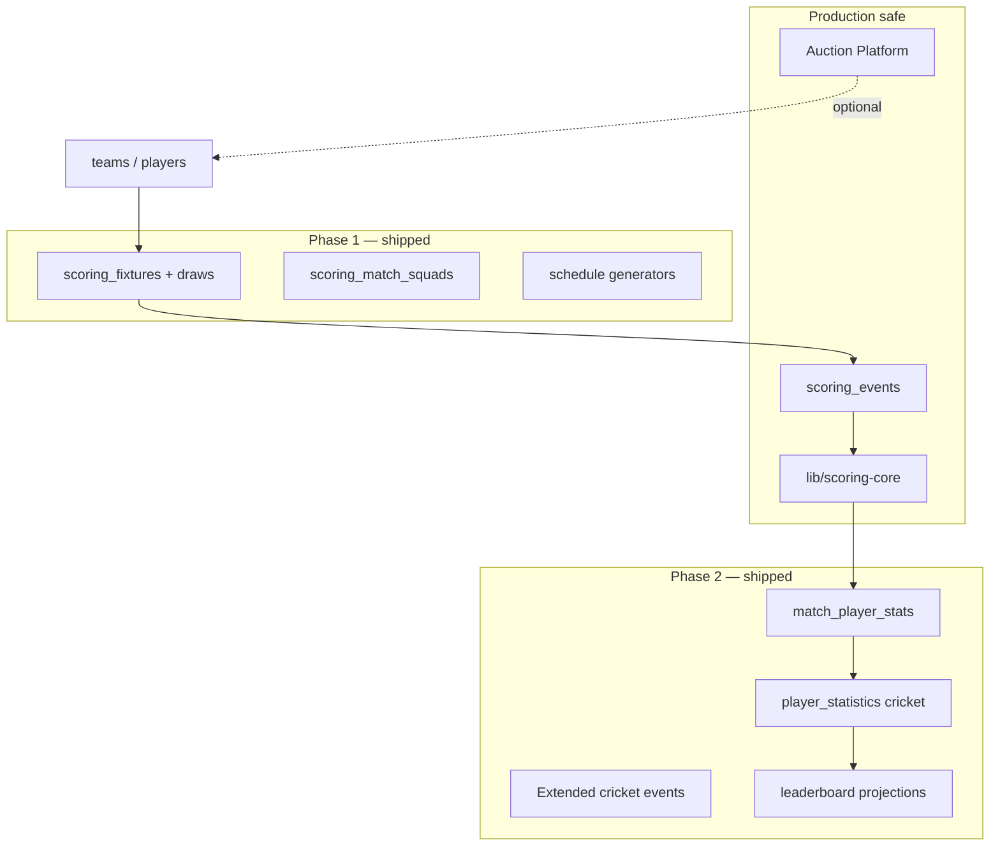
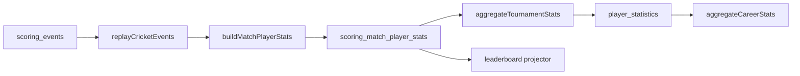

# BidWar Cricket Scoring Engine — Architecture

**Status:** Living document  
**Last updated:** June 2026  
**Scope:** Cricket scoring foundation through world-class engine (excludes LED/OBS/streaming/sponsorship/AI for now)

---

## Business goal

A CricHeroes user should migrate to BidWar Cricket Scoring with almost zero learning curve. If a user expects a feature from CricHeroes, BidWar should either already support it or have architecture ready for it.

**Constraints**

- Do not modify auction logic or break production auction workflows.
- Scoring works **with** auction and **without** auction.
- Reuse existing entities (`tournaments`, `teams`, `players`, `global_players`) where possible.

---

## Table of contents

1. [Architecture review](#1-architecture-review)
2. [Feature parity matrix vs CricHeroes](#2-feature-parity-matrix-vs-cricheroes)
3. [Gap analysis](#3-gap-analysis)
4. [Database review](#4-database-review)
5. [Scoring engine review](#5-scoring-engine-review)
6. [Statistics engine review](#6-statistics-engine-review)
7. [Player profile architecture](#7-player-profile-architecture)
8. [Leaderboard architecture](#8-leaderboard-architecture)
9. [UI/UX wireframes](#9-uiux-wireframes)
10. [Phase-wise roadmap](#10-phase-wise-roadmap)

**Related docs**

- [scoring-pr1-foundation.md](./scoring-pr1-foundation.md) — Event store V1
- [scoring-pr2-event-engine.md](./scoring-pr2-event-engine.md) — Reducer + REST
- [scoring-pr3-mobile-scorer.md](./scoring-pr3-mobile-scorer.md) — Mobile scorer UI
- [scoring-phase1-foundation.md](./scoring-phase1-foundation.md) — Phase 1 implementation reference
- [master-sports-architecture.md](./master-sports-architecture.md) — Player identity layer

---

## 1. Architecture review

### 1.1 Current system topology

| Layer | Location | Maturity |
|-------|----------|----------|
| Domain engine | `lib/scoring-core` | V1 events + Phase 1 schedule generators |
| Persistence | `scoring_events`, `scoring_sessions`, `scoring_matches` | Production event store |
| Tournament ops | `scoring_draws`, `scoring_fixtures`, `scoring_venues`, … | **Phase 1 shipped** |
| API | `artifacts/api-server/src/routes/scoring.ts`, `scoring-foundation.ts` | REST + SSE |
| UI | `artifacts/auction-platform/src/pages/scoring-*.tsx` | Scorer, schedule, public page |
| Player identity | `global_players`, `tournament_player_profiles` | Foundation exists |
| Auction | `artifacts/auction-platform`, `owner-app`, `bidwar-local` | **Do not touch** |

### 1.2 Architectural strengths

1. **Event sourcing** — `scoring_events` is append-only; undo via `cricket.ball.undone` + replay.
2. **Orthogonal scoring** — `scoring_enabled`, `scoring_phase`, `scoring_pin` on `tournaments` without coupling to auction.
3. **Pure reducer** — `lib/scoring-core` has no DB dependency; fully unit-testable.
4. **Master player identity** — `global_players` + mobile dedup anchors career stats.
5. **Flow A / Flow B** — Direct match create (Flow A) and fixture-grouped matches (Flow B) both supported.

### 1.3 Target principles

1. **Events are truth; everything else is projection** — scoreboard, scorecard, standings, stats, leaderboards.
2. **Auction is optional input** — squads from auction roster or manual registration.
3. **Single player identity** — tournament `players.id` → `global_players.id`; stats roll up to master.
4. **ICC semantics in reducer** — free hit, retired hurt, etc. belong in `lib/scoring-core`, not UI hacks.
5. **Scorer UX is first-class** — thumb-zone pad, &lt;3 taps per ball, no admin-dashboard clutter during live play.
6. **Public pages are broadcast-quality** — separate visual language from organizer admin.

### 1.4 Package boundaries

```
lib/scoring-core/           # Pure domain: events, reducer, schedule, projections (no I/O)
lib/scoring-projections/    # FUTURE: scorecard, stats, leaderboard builders
artifacts/api-server/       # HTTP + SSE + projection triggers
artifacts/auction-platform/ # Scorer UI, schedule, public pages (consumer of API)
```



---

## 2. Feature parity matrix vs CricHeroes

*BidWar capability vs CricHeroes workflows. Not a UI clone — workflow parity.*

### Match scoring

| Feature | CricHeroes | BidWar | Priority |
|---------|------------|--------|----------|
| Ball-by-ball live scoring | ✅ | ✅ V1 | P1 |
| Runs 0–6, wide, no-ball, bye, leg bye | ✅ | ✅ | P1 |
| Wicket (basic types) | ✅ | ✅ 5 types | P1 |
| All ICC dismissal types | ✅ | ❌ 5 of 10 | P1 |
| Penalty runs | ✅ | ❌ | P1 |
| Free hit / powerplay / super over | ✅ | ❌ | P2 |
| Retired hurt/out, substitutes, impact player | ✅ | ❌ | P2 |
| Undo last ball | ✅ | ✅ | P1 |
| Change bowler, new batsman | ✅ | ✅ | P1 |
| End innings / match / abandon | ✅ | ✅ | P1 |
| DLS / rain | ✅ | ❌ | P4 |

### Tournament management

| Feature | CricHeroes | BidWar | Priority |
|---------|------------|--------|----------|
| Scoring without auction | ✅ | ✅ | P1 |
| League / round robin | ✅ | ✅ Phase 1 | P1 |
| Knockout | ✅ | ✅ Phase 1 (R1) | P1 |
| Groups (league + knockout) | ✅ | ✅ Phase 1 | P1 |
| Fixture generator | ✅ | ✅ Phase 1 | P1 |
| Venues | ✅ | ✅ Phase 1 | P1 |
| Officials | ✅ | ✅ Phase 1 schema + API | P2 |
| Points table + NRR | ✅ | ✅ | P1 |
| Delegate scorer PIN | ✅ | ✅ | P1 |

### Match setup

| Feature | CricHeroes | BidWar | Priority |
|---------|------------|--------|----------|
| Toss | ✅ | ✅ | P1 |
| Playing XI | ✅ | ✅ | P1 |
| Bench / squad beyond XI | ✅ | ✅ Phase 1 | P1 |
| Batting order | ✅ | Partial | P1 |
| Custom overs | ✅ | ✅ | P1 |

### Scorecards & stats

| Feature | CricHeroes | BidWar | Priority |
|---------|------------|--------|----------|
| Live score strip | ✅ | ✅ | P1 |
| Full scorecard (batting/bowling) | ✅ | ❌ | P1 |
| Fall of wickets, partnerships | ✅ | ❌ | P1–P2 |
| Tournament player stats | ✅ | ❌ | P1 |
| Career stats | ✅ | Schema only | P2 |
| Leaderboards | ✅ | ❌ | P1–P2 |

---

## 3. Gap analysis

### Resolved in Phase 1 ✅

| Gap | Resolution |
|-----|------------|
| No fixture/league scheduling | `scoring_draws`, schedule generators, `/draws/generate` |
| No bench/squad model | `scoring_match_squads`, squad picker in pre-match setup |
| No venues | `scoring_venues` + API |
| No public tournament page | `/tournament/:id/cricket` |
| Flow B fixtures unused | Fixtures created from draw generation |

### Critical gaps remaining (Phase 2+)

| # | Gap | Phase |
|---|-----|-------|
| G1 | No per-player scorecard projection | 2 |
| G2 | No tournament player stats / leaderboards | 2 |
| G3 | Incomplete ICC dismissals + penalty runs | 2 |
| G4 | Scorer UX still inside admin shell | 2–3 polish |
| G5 | Scoring routes not in OpenAPI | 3 |

### What already worked before Phase 1

Create match → toss → XI → live pad → undo → end innings → complete; points table with NRR; auction squad integration; SSE live updates; scoring PIN.

---

## 4. Database review

### KEEP (do not redesign)

| Table | Reason |
|-------|--------|
| `tournaments`, `teams`, `players`, `bids`, auction tables | Production auction |
| `scoring_events`, `scoring_sessions`, `scoring_matches` | Event-sourced core |
| `scoring_standings` | Points table |
| `global_players`, `tournament_player_profiles`, `player_team_assignments` | Identity layer |

### MODIFY (additive only)

| Table | Change | Status |
|-------|--------|--------|
| `scoring_fixtures` | `draw_id`, `group_id`, `bracket_*`, `venue_id` | ✅ Phase 1 |
| `scoring_matches` | `venue_id`, `officials_json` | ✅ Phase 1 |
| `player_statistics` | Cricket typed columns or dedicated projection table | Phase 2 |
| `tournaments.scoring_settings_json` | Format config schema | Future |

### NEW — Phase 1 ✅

| Table | Purpose |
|-------|---------|
| `scoring_venues` | Grounds |
| `scoring_officials` | Umpires, scorers |
| `scoring_draws` | Format definitions |
| `scoring_groups`, `scoring_group_members` | Group stage |
| `scoring_match_squads` | XI + bench per match |

### NEW — Phase 2 ✅

| Table | Purpose |
|-------|---------|
| `scoring_match_player_stats` | Per-match batting/bowling/fielding |
| `scoring_leaderboard_snapshots` | Precomputed boards |
| `scoring_player_awards` | MoM, milestones |
| `scoring_dls_calculations` | Rain/DLS state |

### Event store scaling

- Partition `scoring_events` by `tournament_id` or time at &gt;50M rows.
- Index `(tournament_id, occurred_at)` for analytics.
- Projections: rebuild from events on match complete; avoid dual-writing stats during live play.

---

## 5. Scoring engine review

### 5.1 V1 event types (shipped)

| Event | Purpose |
|-------|---------|
| `cricket.match.started` | Toss, overs limit |
| `cricket.lineup.set` | Playing XI per team |
| `cricket.ball.recorded` | Ball-by-ball |
| `cricket.innings.ended` | Innings close |
| `cricket.match.completed` | Result |
| `cricket.ball.undone` | Undo (replay layer) |
| `cricket.match.abandoned` | NR / abandon |

**Wicket types today:** bowled, caught, run_out, stumped, lbw  
**Extras today:** wide, no_ball, bye, leg_bye

### 5.2 ICC gaps (Phase 2)

| Rule | Status |
|------|--------|
| Hit wicket, timed out, obstructing field, hit ball twice | Not in reducer |
| Retired hurt / retired out | Not in reducer |
| Penalty runs | Not in reducer |
| Free hit, powerplay, super over | Not in reducer |
| Substitutes, impact player, concussion sub | Not in reducer |
| DLS / rain interruption | Phase 4 |

### 5.3 Recommended event taxonomy (Phase 2)

```
cricket.match.*       started, completed, abandoned, interrupted, resumed
cricket.lineup.*      set, bench_set
cricket.ball.*        recorded, undone
cricket.innings.*     started, ended
cricket.player.*      retired, timed_out, substituted
cricket.penalty.*     awarded
cricket.powerplay.*   configured, period_started, period_ended
```

Version payloads with `event_version` on `scoring_events` for backward-compatible replay.

---

## 6. Statistics engine review

### 6.1 Current state

- `buildCricketMatchSummary()` — innings-level only.
- `scoring_standings` — team NRR and points.
- `player_statistics` — exists; cricket aggregates not wired.
- No ball-level player persistence beyond events.

### 6.2 Target architecture



### 6.3 Projection triggers

| Trigger | Action |
|---------|--------|
| `cricket.match.completed` | Build match player stats; update tournament aggregates |
| `cricket.match.abandoned` | NR in standings only |
| Manual rebuild | Admin API: replay all matches in tournament |

**V1 stats rule:** compute on match complete only (not per-ball dual-write).

### 6.4 Cricket stats schema (planned)

**Per match:** runs, balls, 4s, 6s, dismissal, bowler/fielder; bowling overs, maidens, wickets, economy; fielding catches, run outs, stumpings.

**Tournament aggregate:** innings, average, strike rate, 50s, 100s, best figures.

**Career:** same structure with `tournament_id = NULL` on `player_statistics`.

---

## 7. Player profile architecture

### 7.1 Identity model

```
global_players (gp_*)              ← one physical person
    ↓ global_player_id
players (tournament roster)        ← auction or manual
    ↓ player_id in event payloads
scoring_events                     ← strikerId, bowlerId, etc.
```

**Dedup keys:** `mobile_number` (primary), `auction_player_id`.

### 7.2 Profile layers

| Layer | Source |
|-------|--------|
| Master | `global_players` — name, photo, DOB, handedness |
| Tournament | `tournament_player_profiles` — display name, initials |
| Roster | `players` — role, styles, jersey, team |
| Match | `scoring_match_squads` + future `scoring_match_player_stats` |
| Career | `player_statistics` (tournament_id NULL) |
| History | `player_team_assignments` |

### 7.3 Public profile URL (planned)

`/player/:globalPlayerId` — career stats, tournaments, awards.

---

## 8. Leaderboard architecture

### 8.1 Tournament leaderboards (Phase 2)

| Board | Sort key |
|-------|----------|
| Most runs | `runs DESC` |
| Most wickets | `wickets DESC` |
| Most sixes / fours | `sixes` / `fours DESC` |
| Best strike rate | `SR DESC` (min runs threshold) |
| Best economy | `economy ASC` (min overs threshold) |
| Fielding | catches, stumpings |

### 8.2 Implementation pattern

Materialized `scoring_leaderboard_snapshots` per tournament, refreshed on match complete.

```
GET /api/tournaments/:tid/leaderboards/:category?limit=20
```

### 8.3 Global leaderboards (Phase 4)

Cross-tournament aggregation on `player_statistics` where `tournament_id IS NULL`.

---

## 9. UI/UX wireframes

**Benchmark:** ICC / IPL / MLC / The Hundred — premium sports product, not generic SaaS admin.

### 9.1 Scorer pad (mobile, one-handed)

```
┌─────────────────────────────────────┐
│  MI 142/3 (14.2)    RR 9.8  RRR 8.2 │
│  Kohli 45*(32)  •  Rohit 28 (24)    │
├─────────────────────────────────────┤
│  THIS OVER:  1  4  ·  Wd  2  ·        │
├─────────────────────────────────────┤
│   [0]  [1]  [2]  [3]                │
│   [4]  [6]  [Wd] [Nb]               │
│        [ WICKET ]                   │
├─────────────────────────────────────┤
│  Bumrah ●    [UNDO]    [···]        │
└─────────────────────────────────────┘
```

**Tap budget:** normal ball = 1 tap; wicket = 2 taps.

### 9.2 Pre-match setup (stepper)

```
Step 1: TOSS    →  Step 2: SQUAD & XI  →  Step 3: OPENERS + BOWLER
```

Phase 1 ships squad picker: 11 playing + up to 4 bench, persisted to `scoring_match_squads`.

### 9.3 Public live scorecard (Phase 2)

Full batting/bowling tables, fall of wickets, extras breakdown — broadcast-quality typography on dark sports background.

### 9.4 Tournament hub (public)

Route: `/tournament/:id/cricket` — live matches, fixture list, points table.

### 9.5 Organizer schedule (Phase 1)

Route: `/tournament/:id/score/schedule` — generate round robin / knockout / groups, manage venues.

---

## 10. Phase-wise roadmap

### Phase 0 — Foundation ✅ (PR-1 to PR-6)

Event store, reducer V1, mobile scorer, standings, auction squad integration, SSE.

### Phase 1 — Cricket foundation ✅ (merged)

| Deliverable | Status |
|-------------|--------|
| `scoring_draws`, `scoring_groups`, fixtures API | ✅ |
| Schedule generators (round robin, knockout, groups) | ✅ |
| Venues, officials schema + API | ✅ |
| Match squads (XI + bench) | ✅ |
| Schedule UI + public tournament page | ✅ |
| Hub links (Schedule, Public page) | ✅ |

**Exit criteria:** 8-team league with generated fixtures, playable end-to-end. **Met.**

### Phase 2 — ICC engine + projections ✅

| Deliverable | Status |
|-------------|--------|
| ICC dismissals (hit wicket, timed out, obstructing field, hit ball twice, retired out) | ✅ |
| Penalty runs, retired hurt/out events | ✅ |
| Free hit, powerplay config, super over | ✅ |
| `scoring_match_player_stats` projector (on match complete) | ✅ |
| `scoring_leaderboard_snapshots` (runs, wickets, 4s, 6s, SR, economy, catches, stumpings) | ✅ |
| Public scorecard page + leaderboards on tournament hub | ✅ |
| Scorer pad: extended dismissals, penalty, retired, super over, free hit indicator | ✅ |

**Exit criteria:** Completed match produces full scorecard + tournament leaderboards; fans can view scorecard without auth. **Met.**

### Phase 3 — Parity polish

- Player/team public profiles, MoM awards
- Share URLs, WhatsApp OG tags
- OpenAPI for scoring routes
- Scorer shell visual refresh (IPL-grade)

### Phase 4 — Future ready

- DLS / rain interruptions
- Global stats, offline scorer queue
- Analytics (wagon wheel, etc. — if in scope later)

---

## Quick reference — Phase 1 APIs

Base: `/api/tournaments/:tournamentId/scoring`

| Method | Path | Auth |
|--------|------|------|
| GET | `/public/schedule` | Public |
| POST | `/draws/generate` | Organizer |
| GET | `/fixtures`, `/draws` | Organizer |
| GET/POST | `/venues`, `/officials` | Organizer |
| PUT | `/matches/:matchId/squads/:teamId` | Organizer |

See [scoring-phase1-foundation.md](./scoring-phase1-foundation.md) for implementation file paths.
