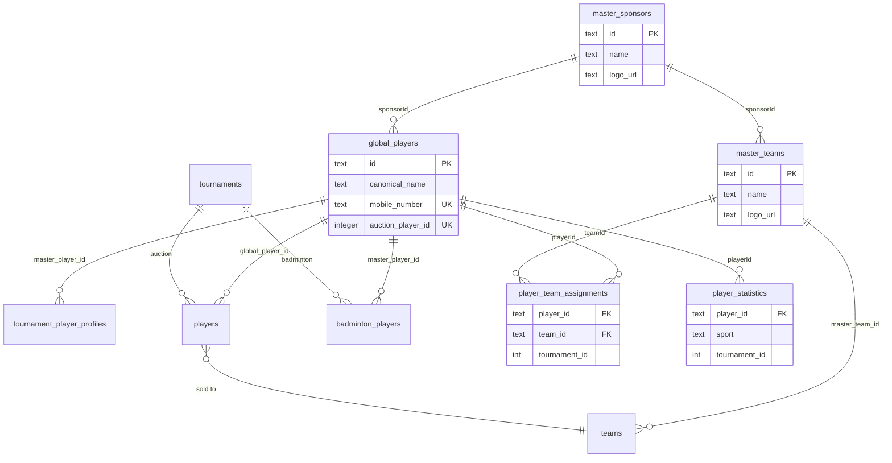

# Master Sports Core Architecture

BidWar shared sports ecosystem: **one player profile** across Auction, Badminton, Cricket, and future sports.

## Design Principle

- **Additive only** — existing auction and badminton flows unchanged at the API contract level.
- **Reuse `global_players`** as `MasterPlayer` — no duplicate player table.
- **Legacy fallback** — if `masterPlayerId` is missing, badminton uses `badminton_players` record as before.

---

## MASTER SPORTS DOMAIN SEPARATION

**Non-negotiable rule:** these four concepts are independent forever.

```
Master Player  ≠  Auction Franchise  ≠  Playing Pair  ≠  Competition Side
```

| Layer | What it is | Example |
|-------|------------|---------|
| **Master Player** | One physical person (`global_players`) | Abhinav Keshri |
| **Tournament Profile** | Tournament-specific display + initials (`tournament_player_profiles`) | Tournament A: initials `AK`; Tournament B: initials `ABK` |
| **Auction Franchise Assignment** | Informational ownership (`player_team_assignments`) | Abhinav sold to Team B |
| **Match Participation** | Who plays with whom in a match (side JSON / pairs) | Abhinav + Mohit vs Tushar + Rahul |
| **Competition Side** | Left or right on scoreboard | Left side |

### Independence examples

- Abhinav may be **sold to Team B** in auction.
- In a badminton doubles match, Abhinav may pair with **Mohit** (any franchise).
- Auction franchise is **metadata only** — it must never control pairing logic.
- Tournament initials live on **tournament profile**, never on master player.

### Data flow

```
Master Player (global_players)
        ↓
Tournament Profile (display_name, initials, photo_override)
        ↓
Auction Franchise Assignment (informational badge)
        ↓
Match Participation (pair / side JSON at schedule time)
        ↓
Competition Side (left / right in scorer state)
```

### Field naming (badminton display)

| Old (ambiguous) | New (clear) |
|-----------------|-------------|
| `teamName` | `franchiseName` (auction franchise) |
| `teamLogoUrl` | `franchiseLogoUrl` |

Legacy `teamName` / `teamLogoUrl` remain in side JSON for backward compatibility with existing matches and OBS URLs.

---

## 1. Schema Changes

### MasterPlayer (`global_players` extended)

| Field | Type | Notes |
|-------|------|-------|
| id | text PK | `gp_*` format |
| firstName, lastName, displayName | text | Split from canonicalName |
| photoUrl, mobile, email | text | Dedup keys |
| dob, gender, country, state, city, academy, handedness | text | Profile |
| worldRanking, nationalRanking | integer | Rankings |
| sponsorId | text FK | → master_sponsors |
| auctionPlayerId | integer unique | Auction sync anchor |
| canonicalName, sport, defaultRole, age, notes | existing | Backward compat |

### MasterTeam (`master_teams`)

| Field | Type |
|-------|------|
| id | text PK (`mt_*`) |
| name, shortName, logoUrl | text |
| primaryColor, secondaryColor | text |
| ownerName, sponsorId | text |

`teams.master_team_id` links auction teams → master teams.

### TournamentPlayerProfile (`tournament_player_profiles`)

Tournament-scoped identity — **initials never stored on master player**.

| Field | Type | Notes |
|-------|------|-------|
| tournamentId, masterPlayerId | unique pair | One profile per player per tournament |
| displayName | text | Tournament display label |
| initials | text | Unique within tournament (`AK`, `AK2`, …) |
| photoOverrideUrl | text | Optional tournament photo |
| category, seedRank | text / int | Draw metadata |

### MasterSponsor (`master_sponsors`)

| Field | Type |
|-------|------|
| id | text PK (`ms_*`) |
| name, logoUrl, website, description | text |

### PlayerTeamAssignment (`player_team_assignments`)

| Field | Type |
|-------|------|
| playerId | text → global_players |
| teamId | text → master_teams |
| tournamentId, seasonId, sport | |
| assignedAt | timestamp |
| auctionPlayerId, auctionTeamId | audit |

### PlayerStatistics (`player_statistics`)

Badminton stats keyed by **master player id**, never by name:

- matchesPlayed, matchesWon, matchesLost
- gamesWon, gamesLost, pointsScored, pointsConceded

### Supporting Tables

- `master_player_id_mappings` — badminton_player_id → master_player_id
- `master_sports_sync_log` — append-only sync audit
- `badminton_players.master_player_id` — tournament player link

### Tournament Settings (in `scoring_settings_json`)

```json
{
  "autoSyncAuctionPlayers": true,
  "linkedAuctionTournamentId": 42
}
```

---

## 2. ER Diagram



---

## 3. Migration Plan

### Phase A — Schema (automatic on boot)

`lib/db/src/index.ts` runs idempotent `ALTER TABLE` / `CREATE TABLE IF NOT EXISTS`.

### Phase B — Data migration

```bash
# Per badminton tournament (organizer API):
POST /api/tournaments/:id/badminton/migrate-to-master

# Or programmatic:
import { migrateBadmintonPlayersToMaster } from "./lib/master-sports/migrate-badminton";
await migrateBadmintonPlayersToMaster(tournamentId);
```

Steps:
1. For each `badminton_players` row without `master_player_id`
2. Match by mobile → existing `global_players`, else create new `gp_*`
3. Write `master_player_id_mappings`
4. Log to `master_sports_sync_log`
5. Initialize `player_statistics` rows (zero baseline)

### Phase C — Auction backfill

```bash
POST /api/tournaments/:id/badminton/sync-auction-players
# Or automatic on auction conclude + per player create/update
```

---

## 4. API Changes

### New routes (`/api/tournaments/:id/badminton/...`)

| Method | Path | Auth | Purpose |
|--------|------|------|---------|
| GET | `/master-players` | Public | List master players for import/match picker |
| POST | `/import-master-players` | Owner | Import selected into badminton_players |
| GET | `/master-players/:id/side-json` | Public | Side JSON for match creation |
| GET/PATCH | `/settings` | Read public / write owner | Auto sync mode |
| POST | `/migrate-to-master` | Owner | Run badminton migration |
| POST | `/sync-auction-players` | Owner | Manual auction→master sync |

### Existing routes (additive hooks)

| Route | Hook |
|-------|------|
| `POST /tournaments/:id/players` | `syncAuctionPlayerToMasterAsync` |
| `PATCH /tournaments/:id/players/:id` | `syncAuctionPlayerToMasterAsync` |
| `POST /tournaments/:id/auction/sell` | `onAuctionPlayerSoldAsync` + team assignment |
| `POST /tournaments/:id/auction/manual-sell` | same |
| `POST /tournaments/:id/auction/conclude` | `syncAllAuctionPlayersAsync` |

### Match completion

`badminton-service.updateSnapshot` → `updateBadmintonStatisticsFromMatch` when terminal.

---

## 5. UI Changes

| Page | Change |
|------|--------|
| Badminton Players | **Import From Auction** button + checkbox modal |
| Badminton Matches | **MasterPlayerPicker** for left/right sides; manual override fields |
| Broadcast Display | Photo → initials fallback; team name/logo; sponsor logo; `loading="lazy"` |
| Tournament settings | `autoSyncAuctionPlayers` via PATCH `/badminton/settings` |
| Cricket Scorer list | **Sync** button → POST `/scoring/sync-roster`; squad counts from auction |
| Cricket pre-match | Lineup picker shows photo + name for sold/retained squad |

---

## 5b. Cricket Roster (mutable franchise squads)

Cricket uses **auction teams** as live squads. Scoring still references auction `players.id` and `teams.id`.

| Layer | Role |
|-------|------|
| `players.team_id` + status `sold`/`retained` | Live roster for playing XI |
| `global_players` | Master identity (`players.global_player_id`) |
| `master_teams` | Canonical franchise (`teams.master_team_id`) |
| `player_team_assignments` | Current + historical roster (`is_active`, `ended_at`, `assignment_type`) |
| `player_statistics` (`sport='cricket'`, `stats_json`) | Future per-player cricket aggregates |

### Assignment types

`auction_sale` | `retained` | `transfer` | `unsold_replacement` | `interchange`

Only one **active** assignment per master player per tournament (partial unique index).

### API routes (`/tournaments/:id/scoring/…`)

| Method | Path | Purpose |
|--------|------|---------|
| GET | `/master-teams` | Teams + squad counts |
| GET | `/master-players?teamId=` | All players (optional team filter) |
| GET | `/squads/:auctionTeamId` | Sold/retained squad |
| POST | `/sync-roster` | Sync teams + roster to master layer |

### Hooks

| Event | Handler |
|-------|---------|
| Auction sell | `createPlayerTeamAssignmentFromSale` |
| Player PATCH (team/status) | `onAuctionPlayerRosterChangedAsync` |
| Manual sync | `syncCricketRosterFromAuction` |

---

## 6. Sync Service Architecture

```
artifacts/api-server/src/lib/master-sports/
├── sync.ts              # syncAuctionPlayerToMaster, team sync, sale assignments
├── tournament-profile.ts # tournament_player_profiles + initials allocation
├── tournament-initials.ts # initials algorithm (profile-backed)
├── sync-helpers.ts      # audit log
├── roster-assignments.ts # cricket franchise roster history (active/end)
├── cricket-roster.ts    # cricket list/sync/roster change hooks
├── cricket-stats.ts     # cricket stats baseline rows
├── badminton.ts         # import, list, side JSON, statistics
├── migrate-badminton.ts # one-time migration
└── index.ts
```

### `syncAuctionPlayerToMaster()` match order

1. `players.global_player_id` → existing master
2. `global_players.auction_player_id`
3. Mobile (normalized Indian format)
4. Email (case-insensitive)
5. Name similarity (normalized canonical/display name)

### On auction sell

1. Sync player → master
2. Sync team → master_teams
3. End prior active `player_team_assignments` row (if any)
4. Insert new active assignment + ensure cricket stats baseline

All sync calls are **fire-and-forget** from auction routes — auction latency unaffected.

---

## 7. Rollback Strategy

### Safe rollback (no data loss)

1. **Disable sync hooks** — remove async calls from `players.ts` / `auction.ts` (feature flag optional).
2. **Disable badminton master routes** — unmount `master-sports` router.
3. **Badminton continues** — `badminton_players` unchanged; matches use legacy side JSON.
4. **OBS overlays** — photo/initials logic degrades gracefully when team fields absent.

### Schema rollback (only if necessary)

New tables are additive. Do **not** drop `global_players` columns (auction may reference them).

```sql
-- Optional: stop writing new data
-- Tables can remain; no FK constraints block auction/badminton core tables
```

### Data recovery

- `master_sports_sync_log` — full audit trail
- `master_player_id_mappings` — reverse lookup badminton → master
- Original `badminton_players` rows never deleted by migration

---

## Backward Compatibility Checklist

- [x] Existing badminton tournaments work without migration
- [x] Manual name entry still works in match creation
- [x] Scorer URLs unchanged
- [x] OBS overlay URLs unchanged
- [x] Auction player CRUD unchanged
- [x] Auction sell/unsold/conclude unchanged (sync is async side effect)
