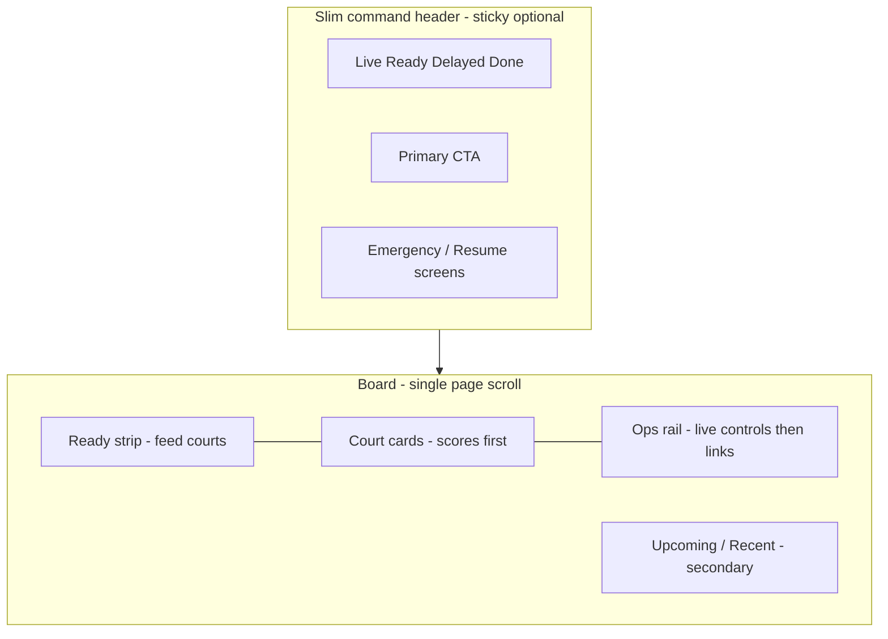

# Live Control Command Board — Redesign Spec

**Date:** 2026-07-31  
**Status:** Draft (from UX audit approval)  
**Source audit:** Live Control Page — UX Audit  
**Primary surface:** `/tournament/:id/badminton/control`  
**Approach:** Viewport-first ops board — one scroll model, courts first, live actions over setup chrome

## Goal

Turn Live Control from a **setup hub + broadcast console** into a **command board** an operator can run match day from without fighting scroll, hunting setup links, or leaving the page for every action.

Success looks like:

1. Courts + live scores visible on first paint (above the fold).
2. One primary scroll region — no sticky rail fighting a sticky status bar.
3. Live controls (screen focus, pause, moments) above setup (QR / Open / Copy links).
4. Queue “feed the courts” actions reachable without scrolling past the whole board.
5. Health only when unhealthy, and only with signals that mean something during play.

## Priorities (locked)

Approved scope from the audit — implement in this order. Do not expand into full inline scoring in Phase 1.

### Phase A — P0 (must ship first)

| ID | Issue | Outcome |
|----|-------|---------|
| A1 | Competing stickies + nested rail scroll | Single scroll model; no dual sticky overlap |
| A2 | ~½ viewport non-ops chrome before courts | Courts first; demote IA/logo pedagogy on this route |
| A3 | Ops rail setup-first | Live screen/moment/music controls above setup links |

### Phase B — P1 (immediately after A)

| ID | Issue | Outcome |
|----|-------|---------|
| B1 | Queues under court grid | Ready/feed actions adjacent to free/ready courts |
| B2 | Misleading health strip | Hide when all-clear; fix or relabel false signals |
| B3 | Court card live telemetry gaps | Show games won + clearer live score; scorer hint if available |
| B4 | Start vs Open scoring confusion | Clear labels + hierarchy; reduce accidental Director hops |
| B5 | Alerts inflate above board | Compact / collapse; never push courts below fold when quiet |

### Phase C — P2 (polish, same epic if cheap)

| ID | Issue |
|----|-------|
| C1 | Triple nested scroll (activity) |
| C2 | max-w-7xl vs max-w-[1600px] misalignment |
| C3 | Live button soup hierarchy |
| C4 | Remove “Operator priority” copy block |
| C5 | Demote or remove local activity feed |

### Explicit non-goals (this redesign)

- Full inline point-by-point scoring on Live Control (stay on scorer route for that).
- Real tablet presence / WebSocket “scorer online” hardware telemetry (needs new backend signals — track separately).
- Walkover/retirement UI beyond existing Director panel.
- Changing SportsShell sidebar nav IA.
- Reverting BidWar logo / tournament name on **other** hub pages (only Live Control chrome density changes).

---

## Decisions (locked)

| Decision | Choice |
|----------|--------|
| Page chrome on Live Control | Skip fat `PageHeader` + “Do now” strip; use slim command header (counts + emergency + optional compact brand) |
| Tournament name | Once — in slim command header (sidebar already has it; do not triple-repeat) |
| BidWar mark on this page | Optional compact mark in slim header **or** rely on sidebar logo — not a full centered logo row + H1 stack |
| Scroll model | **Shell main scrolls only.** Right column is **not** sticky with its own max-height scroller. Optional: sticky **only** the slim status strip (`top-0`), with rail scrolling away with the page |
| Ops rail content order | Screens follow → Moments/Clear → Venue scene → Music → collapsed “Links & QR” |
| Queues placement | “Ready to start” strip **beside/above** empty & finished courts (or compact Ready panel above court grid); Upcoming/Recent can stay lower or tabbed |
| Health | Render strip **only if** any level ≠ healthy; fix cold-start realtime false green; relabel Scorers to “PINs set” until true presence exists |
| Alerts | Show at most one critical band above courts; suggestions move to a dismissible drawer/popover or bottom of left column |
| Start match CTA | Label stays “Start match” but primary path should open Match Control with clear subtitle; live primary remains “Open scoring” (new tab OK for Phase A/B) |
| Activity feed | Remove from default Live Control view (toast already covers confirmations) |

---

## Target information architecture

Vertical order (target):

1. Slim command header (counts, primary CTA, emergency) — optional sticky
2. Critical alert band only when needed (collapsed otherwise)
3. Ready-to-assign / Ready-to-start strip (compact)
4. Two-column board: Courts | Ops rail (document flow, no nested sticky scroll)
5. Upcoming + Recently finished (secondary)

---

## Scroll model (A1)

### Current (broken)

- SportsShell main: `overflow-y-auto`
- TopBar: `sticky top-0 z-20`
- Ops column: `sticky top-3` + `max-h-[100dvh-…]` + `overflow-y-auto`
- Activity: nested `max-h-40 overflow-y-auto`

### Target

1. **Remove** sticky + max-height + overflow from the ops rail wrapper in [control-center.tsx](artifacts/auction-platform/src/pages/badminton/control-center.tsx).
2. Keep **at most one** sticky element: the slim command header (`sticky top-0 z-20`), height known (~56–72px).
3. Ops rail participates in normal document flow beside courts; page scroll reveals Moments/Links together with queues.
4. Do not reintroduce a second sticky column. If rail is long, that is acceptable — length is reduced by collapsing setup links (A3).

Acceptance: scrolling Live Control never shows right-column content sliding under the status header or queues painting through the rail.

---

## Chrome density (A2)

### Current

`BadmintonIaPageChrome` → `PageHeader` (logo + tournament + H1 + purpose) + “Do now” + `MissionControlTopBar` (repeats identity).

### Target

Live Control **does not use** full IA page chrome.

Options (pick one in implementation; preferred = 1):

1. **Preferred:** Render `HubPageShell` + page-local slim header only (no `BadmintonIaPageChrome` on this route). Pass tournament name into the slim header.
2. Alternate: Keep `BadmintonIaPageChrome` but add `variant="ops"` that suppresses logo row, purpose, and “Do now”, leaving only a one-line title if needed.

Files:

- [control-center.tsx](artifacts/auction-platform/src/pages/badminton/control-center.tsx) — stop wrapping with fat chrome
- [mission-control-top-bar.tsx](artifacts/auction-platform/src/components/badminton/mission-control/mission-control-top-bar.tsx) — become the slim command header; drop duplicate “Live control” eyebrow if title is obvious from nav
- [ia-workflow-chrome.tsx](artifacts/auction-platform/src/components/badminton/ia-workflow-chrome.tsx) / [page-chrome.tsx](artifacts/auction-platform/src/components/badminton/page-chrome.tsx) — no global regression; other hub pages keep logo + tournament name

Acceptance: from top of main content to first court card ≤ ~120px when no alerts (counts strip + optional ready strip).

---

## Ops rail reorder (A3 + C4 + C5)

Reorder [mission-control-ops-rail.tsx](artifacts/auction-platform/src/components/badminton/mission-control/mission-control-ops-rail.tsx):

1. **Screens follow** (always show when ≥1 live; single-live shows “Following Court X”)
2. **Moments + Clear**
3. **Venue scene**
4. **Venue music** On/Pause
5. **Links & access** — single collapsed `
` / accordion: Scorer Copy/QR + Venue/OBS/Scorer-home cards
6. Remove “Operator priority” explainer block
7. Remove `MissionControlActivityFeed` from Live Control page compose

Acceptance: with two live courts, screen-focus and Moments are visible without scrolling the rail past three BroadcastLinkCards.

---

## Queues / feed courts (B1)

### Target

- Extract **Ready matches** into a compact horizontal/list strip **above** the court grid (or pinned under the command header).
- Keep Upcoming + Recent below the court grid (or in a secondary tab “Schedule queues”).
- Ready row primary actions stay: Start (Match Control), Move → free court — but visually nearer empty courts.

Files: [mission-control-queues.tsx](artifacts/auction-platform/src/components/badminton/mission-control/mission-control-queues.tsx), [control-center.tsx](artifacts/auction-platform/src/pages/badminton/control-center.tsx).

Acceptance: with 2 court cards visible, at least one Ready match action is visible without scrolling past the court grid.

---

## Health strip (B2)

### Fixes in `deriveSystemHealth` ([mission-control-ops.ts](artifacts/auction-platform/src/lib/mission-control-ops.ts))

1. **Realtime cold start:** if `lastRealtimeAt == null`, use `warning` (or `unknown`), not `healthy`.
2. **Scorers label:** UI copy becomes “Court PINs” / “PINs set (n/m)” — not “Scorers online.”
3. **OBS:** keep branding-ok as weak signal; label as “Broadcast config” not “OBS connected,” **or** hide OBS chip until a real heartbeat exists.
4. **Render rule:** [mission-control-health.tsx](artifacts/auction-platform/src/components/badminton/mission-control/mission-control-health.tsx) returns `null` when every shown level is healthy.

Acceptance: quiet good day shows no health strip; after load with no SSE yet, strip does not claim full green sync.

---

## Court cards (B3 + B4 + C3)

### Data (B3)

When live/paused and `state` present:

- Show **games won** if available (`gamesLeft` / `gamesRight` or equivalent on match state).
- Keep current game score prominent (`L–R` large, game index secondary).
- If court has `scorerName` / `hasScorerPin`, show a one-line hint (“PIN set” / scorer name) — not fake online.

### Actions (B4 + C3)

Live card hierarchy:

1. **Primary:** Open scoring
2. **Secondary row:** Show on screens (if not following) | Pause / Resume
3. **Overflow / demoted:** Director, Unlock scorer (paused), Force finish (confirm — already exists)

Ready card:

- Primary: Start match → Match Control (keep); helper text: “Toss & start in Match Control”
- Do not label Match Control as if it were the scorer

Acceptance: Force finish is visually quieter than Pause; Open scoring is the only filled primary on live cards.

---

## Alerts (B5)

- Critical attention: single compact banner under command header.
- Suggestions: move below courts or into a “Tips (n)” disclosure — not a stacked list above the board.
- Keep dismiss behavior; no new persistence required.

Files: [mission-control-alerts.tsx](artifacts/auction-platform/src/components/badminton/mission-control/mission-control-alerts.tsx), [control-center.tsx](artifacts/auction-platform/src/pages/badminton/control-center.tsx).

---

## Width / alignment (C2)

Use one content width on Live Control: `max-w-[1600px]` (or `max-w-7xl` — pick **1600** to match the board) for the slim header and board alike so columns align.

---

## File change map

| File | Change |
|------|--------|
| `pages/badminton/control-center.tsx` | Drop fat IA chrome; remove sticky rail; recompose Ready strip + courts + rail + secondary queues; drop activity feed |
| `mission-control-top-bar.tsx` | Slim command header; less identity duplication |
| `mission-control-ops-rail.tsx` | Reorder; collapse links; remove explainer |
| `mission-control-court-card.tsx` | Games won; action hierarchy; Start helper copy |
| `mission-control-queues.tsx` | Split Ready strip vs secondary queues |
| `mission-control-health.tsx` | Hide when all healthy; label fixes |
| `mission-control-alerts.tsx` | Compact critical; demote suggestions |
| `mission-control-activity.tsx` | Unused on this page (keep module for possible reuse) |
| `lib/mission-control-ops.ts` | Cold-start realtime; scorer/OBS semantics |
| `lib/__tests__/mission-control-ops.test.ts` | Cover health cold-start + PIN labeling cases |

No API/schema changes required for Phase A/B except reading fields already on match state / court rows.

---

## Implementation sequence

1. **A1 + A2** — chrome + scroll (biggest perceived fix).
2. **A3 + C4 + C5** — rail reorder / collapse / drop activity.
3. **B1** — Ready strip above courts.
4. **B2 + B5** — health + alerts quieting.
5. **B3 + B4 + C3** — court card data + button hierarchy.
6. **C2** — width alignment pass.
7. Tests for `deriveSystemHealth` + light component smoke if existing patterns allow.

---

## Test plan

- [ ] Desktop lg+: scroll entire Live Control — no right-rail overlap under status header; no second scrollbar on the rail.
- [ ] First paint with 2 live courts: court cards visible without scrolling past logo/IA blocks.
- [ ] Ops rail: Moments / Screens follow appear before Venue/OBS/Scorer link cards (links collapsed).
- [ ] Ready match visible above or with courts; Upcoming/Recent still reachable.
- [ ] Health hidden when all healthy; after hard refresh with no SSE yet, sync not falsely “healthy.”
- [ ] Live card: games won (when present), Open scoring primary, Force finish demoted.
- [ ] Emergency pause / Resume screens still work from slim header.
- [ ] Other badminton hub pages still show PageHeader BidWar logo + tournament name (no regression).
- [ ] Unit tests for health cold-start and PIN-based scorer level.

---

## Open follow-ups (out of scope)

- True scorer device presence / lock heartbeat on cards.
- Optional “focus mode” that hides queues entirely during peak live.
- Inline scoring on Live Control (product decision; not this redesign).
