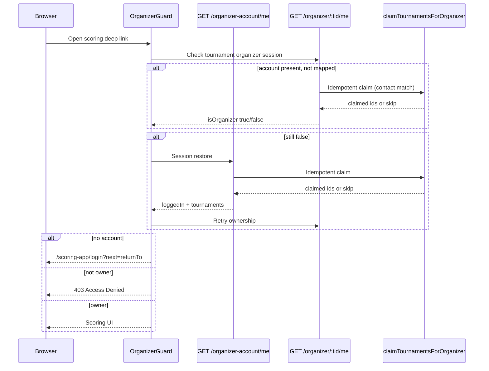

# Scoring Auth Phase 1 — Stability Design

**Date:** 2026-08-03  
**Status:** Approved  
**Branch scope:** Scoring authentication stability only  
**Non-goals:** Tournament engine, multi-day support, Phase 2 platform auth rewrite

---

## Root Cause

1. Scoring organizer routes share Auction’s `OrganizerGuard`, auth hooks, and `bidwar_auth` cookie via the scoring-app Vite `@` → `auction-platform/src` alias. That sharing is intentional for Phase 1.
2. `claimTournamentsForOrganizer` ran only on signup/login/OAuth — **not** on session restore (`GET /auth/organizer-account/me`) or tournament ownership bootstrap (`GET /auth/organizer/:tournamentId/me`).
3. Fresh scoring entry with an existing organizer-account cookie but unclaimed tournament ownership failed the guard, then fell into password-gate / wrong routing and surfaced developer 404 copy (“Did you forget to add the page to the router?”).

---

## Current Flow (broken)

```
Open /scoring-app/tournament/:id/badminton
  → OrganizerGuard → GET /auth/organizer/:id/me (not owner)
  → GET /auth/organizer-account/me (logged in, no claim)
  → redirect /tournament/:id/login  OR  /organizer?next=…
  → Auction UI / password gate / 404-dev copy
```

Claim never runs on restore, so Auction login “magically” fixed access because login re-ran claim.

---

## Proposed Flow (Phase 1)

```
Open /scoring-app/tournament/:id/…
  → OrganizerGuard
  → GET /auth/organizer/:id/me
       └─ if account session + unlinked match → claim (idempotent) → grant JWT map
  → if still no tournament session:
       └─ GET /auth/organizer-account/me (claims any matching unlinked tournaments)
       └─ retry GET /auth/organizer/:id/me
  → if unauthenticated → /scoring-app/login?next=<returnTo>  (not Auction homepage)
  → if authenticated but not owner after claim → 403 Access Denied (scoring)
  → if owner → render scoring UI
```

OBS / display / public / LED routes stay outside `OrganizerGuard` (feature flag only).

---

## Sequence Diagram



---

## Implementation Details

### 1. Idempotent claim + structured logs

`claimTournamentsForOrganizer`:

- Only updates rows where `organizer_id IS NULL` (never steals).
- No-op when contact empty or no matching unlinked rows (no unnecessary writes).
- Structured log events (pino message):
  - `SCORING_AUTH_CLAIM_STARTED` (debug)
  - `SCORING_AUTH_CLAIM_SUCCESS` (info, only when ids claimed)
  - `SCORING_AUTH_CLAIM_SKIPPED` (debug — reason code)
  - `SCORING_AUTH_CLAIM_FAILED` (error)

Call sites:

- `GET /auth/organizer-account/me`
- `GET /auth/organizer/:tournamentId/me` (when account present but not yet mapped)

### 2. Scoring login (no Auction homepage)

- New scoring route: `/scoring-app/login?next=…`
- Reuses existing organizer-account login/signup APIs and AuthForm UI in a scoring-only shell.
- Return path always preserved via `navigateAfterOrganizerAuth`.
- Idle logout / SportsShell logout from scoring → scoring login (or scoring-safe destination), not `/organizer` dashboard.

### 3. Production errors

| Code | User-facing |
|------|-------------|
| 401 | Your session has expired. Please sign in again. |
| 403 | You don't have permission to access this tournament. |
| 404 | Tournament not found. / Page not found. |
| 503 | Scoring is currently unavailable. Please contact your tournament administrator. |

No developer/router terminology.

### 4. Logout client cleanup

On organizer logout from scoring:

- Server: clear `bidwar_auth`
- Client: clear organizer-account query, tournament organizer-auth queries, related React Query tournament caches
- Avoid stale restore after logout

### 5. Route / display safety

- Organizer deep links must work on refresh.
- Display, overlay, public standings, scorer PIN flows must **not** gain OrganizerGuard redirects.

---

## Files Changed

| Area | Files |
|------|--------|
| Spec | `docs/superpowers/specs/2026-08-03-scoring-auth-phase1-stability-design.md` |
| Claim | `artifacts/api-server/src/lib/claim-tournaments-for-organizer.ts` |
| Auth routes | `artifacts/api-server/src/routes/auth.ts` |
| Guard | `artifacts/auction-platform/src/components/organizer-guard.tsx` |
| Errors | `not-found-view.tsx`, `scoring-feature-guard.tsx`, new access-denied / unavailable views |
| Login | scoring-app login route + scoring login page shell |
| Shell / idle | `sports-shell.tsx`, `use-organizer-inactivity-logout.ts` |
| Logout helper | `organizer-account-auth-cache.ts` (+ clear helpers) |
| Tests | claim + auth route / guard regression tests |

---

## Risk Analysis

| Risk | Mitigation |
|------|------------|
| Claim on GET `/me` is a write | Idempotent; only unlinked rows; debug skip logs |
| Hot-path DB cost | Short-circuit empty contact; SQL prefilter; skip write when nothing to claim |
| Auction regression | Auction still uses `/organizer`; claim helper unchanged for login/signup call sites |
| OBS redirect regression | Do not wrap public/display/overlay in OrganizerGuard |
| Auth architecture drift | No cookie/JWT/provider changes (Phase 2 stop-rule) |

---

## Rollback Plan

1. Revert this branch / deploy previous api-server + auction-platform + scoring-app artifacts.
2. Claim-on-restore is additive; reverting removes claim from GET handlers only.
3. No schema migration — no DB rollback required.

---

## Test Matrix

| Case | Expected |
|------|----------|
| Fresh browser login to scoring | Login at `/scoring-app/login`, return to deep link |
| Existing session restore | Claim runs; tournament opens |
| Claim on restore | Unlinked matching tournament linked once |
| Already claimed | SKIPPED; no write; access works |
| Wrong organizer | 403 Access Denied (scoring) |
| Session expiry | 401 messaging → sign in again |
| Logout | Cookie + client caches cleared; no stale restore |
| Refresh | Deep link still works |
| Deep link | Direct URL works without prior nav history |
| Feature disabled | 503 Scoring unavailable |
| Tournament not found | 404 messaging |
| Auction regression | `/organizer` login + portal unchanged |
| OBS / display / public | No organizer auth redirect |

---

## Phase 2 (out of scope)

Architecture RFC later: shared Platform Authentication Service; independent scoring providers/guards/shell/cookies if required. **Do not implement in this branch.**
